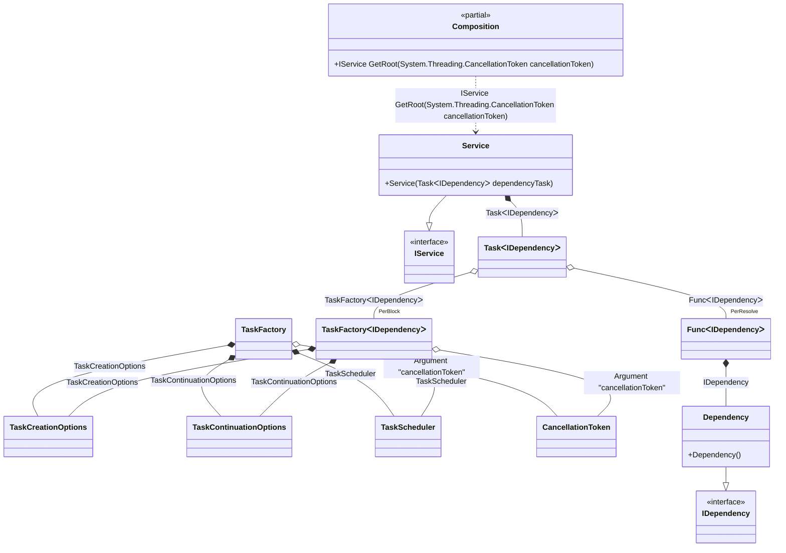

#### Task

[](../tests/Pure.DI.UsageTests/BaseClassLibrary/TaskScenario.cs)

By default, tasks are started automatically when they are injected. It is recommended to use an argument of type <c>CancellationToken</c> to the composition root to be able to cancel the execution of a task. In this case, the composition root property is automatically converted to a method with a parameter of type <c>CancellationToken</c>. To start a task, an instance of type <c>TaskFactory<T></c> is used, with default settings:

- CancellationToken.None
- TaskScheduler.Default
- TaskCreationOptions.None
- TaskContinuationOptions.None

But you can always override them, as in the example below for <c>TaskScheduler.Current</c>.

```c#
interface IDependency
{
    ValueTask DoSomething(CancellationToken cancellationToken);
}

class Dependency : IDependency
{
    public ValueTask DoSomething(CancellationToken cancellationToken) => ValueTask.CompletedTask;
}

interface IService
{
    Task RunAsync(CancellationToken cancellationToken);
}

class Service(Task<IDependency> dependencyTask) : IService
{
    public async Task RunAsync(CancellationToken cancellationToken)
    {
        var dependency = await dependencyTask;
        await dependency.DoSomething(cancellationToken);
    }
}

DI.Setup(nameof(Composition))
    .Hint(Hint.Resolve, "Off")
    // Overrides TaskScheduler.Default if necessary
    .Bind<TaskScheduler>().To(_ => TaskScheduler.Current)
    // Specifies to use CancellationToken from the composition root argument,
    // if not specified then CancellationToken.None will be used
    .RootArg<CancellationToken>("cancellationToken")
    .Bind<IDependency>().To<Dependency>()
    .Bind<IService>().To<Service>()

    // Composition root
    .Root<IService>("GetRoot");

var composition = new Composition();
using var cancellationTokenSource = new CancellationTokenSource();

// Creates a composition root with the CancellationToken passed to it
var service = composition.GetRoot(cancellationTokenSource.Token);
await service.RunAsync(cancellationTokenSource.Token);
```

<details open>
<summary>Class Diagram</summary>



</details>

<details>
<summary>Pure.DI-generated partial class Composition</summary><blockquote>

```c#
partial class Composition
{
  private readonly Composition _root;
  private readonly object _lock;

  public Composition()
  {
    _root = this;
    _lock = new object();
  }

  internal Composition(Composition parentScope)
  {
    _root = (parentScope ?? throw new ArgumentNullException(nameof(parentScope)))._root;
    _lock = _root._lock;
  }

  [MethodImpl(MethodImplOptions.AggressiveInlining)]
  public IService GetRoot(CancellationToken cancellationToken)
  {
    var perResolve42_Func = default(Func<IDependency>);
    TaskScheduler transient5_TaskScheduler = TaskScheduler.Current;
    TaskContinuationOptions transient4_TaskContinuationOptions = TaskContinuationOptions.None;
    TaskCreationOptions transient3_TaskCreationOptions = TaskCreationOptions.None;
    TaskFactory<IDependency> perBlock2_TaskFactory;
    {
        var cancellationToken_1 = cancellationToken;
        var taskCreationOptions_2 = transient3_TaskCreationOptions;
        var taskContinuationOptions_3 = transient4_TaskContinuationOptions;
        var taskScheduler_4 = transient5_TaskScheduler;
        perBlock2_TaskFactory = new TaskFactory<IDependency>(cancellationToken_1, taskCreationOptions_2, taskContinuationOptions_3, taskScheduler_4);
    }
    perResolve42_Func = new Func<IDependency>(
    [MethodImpl(MethodImplOptions.AggressiveInlining)]
    () =>
    {
        var value_5 = new Dependency();
        return value_5;
    });
    Task<IDependency> transient1_Task;
    {
        var factory_6 = perResolve42_Func!;
        var taskFactory_7 = perBlock2_TaskFactory;
        transient1_Task = taskFactory_7.StartNew(factory_6);
    }
    return new Service(transient1_Task);
  }
}
```

</blockquote></details>

