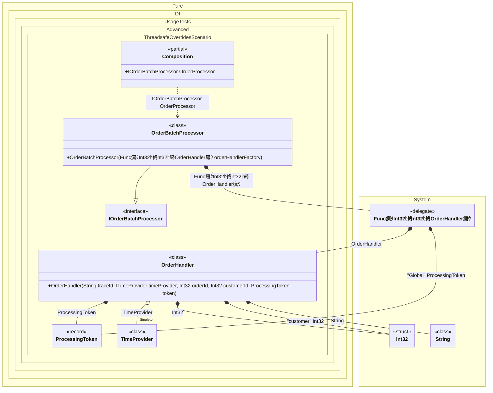

#### Thread-safe overrides


```c#
using Shouldly;
using Pure.DI;
using System.Collections.Immutable;

DI.Setup(nameof(Composition))
    .Bind("Global").To(_ => new ProcessingToken("TOKEN-123"))
    .Bind().As(Lifetime.Singleton).To<TimeProvider>()
    .Bind().To<Func<int, int, IOrderHandler>>(ctx =>
        (orderId, customerId) => {
            // Retrieves a global processing token to be passed to the handler
            ctx.Inject("Global", out ProcessingToken token);

            // The factory is invoked in parallel, so we must lock
            // the context to safely perform overrides for the specific graph
            lock (ctx.Lock)
            {
                // Overrides the 'int' dependency (OrderId)
                ctx.Override(orderId);

                // Overrides the tagged 'int' dependency (CustomerId)
                ctx.Override(customerId, "customer");

                // Overrides the 'string' dependency (TraceId)
                ctx.Override($"Order:{orderId}-Cust:{customerId}");

                // Overrides the 'ProcessingToken' dependency with the injected value
                ctx.Override(token);

                // Creates the handler with the overridden dependencies
                ctx.Inject<OrderHandler>(out var handler);
                return handler;
            }
        })
    .Bind().To<OrderBatchProcessor>()

    // Composition root
    .Root<IOrderBatchProcessor>("OrderProcessor");

var composition = new Composition();
var orderProcessor = composition.OrderProcessor;

orderProcessor.Handlers.Length.ShouldBe(100);
for (var i = 0; i < 100; i++)
{
    orderProcessor.Handlers.Count(h => h.OrderId == i).ShouldBe(1);
}

record ProcessingToken(string Value);

interface ITimeProvider
{
    DateTimeOffset Now { get; }
}

class TimeProvider : ITimeProvider
{
    public DateTimeOffset Now => DateTimeOffset.Now;
}

interface IOrderHandler
{
    string TraceId { get; }

    int OrderId { get; }

    int CustomerId { get; }
}

class OrderHandler(
    string traceId,
    ITimeProvider timeProvider,
    int orderId,
    [Tag("customer")] int customerId,
    ProcessingToken token)
    : IOrderHandler
{
    public string TraceId => traceId;

    public int OrderId => orderId;

    public int CustomerId => customerId;
}

interface IOrderBatchProcessor
{
    ImmutableArray<IOrderHandler> Handlers { get; }
}

class OrderBatchProcessor(Func<int, int, IOrderHandler> orderHandlerFactory)
    : IOrderBatchProcessor
{
    public ImmutableArray<IOrderHandler> Handlers { get; } =
    [
        // Simulates parallel processing of orders
        ..Enumerable.Range(0, 100)
            .AsParallel()
            .Select(i => orderHandlerFactory(i, 99))
    ];
}
```

<details>
<summary>Running this code sample locally</summary>

- Make sure you have the [.NET SDK 10.0](https://dotnet.microsoft.com/en-us/download/dotnet/10.0) or later is installed
```bash
dotnet --list-sdk
```
- Create a net10.0 (or later) console application
```bash
dotnet new console -n Sample
```
- Add references to NuGet packages
  - [Pure.DI](https://www.nuget.org/packages/Pure.DI)
  - [Shouldly](https://www.nuget.org/packages/Shouldly)
```bash
dotnet add package Pure.DI
dotnet add package Shouldly
```
- Copy the example code into the _Program.cs_ file

You are ready to run the example 🚀
```bash
dotnet run
```

</details>

The following partial class will be generated:

```c#
partial class Composition
{
#if NET9_0_OR_GREATER
  private readonly Lock _lock = new Lock();
#else
  private readonly Object _lock = new Object();
#endif

  private TimeProvider? _singletonTimeProvider52;

  public IOrderBatchProcessor OrderProcessor
  {
    [MethodImpl(MethodImplOptions.AggressiveInlining)]
    get
    {
      Func<int, int, IOrderHandler> transientFunc1 =
      [MethodImpl(MethodImplOptions.AggressiveInlining)]
      (localOrderId, localCustomerId) =>
      {
        // Retrieves a global processing token to be passed to the handler
        ProcessingToken transientProcessingToken2 = new ProcessingToken("TOKEN-123");
        ProcessingToken localToken = transientProcessingToken2;
        // The factory is invoked in parallel, so we must lock
        // the context to safely perform overrides for the specific graph
        lock (_lock)
        {
          // Overrides the 'int' dependency (OrderId)
          // Overrides the tagged 'int' dependency (CustomerId)
          // Overrides the 'string' dependency (TraceId)
          // Overrides the 'ProcessingToken' dependency with the injected value
          // Creates the handler with the overridden dependencies
          int overriddenInt32 = localOrderId;
          int overriddenInt321 = localCustomerId;
          string overriddenString2 = $"Order:{localOrderId}-Cust:{localCustomerId}";
          ProcessingToken overriddenProcessingToken3 = localToken;
          if (_singletonTimeProvider52 is null)
            lock (_lock)
              if (_singletonTimeProvider52 is null)
              {
                _singletonTimeProvider52 = new TimeProvider();
              }

          OrderHandler localHandler = new OrderHandler(overriddenString2, _singletonTimeProvider52, overriddenInt32, overriddenInt321, overriddenProcessingToken3);
          return localHandler;
        }
      };
      return new OrderBatchProcessor(transientFunc1);
    }
  }
}
```

Class diagram:



