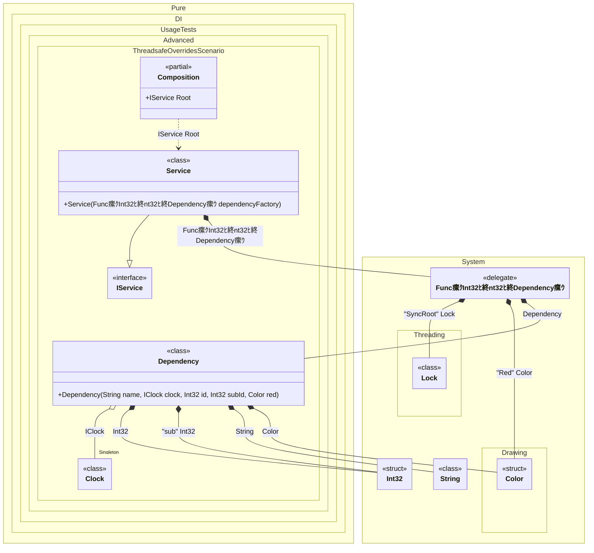

#### Thread-safe overrides


```c#
using Shouldly;
using Pure.DI;
using System.Collections.Immutable;
using System.Drawing;

DI.Setup(nameof(Composition))
    .Bind(Tag.Red).To(_ => Color.Red)
    .Bind().As(Lifetime.Singleton).To<Clock>()
    .Bind().To<Func<int, int, IDependency>>(ctx =>
        (dependencyId, subId) =>
        {
            ctx.Inject(Tag.Red, out Color red);

            // Get composition sync root object
            ctx.Inject(Tag.SyncRoot, out Lock lockObject);
            lock (lockObject)
            {
                // Overrides with a lambda argument
                ctx.Override(dependencyId);

                // Overrides with tag using lambda argument
                ctx.Override(subId, "sub");

                // Overrides with some value
                ctx.Override($"Dep {dependencyId} {subId}");

                // Overrides with injected value
                ctx.Override(red);

                ctx.Inject<Dependency>(out var dependency);
                return dependency;
            }
        })
    .Bind().To<Service>()

    // Composition root
    .Root<IService>("Root");

var composition = new Composition();
var service = composition.Root;
service.Dependencies.Length.ShouldBe(100);
for (var i = 0; i < 100; i++)
{
    service.Dependencies.Count(dep => dep.Id == i).ShouldBe(1);
}

interface IClock
{
    DateTimeOffset Now { get; }
}

class Clock : IClock
{
    public DateTimeOffset Now => DateTimeOffset.Now;
}

interface IDependency
{
    string Name { get; }

    int Id { get; }

    int SubId { get; }
}

class Dependency(
    string name,
    IClock clock,
    int id,
    [Tag("sub")] int subId,
    Color red)
    : IDependency
{
    public string Name => name;

    public int Id => id;

    public int SubId => subId;
}

interface IService
{
    ImmutableArray<IDependency> Dependencies { get; }
}

class Service(Func<int, int, IDependency> dependencyFactory): IService
{
    public ImmutableArray<IDependency> Dependencies { get; } =
        [
            ..Enumerable.Range(0, 100).AsParallel().Select(i => dependencyFactory(i, 99))
        ];
}
```

<details>
<summary>Running this code sample locally</summary>

- Make sure you have the [.NET SDK 9.0](https://dotnet.microsoft.com/en-us/download/dotnet/9.0) or later is installed
```bash
dotnet --list-sdk
```
- Create a net9.0 (or later) console application
```bash
dotnet new console -n Sample
```
- Add references to NuGet packages
  - [Pure.DI](https://www.nuget.org/packages/Pure.DI)
  - [Shouldly](https://www.nuget.org/packages/Shouldly)
```bash
dotnet add package Pure.DI
dotnet add package Shouldly
```
- Copy the example code into the _Program.cs_ file

You are ready to run the example 🚀
```bash
dotnet run
```

</details>

The following partial class will be generated:

```c#
partial class Composition
{
  private readonly Composition _root;
#if NET9_0_OR_GREATER
  private readonly Lock _lock;
#else
  private readonly Object _lock;
#endif

  private Clock? _singleClock53;

  [OrdinalAttribute(256)]
  public Composition()
  {
    _root = this;
#if NET9_0_OR_GREATER
    _lock = new Lock();
#else
    _lock = new Object();
#endif
  }

  internal Composition(Composition parentScope)
  {
    _root = (parentScope ?? throw new ArgumentNullException(nameof(parentScope)))._root;
    _lock = parentScope._lock;
  }

  public IService Root
  {
    [MethodImpl(MethodImplOptions.AggressiveInlining)]
    get
    {
      Func<int, int, IDependency> transFunc1 =
      [MethodImpl(MethodImplOptions.AggressiveInlining)]
      (localDependencyId, localSubId) =>
      {
        Drawing.Color transColor2 = Color.Red;
        Drawing.Color localRed = transColor2;
        // Get composition sync root object
        Lock transLock3 = _lock;
        Lock localLockObject = transLock3;
        lock (localLockObject)
        {
          // Overrides with a lambda argument
          // Overrides with tag using lambda argument
          // Overrides with some value
          // Overrides with injected value
          int overrInt321 = localDependencyId;
          int overrInt322 = localSubId;
          string overrString3 = $"Dep {localDependencyId} {localSubId}";
          Drawing.Color overrColor4 = localRed;
          if (_root._singleClock53 is null)
          {
            lock (_lock)
            {
              _root._singleClock53 = new Clock();
            }
          }

          Dependency localDependency = new Dependency(overrString3, _root._singleClock53, overrInt321, overrInt322, overrColor4);
          return localDependency;
        }
      };
      return new Service(transFunc1);
    }
  }
}
```

Class diagram:



