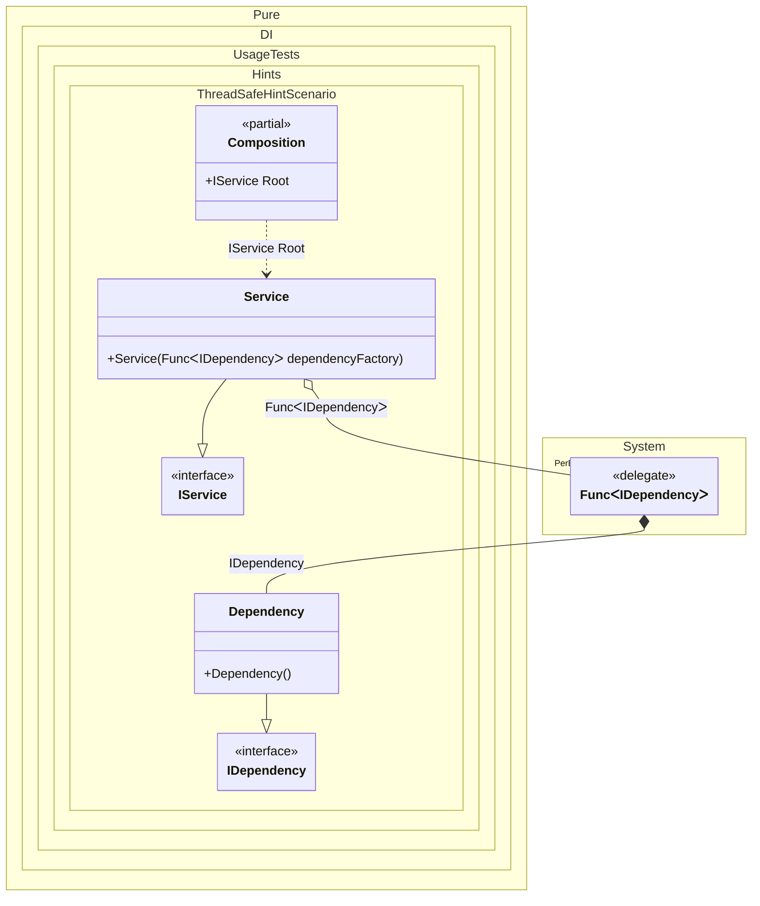

#### ThreadSafe hint

[](../tests/Pure.DI.UsageTests/Hints/ThreadSafeHintScenario.cs)

Hints are used to fine-tune code generation. The _ThreadSafe_ hint determines whether object composition will be created in a thread-safe manner. This hint is _On_ by default. It is good practice not to use threads when creating an object graph, in which case this hint can be turned off, which will lead to a slight increase in performance.
In addition, setup hints can be comments before the _Setup_ method in the form ```hint = value```, for example: `// ThreadSafe = Off`.


```c#
using Pure.DI;
using static Pure.DI.Hint;

DI.Setup(nameof(Composition))
    .Hint(ThreadSafe, "Off")
    .Bind().To<Dependency>()
    .Bind().As(Lifetime.Singleton).To<Service>()
    .Root<IService>("Root");

var composition = new Composition();
var service = composition.Root;

interface IDependency;

class Dependency : IDependency;

interface IService;

class Service(Func<IDependency> dependencyFactory) : IService;
```

<details>
<summary>Running this code sample locally</summary>

- Make sure you have the [.NET SDK 9.0](https://dotnet.microsoft.com/en-us/download/dotnet/9.0) or later is installed
```bash
dotnet --list-sdk
```
- Create a net9.0 (or later) console application
```bash
dotnet new console -n Sample
```
- Add reference to NuGet package
  - [Pure.DI](https://www.nuget.org/packages/Pure.DI)
```bash
dotnet add package Pure.DI
```
- Copy the example code into the _Program.cs_ file

You are ready to run the example 🚀
```bash
dotnet run
```

</details>

For more hints, see [this](README.md#setup-hints) page.

The following partial class will be generated:

```c#
partial class Composition
{
  private readonly Composition _root;

  private Service? _singletonService44;

  [OrdinalAttribute(256)]
  public Composition()
  {
    _root = this;
  }

  internal Composition(Composition parentScope)
  {
    _root = (parentScope ?? throw new ArgumentNullException(nameof(parentScope)))._root;
  }

  public IService Root
  {
    [MethodImpl(MethodImplOptions.AggressiveInlining)]
    get
    {
      if (_root._singletonService44 is null)
      {
        Func<IDependency> perBlockFunc0 = new Func<IDependency>(
        [MethodImpl(MethodImplOptions.AggressiveInlining)]
        () =>
        {
          IDependency localValue88 = new Dependency();
          return localValue88;
        });
        _root._singletonService44 = new Service(perBlockFunc0);
      }

      return _root._singletonService44;
    }
  }
}
```

Class diagram:



