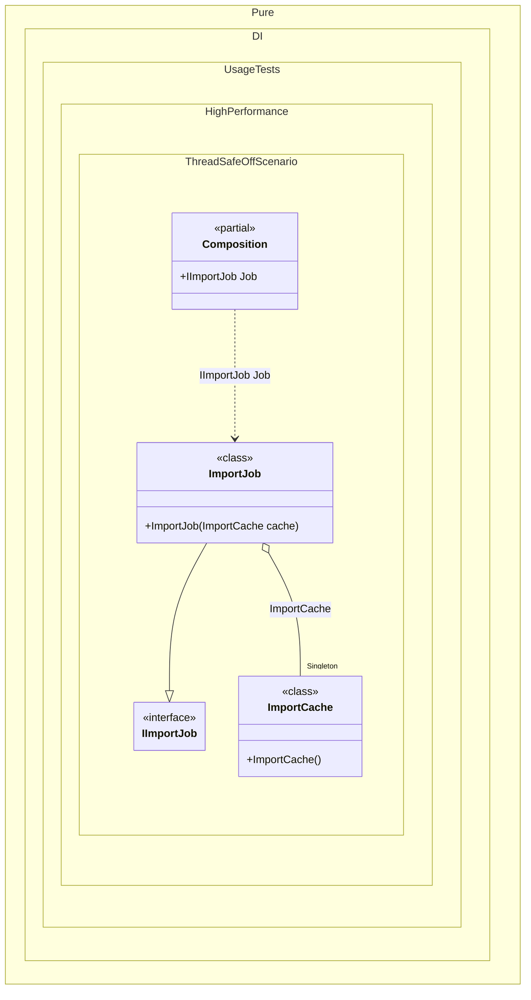

#### ThreadSafe Off for single-thread composition

Pure.DI generates thread-safe code by default because composition instances are often shared. When a composition is created and used on one thread, such as inside a command-line import step, a game-loop setup phase, or a short-lived benchmark harness, the synchronization path can be disabled explicitly.
This example builds a report import pipeline that is created, used, and discarded inside one job. `ThreadSafe = Off` removes generated locking for composition-owned cached instances, while the application keeps the single-threaded ownership rule at the boundary.


```c#
using Shouldly;
using Pure.DI;
using static Pure.DI.Hint;
using static Pure.DI.Lifetime;

DI.Setup(nameof(Composition))
    .Hint(ThreadSafe, "Off")
    .Bind().As(Singleton).To<ImportCache>()
    .Bind<IImportJob>().To<ImportJob>()
    .Root<IImportJob>("Job");

var composition = new Composition();
var job = composition.Job;

job.Import(["A-100", "A-100", "B-200"]).ShouldBe(2);

interface IImportJob
{
    int Import(IReadOnlyList<string> productCodes);
}

sealed class ImportJob(ImportCache cache) : IImportJob
{
    public int Import(IReadOnlyList<string> productCodes)
    {
        foreach (var code in productCodes)
        {
            cache.SeenCodes.Add(code);
        }

        return cache.SeenCodes.Count;
    }
}

sealed class ImportCache
{
    public HashSet<string> SeenCodes { get; } = [];
}
```

<details>
<summary>Running this code sample locally</summary>

- Make sure you have the [.NET SDK 10.0](https://dotnet.microsoft.com/en-us/download/dotnet/10.0) or later installed
```bash
dotnet --list-sdk
```
- Create a net10.0 (or later) console application
```bash
dotnet new console -n Sample
```
- Add references to the NuGet packages
  - [Pure.DI](https://www.nuget.org/packages/Pure.DI)
  - [Shouldly](https://www.nuget.org/packages/Shouldly)
```bash
dotnet add package Pure.DI
dotnet add package Shouldly
```
- Copy the example code into the _Program.cs_ file

You are ready to run the example 🚀
```bash
dotnet run
```

</details>

Use this only when the composition instance is not shared across threads. If delegates, factories, or roots can be invoked concurrently, keep thread safety enabled or synchronize the critical factory section yourself with `ctx.Lock`.

<details>
<summary>The following partial class will be generated</summary>

```c#
partial class Composition
{

  private ImportCache? _singletonCompositionInOtherProject;

  public IImportJob Job
  {
    [MethodImpl(MethodImplOptions.AggressiveInlining)]
    get
    {
      if (_singletonCompositionInOtherProject is null)
      {
        _singletonCompositionInOtherProject = new ImportCache();
      }

      return new ImportJob(_singletonCompositionInOtherProject);
    }
  }
}
```

</details>

Class diagram:



See also:

- [ThreadSafe hint](threadsafe-hint.md)
- [Thread-safe overrides](thread-safe-overrides.md)

