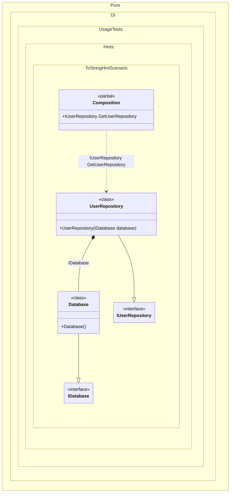

#### ToString hint

Hints are used to fine-tune code generation. The _ToString_ hint determines if the _ToString()_ method should be generated. This method provides a text-based class diagram in the format [mermaid](https://mermaid.js.org/). To see this diagram, just call the ToString method and copy the text to [this site](https://mermaid.live/). An example class diagram can be seen below.
In addition, setup hints can be comments before the _Setup_ method in the form ```hint = value```, for example: `// ToString = On`.


```c#
using Pure.DI;

DI.Setup(nameof(Composition))
    .Hint(Hint.ToString, "On")
    .Bind().To<Database>()
    .Bind().To<UserRepository>()
    .Root<IUserRepository>("GetUserRepository");

var composition = new Composition();
// The ToString() method generates a class diagram in mermaid format
string classDiagram = composition.ToString();

interface IDatabase;

class Database : IDatabase;

interface IUserRepository;

class UserRepository(IDatabase database) : IUserRepository;
```

<details>
<summary>Running this code sample locally</summary>

- Make sure you have the [.NET SDK 10.0](https://dotnet.microsoft.com/en-us/download/dotnet/10.0) or later is installed
```bash
dotnet --list-sdk
```
- Create a net10.0 (or later) console application
```bash
dotnet new console -n Sample
```
- Add reference to NuGet package
  - [Pure.DI](https://www.nuget.org/packages/Pure.DI)
```bash
dotnet add package Pure.DI
```
- Copy the example code into the _Program.cs_ file

You are ready to run the example 🚀
```bash
dotnet run
```

</details>

Developers who start using DI technology often complain that they stop seeing the structure of the application because it is difficult to understand how it is built. To make life easier, you can add the _ToString_ hint by telling the generator to create a `ToString()` method.
For more hints, see [this](README.md#setup-hints) page.

The following partial class will be generated:

```c#
partial class Composition
{
  public IUserRepository GetUserRepository
  {
    [MethodImpl(MethodImplOptions.AggressiveInlining)]
    get
    {
      return new UserRepository(new Database());
    }
  }
}
```

Class diagram:



