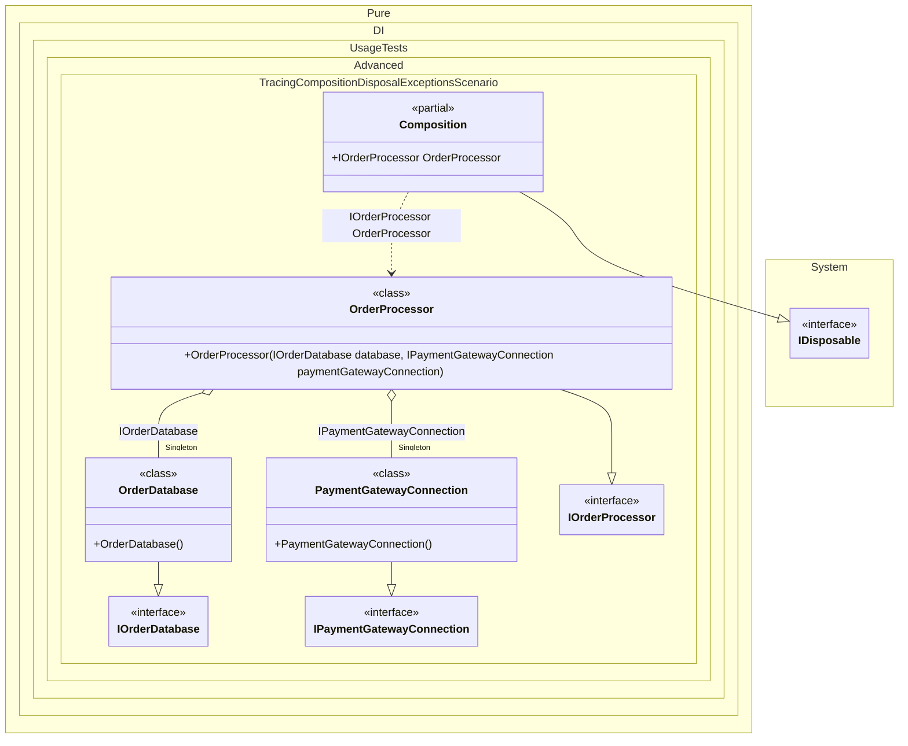

#### Tracing exceptions during composition disposal

A generated composition catches exceptions thrown while disposing tracked singleton and scoped dependencies, invokes the `OnDisposeException` partial method, and continues disposing the remaining resources. Implement this method in the composition partial class to send failures to logging, tracing, or monitoring without wrapping every resource manually.


```c#
using Shouldly;
using Pure.DI;

var composition = new Composition();
var orderProcessor = composition.OrderProcessor;

// Simulates application shutdown. The payment gateway throws while
// closing, but the database connection must still be released.
composition.Dispose();

composition.Events.ShouldBe([
    "PaymentGatewayConnection: The remote payment session did not close cleanly."]);
orderProcessor.Database.IsDisposed.ShouldBeTrue();

interface IOrderDatabase
{
    bool IsDisposed { get; }
}

// Represents a long-lived database connection owned by the application.
class OrderDatabase : IOrderDatabase, IDisposable
{
    public bool IsDisposed { get; private set; }

    public void Dispose() => IsDisposed = true;
}

interface IPaymentGatewayConnection;

// Represents an external client that can fail during application shutdown.
class PaymentGatewayConnection : IPaymentGatewayConnection, IDisposable
{
    public void Dispose() =>
        throw new IOException("The remote payment session did not close cleanly.");
}

interface IOrderProcessor
{
    IOrderDatabase Database { get; }
}

class OrderProcessor(
    IOrderDatabase database,
    IPaymentGatewayConnection paymentGatewayConnection)
    : IOrderProcessor
{
    public IOrderDatabase Database { get; } = database;

    public IPaymentGatewayConnection PaymentGatewayConnection { get; } = paymentGatewayConnection;
}

partial class Composition
{
    static void Setup() =>

        DI.Setup()
            .Bind<IOrderDatabase>().As(Lifetime.Singleton).To<OrderDatabase>()
            .Bind<IPaymentGatewayConnection>().As(Lifetime.Singleton).To<PaymentGatewayConnection>()
            .Bind<IOrderProcessor>().To<OrderProcessor>()
            .Root<IOrderProcessor>("OrderProcessor");

    private readonly List<string> _events = [];

    // Called whenever a tracked IDisposable throws during composition disposal.
    partial void OnDisposeException<T>(T disposableInstance, Exception exception)
        where T : IDisposable =>
        _events.Add($"{disposableInstance.GetType().Name}: {exception.Message}");

    public IReadOnlyList<string> Events => _events;

    public void Clear() => _events.Clear();
}
```

<details>
<summary>Running this code sample locally</summary>

- Make sure you have the [.NET SDK 10.0](https://dotnet.microsoft.com/en-us/download/dotnet/10.0) or later installed
```bash
dotnet --list-sdk
```
- Create a net10.0 (or later) console application
```bash
dotnet new console -n Sample
```
- Add references to the NuGet packages
  - [Pure.DI](https://www.nuget.org/packages/Pure.DI)
  - [Shouldly](https://www.nuget.org/packages/Shouldly)
```bash
dotnet add package Pure.DI
dotnet add package Shouldly
```
- Copy the example code into the _Program.cs_ file

You are ready to run the example 🚀
```bash
dotnet run
```

</details>

>[!IMPORTANT]
>The exception is suppressed after `OnDisposeException` returns so that cleanup can continue. If the application must fail shutdown, the partial method can record the failure and then throw according to the application's shutdown policy.

<details>
<summary>The following partial class will be generated</summary>

```c#
partial class Composition: IDisposable
{
#if NET9_0_OR_GREATER
  private readonly Lock _lock = new Lock();
#else
  private readonly Object _lock = new Object();
#endif
  private object[] _disposables = new object[2];
  private int _disposeIndex;

  private OrderDatabase? _singletonCompositionInOtherProject;
  private PaymentGatewayConnection? _singletonCompositionWithGenericRootsAndArgsInOtherProject;

  public IOrderProcessor OrderProcessor
  {
    [MethodImpl(MethodImplOptions.AggressiveInlining)]
    get
    {
      if (_singletonCompositionInOtherProject is null)
        lock (_lock)
          if (_singletonCompositionInOtherProject is null)
          {
            _singletonCompositionInOtherProject = new OrderDatabase();
            _disposables[_disposeIndex++] = _singletonCompositionInOtherProject;
          }

      if (_singletonCompositionWithGenericRootsAndArgsInOtherProject is null)
        lock (_lock)
          if (_singletonCompositionWithGenericRootsAndArgsInOtherProject is null)
          {
            _singletonCompositionWithGenericRootsAndArgsInOtherProject = new PaymentGatewayConnection();
            _disposables[_disposeIndex++] = _singletonCompositionWithGenericRootsAndArgsInOtherProject;
          }

      return new OrderProcessor(_singletonCompositionInOtherProject, _singletonCompositionWithGenericRootsAndArgsInOtherProject);
    }
  }

  public void Dispose()
  {
    int disposeIndex;
    object[] disposables;
    lock (_lock)
    {
      disposeIndex = _disposeIndex;
      _disposeIndex = 0;
      disposables = _disposables;
      _disposables = new object[2];
      _singletonCompositionInOtherProject = null;
      _singletonCompositionWithGenericRootsAndArgsInOtherProject = null;
    }

    while (disposeIndex-- > 0)
    {
      switch (disposables[disposeIndex])
      {
        case IDisposable disposableInstance:
          try
          {
            disposableInstance.Dispose();
          }
          catch (Exception exception)
          {
            OnDisposeException(disposableInstance, exception);
          }
          break;
      }
    }
  }

  partial void OnDisposeException<T>(T disposableInstance, Exception exception) where T : IDisposable;
}
```

</details>

Class diagram:



See also:

- [Tracing exceptions during Owned disposal](tracing-exceptions-during-owned-disposal.md)
- [Tracking disposable instances per a composition root](tracking-disposable-instances-per-a-composition-root.md)

