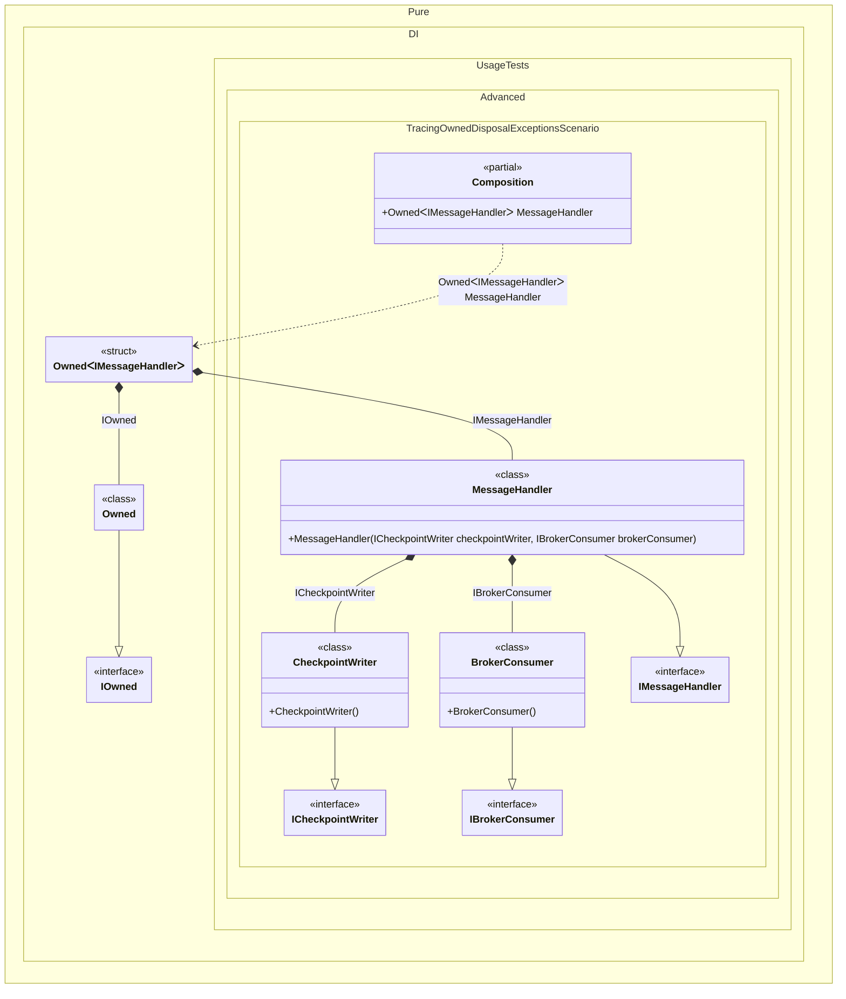

#### Tracing exceptions during Owned disposal

`Owned<T>` catches exceptions thrown while disposing resources in its graph, invokes the `OnDisposeException` partial method on the generated `Pure.DI.Owned` accumulator, and continues disposing the remaining resources. Implement this hook to associate per-operation cleanup failures with application diagnostics.


```c#
using Shouldly;
using Pure.DI;

var composition = new Composition();
var messageHandler = composition.MessageHandler;

// Ends processing of one message. The broker consumer fails to
// close, but the checkpoint writer must still be released.
messageHandler.Dispose();

messageHandler.Events.ShouldBe([
    "BrokerConsumer: The broker did not acknowledge consumer shutdown."]);
messageHandler.Value.CheckpointWriter.IsDisposed.ShouldBeTrue();

interface ICheckpointWriter
{
    bool IsDisposed { get; }
}

// Represents a per-message checkpoint buffer that must always be released.
class CheckpointWriter : ICheckpointWriter, IDisposable
{
    public bool IsDisposed { get; private set; }

    public void Dispose() => IsDisposed = true;
}

interface IBrokerConsumer;

// Represents a per-message broker consumer that can fail while closing.
class BrokerConsumer : IBrokerConsumer, IDisposable
{
    public void Dispose() =>
        throw new IOException("The broker did not acknowledge consumer shutdown.");
}

interface IMessageHandler
{
    ICheckpointWriter CheckpointWriter { get; }
}

class MessageHandler(
    ICheckpointWriter checkpointWriter,
    IBrokerConsumer brokerConsumer)
    : IMessageHandler
{
    public ICheckpointWriter CheckpointWriter { get; } = checkpointWriter;

    public IBrokerConsumer BrokerConsumer { get; } = brokerConsumer;
}

partial class Composition
{
    static void Setup() =>

        DI.Setup()
            .Bind<ICheckpointWriter>().To<CheckpointWriter>()
            .Bind<IBrokerConsumer>().To<BrokerConsumer>()
            .Bind<IMessageHandler>().To<MessageHandler>()
            .Root<Owned<IMessageHandler>>("MessageHandler");
}

namespace Pure.DI
{
    internal sealed partial class Owned
    {
        private readonly List<string> _events = [];
//#
        // Called whenever a resource in any Owned<T> graph fails to dispose.
        partial void OnDisposeException<T>(T disposableInstance, Exception exception)
            where T : IDisposable =>
            _events.Add($"{disposableInstance.GetType().Name}: {exception.Message}");
//#
        public IReadOnlyList<string> Events => _events;
    }
//#
    internal readonly partial struct Owned<T>
    {
        // Exposes diagnostics collected for this Owned<T> graph only.
        public IReadOnlyList<string> Events => ((Owned)owned).Events;
    }
}
```

<details>
<summary>Running this code sample locally</summary>

- Make sure you have the [.NET SDK 10.0](https://dotnet.microsoft.com/en-us/download/dotnet/10.0) or later installed
```bash
dotnet --list-sdk
```
- Create a net10.0 (or later) console application
```bash
dotnet new console -n Sample
```
- Add references to the NuGet packages
  - [Pure.DI](https://www.nuget.org/packages/Pure.DI)
  - [Shouldly](https://www.nuget.org/packages/Shouldly)
```bash
dotnet add package Pure.DI
dotnet add package Shouldly
```
- Copy the example code into the _Program.cs_ file

You are ready to run the example 🚀
```bash
dotnet run
```

</details>

>[!IMPORTANT]
>The hook belongs to the non-generic `Pure.DI.Owned` accumulator used internally by every `Owned<T>`, so its partial implementation must be declared in the `Pure.DI` namespace. The partial `Owned<T>` extension exposes only the events collected by its own accumulator.

<details>
<summary>The following partial class will be generated</summary>

```c#
partial class Composition
{
#if NET9_0_OR_GREATER
  private readonly Lock _lock = new Lock();
#else
  private readonly Object _lock = new Object();
#endif

  public Owned<IMessageHandler> MessageHandler
  {
    [MethodImpl(MethodImplOptions.AggressiveInlining)]
    get
    {
      var perBlockOwned = new Owned(2, _lock);
      try
      {
        Owned<IMessageHandler> perBlockOwnedIMessageHandler;
        // Tracks owned disposables
        Owned transientOwned;
        Owned localOwned1 = perBlockOwned;
        transientOwned = localOwned1;
        IOwned localOwned = transientOwned;
        // Creates the owned value
        var transientCheckpointWriter = new CheckpointWriter();
        lock (_lock)
        {
          perBlockOwned.Add(transientCheckpointWriter);
        }

        var transientBrokerConsumer = new BrokerConsumer();
        lock (_lock)
        {
          perBlockOwned.Add(transientBrokerConsumer);
        }

        IMessageHandler localValue = new MessageHandler(transientCheckpointWriter, transientBrokerConsumer);
        perBlockOwnedIMessageHandler = new Owned<IMessageHandler>(localValue, localOwned);
        lock (_lock)
        {
          perBlockOwned.Add(perBlockOwnedIMessageHandler);
        }

        return perBlockOwnedIMessageHandler;
      }
      catch
      {
        if (!Object.ReferenceEquals(perBlockOwned, null))
        {
          try
          {
            ((IDisposable)perBlockOwned).Dispose();
          }
          catch
          {
          // Preserve the original graph construction exception.
          }
        }

        throw;
      }
    }
  }
}
```

</details>

Class diagram:



See also:

- [Tracing exceptions during composition disposal](tracing-exceptions-during-composition-disposal.md)
- [Tracking disposable instances per a composition root](tracking-disposable-instances-per-a-composition-root.md)

