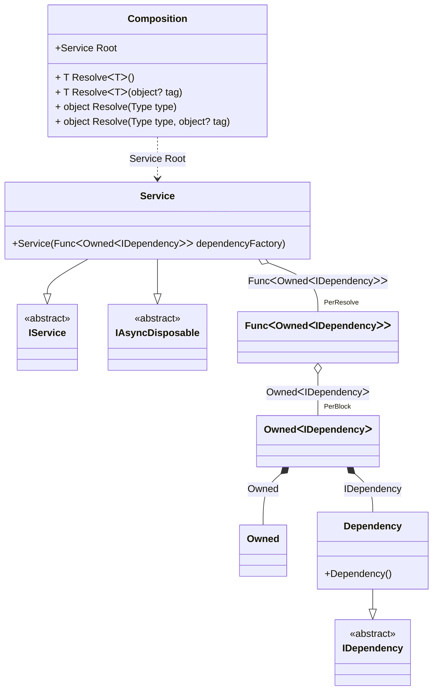

#### Tracking async disposable instances in delegates

[](../tests/Pure.DI.UsageTests/Basics/TrackingAsyncDisposableInDelegatesScenario.cs)

```c#
interface IDependency
{
    bool IsDisposed { get; }
}

class Dependency : IDependency, IAsyncDisposable
{
    public bool IsDisposed { get; private set; }

    public ValueTask DisposeAsync()
    {
        IsDisposed = true;
        return ValueTask.CompletedTask;
    }
}

interface IService
{
    public IDependency Dependency { get; }
}

class Service(Func<Owned<IDependency>> dependencyFactory)
    : IService, IAsyncDisposable
{
    private readonly Owned<IDependency> _dependency = dependencyFactory();

    public IDependency Dependency => _dependency.Value;

    public ValueTask DisposeAsync()
    {
        return _dependency.DisposeAsync();
    }
}

partial class Composition
{
    void Setup() =>
        DI.Setup(nameof(Composition))
            .Bind<IDependency>().To<Dependency>()
            .Bind().To<Service>()

            // Composition root
            .Root<Service>("Root");
}

var composition = new Composition();
var root1 = composition.Root;
var root2 = composition.Root;
        
await root2.DisposeAsync();
        
// Checks that the disposable instances
// associated with root1 have been disposed of
root2.Dependency.IsDisposed.ShouldBeTrue();
        
// Checks that the disposable instances
// associated with root2 have not been disposed of
root1.Dependency.IsDisposed.ShouldBeFalse();
        
await root1.DisposeAsync();
        
// Checks that the disposable instances
// associated with root2 have been disposed of
root1.Dependency.IsDisposed.ShouldBeTrue();
```

<details open>
<summary>Class Diagram</summary>



</details>

<details>
<summary>Pure.DI-generated partial class Composition</summary><blockquote>

```c#
partial class Composition
{
  private readonly Composition _root;
  private readonly object _lock;

  public Composition()
  {
    _root = this;
    _lock = new object();
  }

  internal Composition(Composition baseComposition)
  {
    _root = baseComposition._root;
    _lock = _root._lock;
  }

  public Service Root
  {
    [MethodImpl((MethodImplOptions)0x100)]
    get
    {
      var perResolve39_Func = default(Func<Owned<IDependency>>);
      perResolve39_Func = new Func<Owned<IDependency>>(
      [MethodImpl((MethodImplOptions)256)]
      () =>
      {
          var accumulator38 = new Owned();
          Dependency transient3_Dependency = new Dependency();
          lock (_lock)
          {
              accumulator38.Add(transient3_Dependency);
          }
          Owned<IDependency> perBlock1_Owned;
          {
              var owned_2 = accumulator38;
              var value_3 = transient3_Dependency;
              perBlock1_Owned = new Owned<IDependency>(value_3, owned_2);
          }
          lock (_lock)
          {
              accumulator38.Add(perBlock1_Owned);
          }
          var value_1 = perBlock1_Owned;
          return value_1;
      });
      return new Service(perResolve39_Func);
    }
  }

  [MethodImpl((MethodImplOptions)0x100)]
  public T Resolve<T>()
  {
    return Resolver<T>.Value.Resolve(this);
  }

  [MethodImpl((MethodImplOptions)0x100)]
  public T Resolve<T>(object? tag)
  {
    return Resolver<T>.Value.ResolveByTag(this, tag);
  }

  [MethodImpl((MethodImplOptions)0x100)]
  public object Resolve(Type type)
  {
    var index = (int)(_bucketSize * ((uint)RuntimeHelpers.GetHashCode(type) % 1));
    ref var pair = ref _buckets[index];
    return pair.Key == type ? pair.Value.Resolve(this) : Resolve(type, index);
  }

  [MethodImpl((MethodImplOptions)0x8)]
  private object Resolve(Type type, int index)
  {
    var finish = index + _bucketSize;
    while (++index < finish)
    {
      ref var pair = ref _buckets[index];
      if (pair.Key == type)
      {
        return pair.Value.Resolve(this);
      }
    }

    throw new InvalidOperationException($"Cannot resolve composition root of type {type}.");
  }

  [MethodImpl((MethodImplOptions)0x100)]
  public object Resolve(Type type, object? tag)
  {
    var index = (int)(_bucketSize * ((uint)RuntimeHelpers.GetHashCode(type) % 1));
    ref var pair = ref _buckets[index];
    return pair.Key == type ? pair.Value.ResolveByTag(this, tag) : Resolve(type, tag, index);
  }

  [MethodImpl((MethodImplOptions)0x8)]
  private object Resolve(Type type, object? tag, int index)
  {
    var finish = index + _bucketSize;
    while (++index < finish)
    {
      ref var pair = ref _buckets[index];
      if (pair.Key == type)
      {
        return pair.Value.ResolveByTag(this, tag);
      }
    }

    throw new InvalidOperationException($"Cannot resolve composition root \"{tag}\" of type {type}.");
  }

  public override string ToString()
  {
    return
      "classDiagram\n" +
        "  class Composition {\n" +
          "    +Service Root\n" +
          "    + T ResolveᐸTᐳ()\n" +
          "    + T ResolveᐸTᐳ(object? tag)\n" +
          "    + object Resolve(Type type)\n" +
          "    + object Resolve(Type type, object? tag)\n" +
        "  }\n" +
        "  class Owned\n" +
        "  Dependency --|> IDependency : \n" +
        "  class Dependency {\n" +
          "    +Dependency()\n" +
        "  }\n" +
        "  Service --|> IService : \n" +
        "  Service --|> IAsyncDisposable : \n" +
        "  class Service {\n" +
          "    +Service(FuncᐸOwnedᐸIDependencyᐳᐳ dependencyFactory)\n" +
        "  }\n" +
        "  class FuncᐸOwnedᐸIDependencyᐳᐳ\n" +
        "  class OwnedᐸIDependencyᐳ\n" +
        "  class IDependency {\n" +
          "    <<abstract>>\n" +
        "  }\n" +
        "  class IService {\n" +
          "    <<abstract>>\n" +
        "  }\n" +
        "  class IAsyncDisposable {\n" +
          "    <<abstract>>\n" +
        "  }\n" +
        "  Service o--  \"PerResolve\" FuncᐸOwnedᐸIDependencyᐳᐳ : FuncᐸOwnedᐸIDependencyᐳᐳ\n" +
        "  Composition ..> Service : Service Root\n" +
        "  FuncᐸOwnedᐸIDependencyᐳᐳ o--  \"PerBlock\" OwnedᐸIDependencyᐳ : OwnedᐸIDependencyᐳ\n" +
        "  OwnedᐸIDependencyᐳ *--  Owned : Owned\n" +
        "  OwnedᐸIDependencyᐳ *--  Dependency : IDependency";
  }

  private readonly static int _bucketSize;
  private readonly static Pair<Type, IResolver<Composition, object>>[] _buckets;

  static Composition()
  {
    var valResolver_0000 = new Resolver_0000();
    Resolver<Service>.Value = valResolver_0000;
    _buckets = Buckets<Type, IResolver<Composition, object>>.Create(
      1,
      out _bucketSize,
      new Pair<Type, IResolver<Composition, object>>[1]
      {
         new Pair<Type, IResolver<Composition, object>>(typeof(Service), valResolver_0000)
      });
  }

  private sealed class Resolver<T>: IResolver<Composition, T>
  {
    public static IResolver<Composition, T> Value = new Resolver<T>();

    public T Resolve(Composition composite)
    {
      throw new InvalidOperationException($"Cannot resolve composition root of type {typeof(T)}.");
    }

    public T ResolveByTag(Composition composite, object tag)
    {
      throw new InvalidOperationException($"Cannot resolve composition root \"{tag}\" of type {typeof(T)}.");
    }
  }

  private sealed class Resolver_0000: IResolver<Composition, Service>
  {
    public Service Resolve(Composition composition)
    {
      return composition.Root;
    }

    public Service ResolveByTag(Composition composition, object tag)
    {
      switch (tag)
      {
        case null:
          return composition.Root;
        default:
          throw new InvalidOperationException($"Cannot resolve composition root \"{tag}\" of type Service.");
      }
    }
  }
}
```

</blockquote></details>

