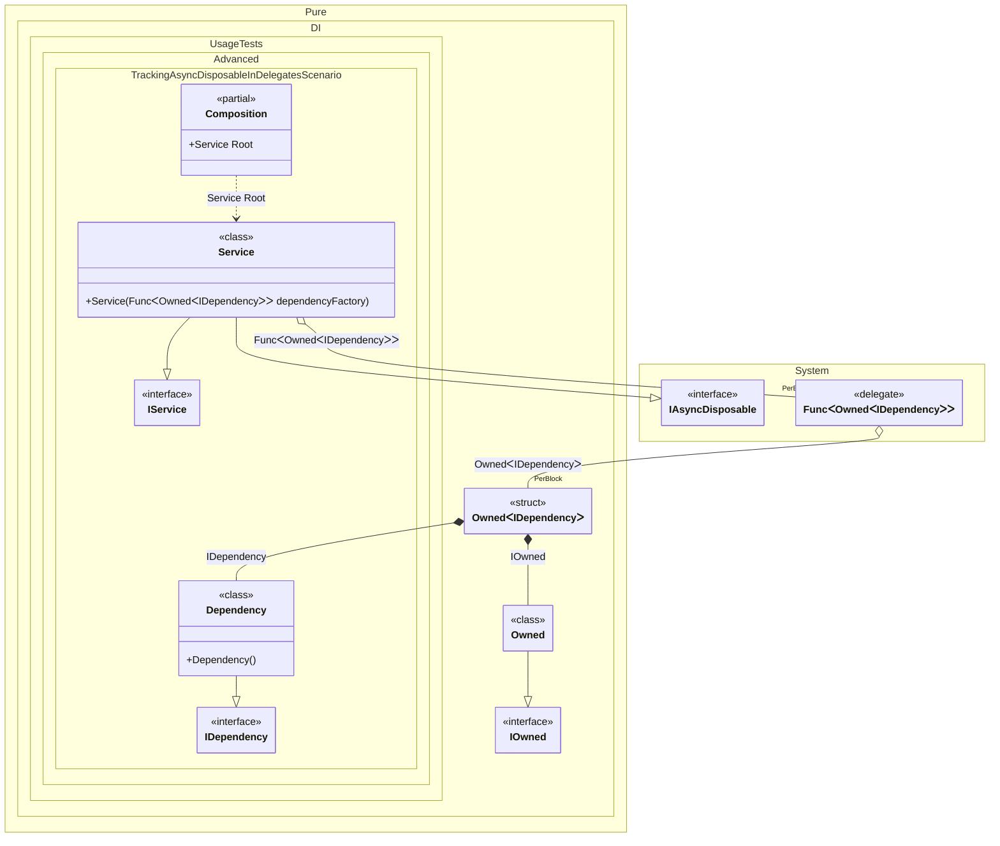

#### Tracking async disposable instances in delegates


```c#
using Shouldly;
using Pure.DI;

var composition = new Composition();
var root1 = composition.Root;
var root2 = composition.Root;

await root2.DisposeAsync();

// Checks that the disposable instances
// associated with root1 have been disposed of
root2.Dependency.IsDisposed.ShouldBeTrue();

// Checks that the disposable instances
// associated with root2 have not been disposed of
root1.Dependency.IsDisposed.ShouldBeFalse();

await root1.DisposeAsync();

// Checks that the disposable instances
// associated with root2 have been disposed of
root1.Dependency.IsDisposed.ShouldBeTrue();

interface IDependency
{
    bool IsDisposed { get; }
}

class Dependency : IDependency, IAsyncDisposable
{
    public bool IsDisposed { get; private set; }

    public ValueTask DisposeAsync()
    {
        IsDisposed = true;
        return ValueTask.CompletedTask;
    }
}

interface IService
{
    public IDependency Dependency { get; }
}

class Service(Func<Owned<IDependency>> dependencyFactory)
    : IService, IAsyncDisposable
{
    private readonly Owned<IDependency> _dependency = dependencyFactory();

    public IDependency Dependency => _dependency.Value;

    public ValueTask DisposeAsync()
    {
        return _dependency.DisposeAsync();
    }
}

partial class Composition
{
    static void Setup() =>

        DI.Setup()
            .Bind<IDependency>().To<Dependency>()
            .Bind().To<Service>()

            // Composition root
            .Root<Service>("Root");
}
```

<details>
<summary>Running this code sample locally</summary>

- Make sure you have the [.NET SDK 9.0](https://dotnet.microsoft.com/en-us/download/dotnet/9.0) or later is installed
```bash
dotnet --list-sdk
```
- Create a net9.0 (or later) console application
```bash
dotnet new console -n Sample
```
- Add references to NuGet packages
  - [Pure.DI](https://www.nuget.org/packages/Pure.DI)
  - [Shouldly](https://www.nuget.org/packages/Shouldly)
```bash
dotnet add package Pure.DI
dotnet add package Shouldly
```
- Copy the example code into the _Program.cs_ file

You are ready to run the example 🚀
```bash
dotnet run
```

</details>

The following partial class will be generated:

```c#
partial class Composition
{
  private readonly Composition _root;
  private readonly Lock _lock;

  [OrdinalAttribute(256)]
  public Composition()
  {
    _root = this;
    _lock = new Lock();
  }

  internal Composition(Composition parentScope)
  {
    _root = (parentScope ?? throw new ArgumentNullException(nameof(parentScope)))._root;
    _lock = _root._lock;
  }

  public Service Root
  {
    [MethodImpl(MethodImplOptions.AggressiveInlining)]
    get
    {
      var accumulator55 = new Owned();
      Func<Owned<IDependency>> perBlockFunc1 = new Func<Owned<IDependency>>(
      [MethodImpl(MethodImplOptions.AggressiveInlining)]
      () =>
      {
        var accumulator55 = new Owned();
        Owned transientOwned3;
        Owned localOwned49 = accumulator55;
        transientOwned3 = localOwned49;
        using (_lock.EnterScope())
        {
          accumulator55.Add(transientOwned3);
        }

        Dependency transientDependency4 = new Dependency();
        using (_lock.EnterScope())
        {
          accumulator55.Add(transientDependency4);
        }

        Owned<IDependency> perBlockOwned2;
        // Creates the owner of an instance
        IOwned localOwned50 = transientOwned3;
        IDependency localValue51 = transientDependency4;
        perBlockOwned2 = new Owned<IDependency>(localValue51, localOwned50);
        using (_lock.EnterScope())
        {
          accumulator55.Add(perBlockOwned2);
        }

        Owned<IDependency> localValue48 = perBlockOwned2;
        return localValue48;
      });
      Service transientService0 = new Service(perBlockFunc1);
      using (_lock.EnterScope())
      {
        accumulator55.Add(transientService0);
      }

      return transientService0;
    }
  }
}
```

Class diagram:



