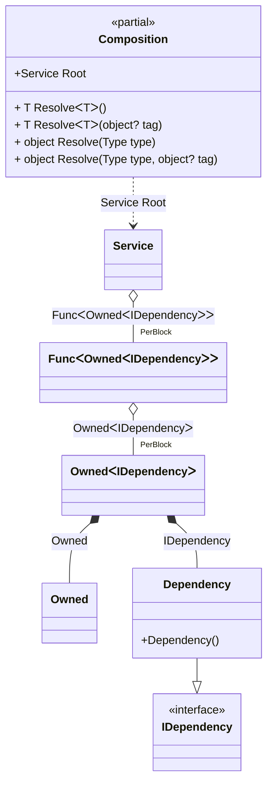

#### Tracking async disposable instances in delegates

[](../tests/Pure.DI.UsageTests/Advanced/TrackingAsyncDisposableInDelegatesScenario.cs)


```c#
interface IDependency
{
    bool IsDisposed { get; }
}

class Dependency : IDependency, IAsyncDisposable
{
    public bool IsDisposed { get; private set; }

    public ValueTask DisposeAsync()
    {
        IsDisposed = true;
        return ValueTask.CompletedTask;
    }
}

interface IService
{
    public IDependency Dependency { get; }
}

class Service(Func<Owned<IDependency>> dependencyFactory)
    : IService, IAsyncDisposable
{
    private readonly Owned<IDependency> _dependency = dependencyFactory();

    public IDependency Dependency => _dependency.Value;

    public ValueTask DisposeAsync()
    {
        return _dependency.DisposeAsync();
    }
}

partial class Composition
{
    static void Setup() =>
        DI.Setup()
            .Bind<IDependency>().To<Dependency>()
            .Bind().To<Service>()

            // Composition root
            .Root<Service>("Root");
}

var composition = new Composition();
var root1 = composition.Root;
var root2 = composition.Root;

await root2.DisposeAsync();

// Checks that the disposable instances
// associated with root1 have been disposed of
root2.Dependency.IsDisposed.ShouldBeTrue();

// Checks that the disposable instances
// associated with root2 have not been disposed of
root1.Dependency.IsDisposed.ShouldBeFalse();

await root1.DisposeAsync();

// Checks that the disposable instances
// associated with root2 have been disposed of
root1.Dependency.IsDisposed.ShouldBeTrue();
```

The following partial class will be generated:

```c#
partial class Composition
{
  private readonly Composition _root;
  private readonly Lock _lock;

  [OrdinalAttribute(20)]
  public Composition()
  {
    _root = this;
    _lock = new Lock();
  }

  internal Composition(Composition parentScope)
  {
    _root = (parentScope ?? throw new ArgumentNullException(nameof(parentScope)))._root;
    _lock = _root._lock;
  }

  public Service Root
  {
    [MethodImpl(MethodImplOptions.AggressiveInlining)]
    get
    {
      var accumulator47 = new Owned();
      Func<Owned<IDependency>> perBlockFunc1 = new Func<Owned<IDependency>>([MethodImpl(MethodImplOptions.AggressiveInlining)] () =>
      {
        var accumulator47 = new Owned();
        Dependency transientDependency4 = new Dependency();
        using (_lock.EnterScope())
        {
          accumulator47.Add(transientDependency4);
        }
        Owned<IDependency> perBlockOwned2;
        // Creates the owner of an instance
        Owned localOwned8 = accumulator47;
        IDependency localValue9 = transientDependency4;
        perBlockOwned2 = new Owned<IDependency>(localValue9, localOwned8);
        using (_lock.EnterScope())
        {
          accumulator47.Add(perBlockOwned2);
        }
        Owned<IDependency> localValue7 = perBlockOwned2;
        return localValue7;
      });
      Service transientService0 = new Service(perBlockFunc1);
      using (_lock.EnterScope())
      {
        accumulator47.Add(transientService0);
      }
      return transientService0;
    }
  }

  [MethodImpl(MethodImplOptions.AggressiveInlining)]
  public T Resolve<T>()
  {
    return Resolver<T>.Value.Resolve(this);
  }

  [MethodImpl(MethodImplOptions.AggressiveInlining)]
  public T Resolve<T>(object? tag)
  {
    return Resolver<T>.Value.ResolveByTag(this, tag);
  }

  [MethodImpl(MethodImplOptions.AggressiveInlining)]
  public object Resolve(Type type)
  {
    var index = (int)(_bucketSize * ((uint)RuntimeHelpers.GetHashCode(type) % 1));
    ref var pair = ref _buckets[index];
    return pair.Key == type ? pair.Value.Resolve(this) : Resolve(type, index);
  }

  [MethodImpl(MethodImplOptions.NoInlining)]
  private object Resolve(Type type, int index)
  {
    var finish = index + _bucketSize;
    while (++index < finish)
    {
      ref var pair = ref _buckets[index];
      if (pair.Key == type)
      {
        return pair.Value.Resolve(this);
      }
    }

    throw new InvalidOperationException($"{CannotResolveMessage} {OfTypeMessage} {type}.");
  }

  [MethodImpl(MethodImplOptions.AggressiveInlining)]
  public object Resolve(Type type, object? tag)
  {
    var index = (int)(_bucketSize * ((uint)RuntimeHelpers.GetHashCode(type) % 1));
    ref var pair = ref _buckets[index];
    return pair.Key == type ? pair.Value.ResolveByTag(this, tag) : Resolve(type, tag, index);
  }

  [MethodImpl(MethodImplOptions.NoInlining)]
  private object Resolve(Type type, object? tag, int index)
  {
    var finish = index + _bucketSize;
    while (++index < finish)
    {
      ref var pair = ref _buckets[index];
      if (pair.Key == type)
      {
        return pair.Value.ResolveByTag(this, tag);
      }
    }

    throw new InvalidOperationException($"{CannotResolveMessage} \"{tag}\" {OfTypeMessage} {type}.");
  }

  private readonly static int _bucketSize;
  private readonly static Pair<Type, IResolver<Composition, object>>[] _buckets;

  static Composition()
  {
    var valResolver_0000 = new Resolver_0000();
    Resolver<Service>.Value = valResolver_0000;
    _buckets = Buckets<Type, IResolver<Composition, object>>.Create(
      1,
      out _bucketSize,
      new Pair<Type, IResolver<Composition, object>>[1]
      {
         new Pair<Type, IResolver<Composition, object>>(typeof(Service), valResolver_0000)
      });
  }

  private const string CannotResolveMessage = "Cannot resolve composition root ";
  private const string OfTypeMessage = "of type ";

  private class Resolver<T>: IResolver<Composition, T>
  {
    public static IResolver<Composition, T> Value = new Resolver<T>();

    public virtual T Resolve(Composition composite)
    {
      throw new InvalidOperationException($"{CannotResolveMessage}{OfTypeMessage}{typeof(T)}.");
    }

    public virtual T ResolveByTag(Composition composite, object tag)
    {
      throw new InvalidOperationException($"{CannotResolveMessage}\"{tag}\" {OfTypeMessage}{typeof(T)}.");
    }
  }

  private sealed class Resolver_0000: Resolver<Service>
  {
    public override Service Resolve(Composition composition)
    {
      return composition.Root;
    }

    public override Service ResolveByTag(Composition composition, object tag)
    {
      switch (tag)
      {
        case null:
          return composition.Root;

        default:
          return base.ResolveByTag(composition, tag);
      }
    }
  }
}
```

Class diagram:



