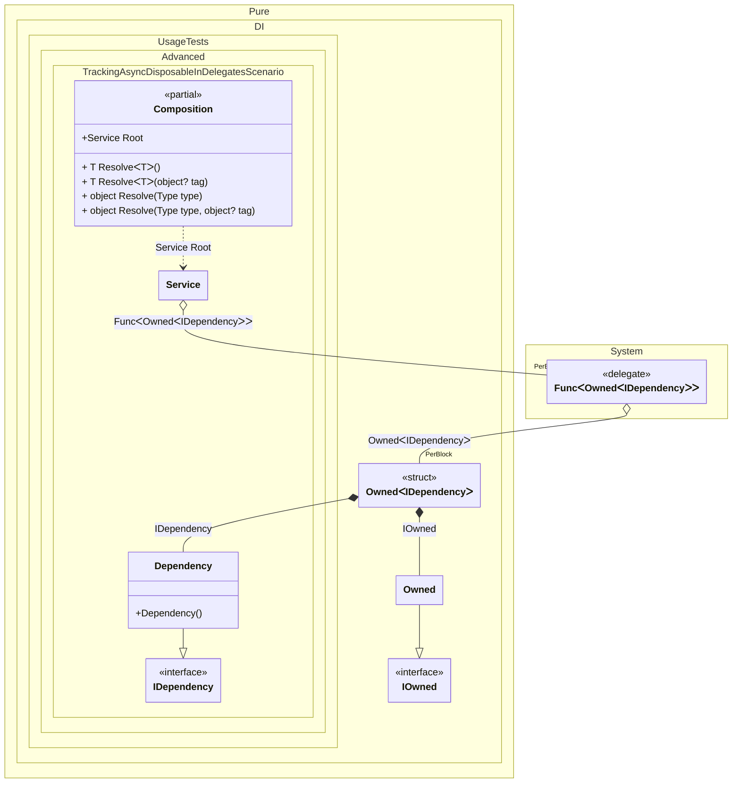

#### Tracking async disposable instances in delegates

[](../tests/Pure.DI.UsageTests/Advanced/TrackingAsyncDisposableInDelegatesScenario.cs)


```c#
using Shouldly;
using Pure.DI;

var composition = new Composition();
var root1 = composition.Root;
var root2 = composition.Root;

await root2.DisposeAsync();

// Checks that the disposable instances
// associated with root1 have been disposed of
root2.Dependency.IsDisposed.ShouldBeTrue();

// Checks that the disposable instances
// associated with root2 have not been disposed of
root1.Dependency.IsDisposed.ShouldBeFalse();

await root1.DisposeAsync();

// Checks that the disposable instances
// associated with root2 have been disposed of
root1.Dependency.IsDisposed.ShouldBeTrue();

interface IDependency
{
    bool IsDisposed { get; }
}

class Dependency : IDependency, IAsyncDisposable
{
    public bool IsDisposed { get; private set; }

    public ValueTask DisposeAsync()
    {
        IsDisposed = true;
        return ValueTask.CompletedTask;
    }
}

interface IService
{
    public IDependency Dependency { get; }
}

class Service(Func<Owned<IDependency>> dependencyFactory)
    : IService, IAsyncDisposable
{
    private readonly Owned<IDependency> _dependency = dependencyFactory();

    public IDependency Dependency => _dependency.Value;

    public ValueTask DisposeAsync()
    {
        return _dependency.DisposeAsync();
    }
}

partial class Composition
{
    static void Setup() =>
        DI.Setup()
            .Bind<IDependency>().To<Dependency>()
            .Bind().To<Service>()

            // Composition root
            .Root<Service>("Root");
}
```

<details>
<summary>Running this code sample locally</summary>

- Make sure you have the [.NET SDK 9.0](https://dotnet.microsoft.com/en-us/download/dotnet/9.0) or later is installed
- Create a net9.0 (or later) console application
- Add references to NuGet packages
  - [Pure.DI](https://www.nuget.org/packages/Pure.DI)
  - [Shouldly](https://www.nuget.org/packages/Shouldly)
- Copy the example code into the _Program.cs_ file

You are ready to run the example!

</details>


Class diagram:



