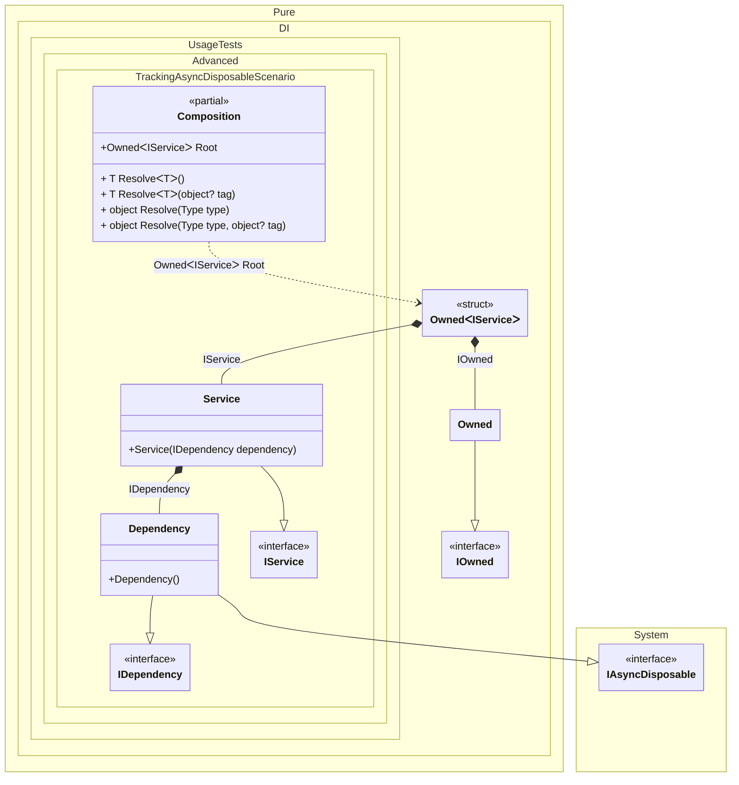

#### Tracking async disposable instances per a composition root


```c#
using Shouldly;
using Pure.DI;

var composition = new Composition();
var root1 = composition.Root;
var root2 = composition.Root;

await root2.DisposeAsync();

// Checks that the disposable instances
// associated with root1 have been disposed of
root2.Value.Dependency.IsDisposed.ShouldBeTrue();

// Checks that the disposable instances
// associated with root2 have not been disposed of
root1.Value.Dependency.IsDisposed.ShouldBeFalse();

await root1.DisposeAsync();

// Checks that the disposable instances
// associated with root2 have been disposed of
root1.Value.Dependency.IsDisposed.ShouldBeTrue();

interface IDependency
{
    bool IsDisposed { get; }
}

class Dependency : IDependency, IAsyncDisposable
{
    public bool IsDisposed { get; private set; }

    public ValueTask DisposeAsync()
    {
        IsDisposed = true;
        return ValueTask.CompletedTask;
    }
}

interface IService
{
    public IDependency Dependency { get; }
}

class Service(IDependency dependency) : IService
{
    public IDependency Dependency { get; } = dependency;
}

partial class Composition
{
    static void Setup() =>
        DI.Setup()

            .Bind().To<Dependency>()
            .Bind().To<Service>()

            // A special composition root
            // that allows to manage disposable dependencies
            .Root<Owned<IService>>("Root");
}
```

<details>
<summary>Running this code sample locally</summary>

- Make sure you have the [.NET SDK 9.0](https://dotnet.microsoft.com/en-us/download/dotnet/9.0) or later is installed
```bash
dotnet --list-sdk
```
- Create a net9.0 (or later) console application
```bash
dotnet new console -n Sample
```
- Add references to NuGet packages
  - [Pure.DI](https://www.nuget.org/packages/Pure.DI)
  - [Shouldly](https://www.nuget.org/packages/Shouldly)
```bash
dotnet add package Pure.DI
dotnet add package Shouldly
```
- Copy the example code into the _Program.cs_ file

You are ready to run the example 🚀
```bash
dotnet run
```

</details>

The following partial class will be generated:

```c#
partial class Composition
{
  private readonly Composition _root;
  private readonly Object _lock;

  [OrdinalAttribute(256)]
  public Composition()
  {
    _root = this;
    _lock = new Object();
  }

  internal Composition(Composition parentScope)
  {
    _root = (parentScope ?? throw new ArgumentNullException(nameof(parentScope)))._root;
    _lock = _root._lock;
  }

  public Owned<IService> Root
  {
    [MethodImpl(MethodImplOptions.AggressiveInlining)]
    get
    {
      var accumulator54 = new Owned();
      Owned transientOwned1;
      Owned localOwned52 = accumulator54;
      transientOwned1 = localOwned52;
      lock (_lock)
      {
        accumulator54.Add(transientOwned1);
      }

      Dependency transientDependency3 = new Dependency();
      lock (_lock)
      {
        accumulator54.Add(transientDependency3);
      }

      Owned<IService> perBlockOwned0;
      // Creates the owner of an instance
      IOwned localOwned53 = transientOwned1;
      IService localValue54 = new Service(transientDependency3);
      perBlockOwned0 = new Owned<IService>(localValue54, localOwned53);
      lock (_lock)
      {
        accumulator54.Add(perBlockOwned0);
      }

      return perBlockOwned0;
    }
  }

  [MethodImpl(MethodImplOptions.AggressiveInlining)]
  public T Resolve<T>()
  {
    return Resolver<T>.Value.Resolve(this);
  }

  [MethodImpl(MethodImplOptions.AggressiveInlining)]
  public T Resolve<T>(object? tag)
  {
    return Resolver<T>.Value.ResolveByTag(this, tag);
  }

  [MethodImpl(MethodImplOptions.AggressiveInlining)]
  public object Resolve(Type type)
  {
    var index = (int)(_bucketSize * ((uint)RuntimeHelpers.GetHashCode(type) % 1));
    ref var pair = ref _buckets[index];
    return pair.Key == type ? pair.Value.Resolve(this) : Resolve(type, index);
  }

  [MethodImpl(MethodImplOptions.NoInlining)]
  private object Resolve(Type type, int index)
  {
    var finish = index + _bucketSize;
    while (++index < finish)
    {
      ref var pair = ref _buckets[index];
      if (pair.Key == type)
      {
        return pair.Value.Resolve(this);
      }
    }

    throw new InvalidOperationException($"{CannotResolveMessage} {OfTypeMessage} {type}.");
  }

  [MethodImpl(MethodImplOptions.AggressiveInlining)]
  public object Resolve(Type type, object? tag)
  {
    var index = (int)(_bucketSize * ((uint)RuntimeHelpers.GetHashCode(type) % 1));
    ref var pair = ref _buckets[index];
    return pair.Key == type ? pair.Value.ResolveByTag(this, tag) : Resolve(type, tag, index);
  }

  [MethodImpl(MethodImplOptions.NoInlining)]
  private object Resolve(Type type, object? tag, int index)
  {
    var finish = index + _bucketSize;
    while (++index < finish)
    {
      ref var pair = ref _buckets[index];
      if (pair.Key == type)
      {
        return pair.Value.ResolveByTag(this, tag);
      }
    }

    throw new InvalidOperationException($"{CannotResolveMessage} \"{tag}\" {OfTypeMessage} {type}.");
  }

  private readonly static int _bucketSize;
  private readonly static Pair<Type, IResolver<Composition, object>>[] _buckets;

  static Composition()
  {
    var valResolver_0000 = new Resolver_0000();
    Resolver<Owned<IService>>.Value = valResolver_0000;
    _buckets = Buckets<Type, IResolver<Composition, object>>.Create(
      1,
      out _bucketSize,
      new Pair<Type, IResolver<Composition, object>>[1]
      {
         new Pair<Type, IResolver<Composition, object>>(typeof(Owned<IService>), valResolver_0000)
      });
  }

  private const string CannotResolveMessage = "Cannot resolve composition root ";
  private const string OfTypeMessage = "of type ";

  private class Resolver<T>: IResolver<Composition, T>
  {
    public static IResolver<Composition, T> Value = new Resolver<T>();

    public virtual T Resolve(Composition composite)
    {
      throw new InvalidOperationException($"{CannotResolveMessage}{OfTypeMessage}{typeof(T)}.");
    }

    public virtual T ResolveByTag(Composition composite, object tag)
    {
      throw new InvalidOperationException($"{CannotResolveMessage}\"{tag}\" {OfTypeMessage}{typeof(T)}.");
    }
  }

  private sealed class Resolver_0000: Resolver<Owned<IService>>, IResolver<Composition, object>
  {
    public override Owned<IService> Resolve(Composition composition)
    {
      return composition.Root;
    }

    public override Owned<IService> ResolveByTag(Composition composition, object tag)
    {
      switch (tag)
      {
        case null:
          return composition.Root;

        default:
          return base.ResolveByTag(composition, tag);
      }
    }
    object IResolver<Composition, object>.Resolve(Composition composition)
    {
      return Resolve(composition);
    }

    object IResolver<Composition, object>.ResolveByTag(Composition composition, object tag)
    {
      return ResolveByTag(composition, tag);
    }
  }
}
```

Class diagram:



