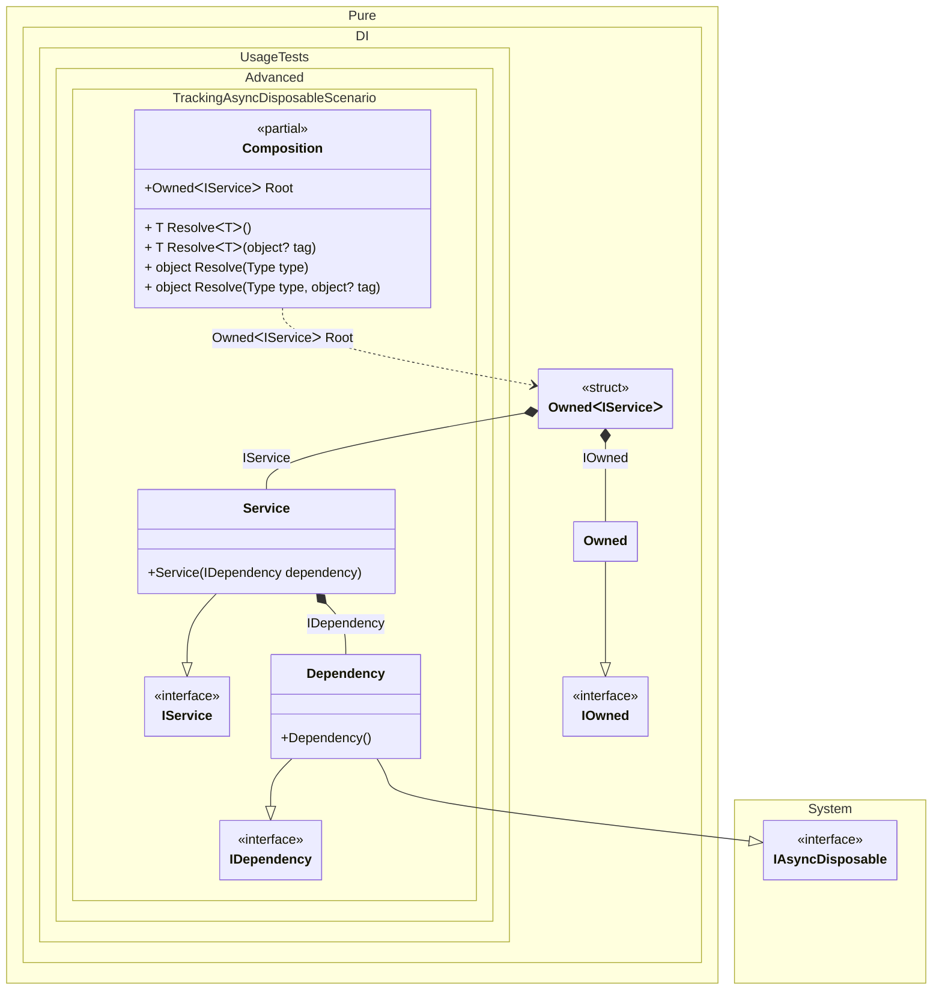

#### Tracking async disposable instances per a composition root

[](../tests/Pure.DI.UsageTests/Advanced/TrackingAsyncDisposableScenario.cs)


```c#
interface IDependency
{
    bool IsDisposed { get; }
}

class Dependency : IDependency, IAsyncDisposable
{
    public bool IsDisposed { get; private set; }

    public ValueTask DisposeAsync()
    {
        IsDisposed = true;
        return ValueTask.CompletedTask;
    }
}

interface IService
{
    public IDependency Dependency { get; }
}

class Service(IDependency dependency) : IService
{
    public IDependency Dependency { get; } = dependency;
}

partial class Composition
{
    static void Setup() =>
        DI.Setup()
            .Bind().To<Dependency>()
            .Bind().To<Service>()

            // A special composition root
            // that allows to manage disposable dependencies
            .Root<Owned<IService>>("Root");
}

var composition = new Composition();
var root1 = composition.Root;
var root2 = composition.Root;

await root2.DisposeAsync();

// Checks that the disposable instances
// associated with root1 have been disposed of
root2.Value.Dependency.IsDisposed.ShouldBeTrue();

// Checks that the disposable instances
// associated with root2 have not been disposed of
root1.Value.Dependency.IsDisposed.ShouldBeFalse();

await root1.DisposeAsync();

// Checks that the disposable instances
// associated with root2 have been disposed of
root1.Value.Dependency.IsDisposed.ShouldBeTrue();
```

The following partial class will be generated:

```c#
partial class Composition
{
  private readonly Composition _root;
  private readonly Lock _lock;

  [OrdinalAttribute(256)]
  public Composition()
  {
    _root = this;
    _lock = new Lock();
  }

  internal Composition(Composition parentScope)
  {
    _root = (parentScope ?? throw new ArgumentNullException(nameof(parentScope)))._root;
    _lock = _root._lock;
  }

  public Owned<IService> Root
  {
    [MethodImpl(MethodImplOptions.AggressiveInlining)]
    get
    {
      var accumulator46 = new Owned();
      Dependency transientDependency3 = new Dependency();
      using (_lock.EnterScope())
      {
        accumulator46.Add(transientDependency3);
      }
      Owned<IService> perBlockOwned0;
      // Creates the owner of an instance
      Owned transientOwned1;
      Owned localOwned17 = accumulator46;
      transientOwned1 = localOwned17;
      using (_lock.EnterScope())
      {
        accumulator46.Add(transientOwned1);
      }
      IOwned localOwned15 = transientOwned1;
      IService localValue16 = new Service(transientDependency3);
      perBlockOwned0 = new Owned<IService>(localValue16, localOwned15);
      using (_lock.EnterScope())
      {
        accumulator46.Add(perBlockOwned0);
      }
      return perBlockOwned0;
    }
  }

  [MethodImpl(MethodImplOptions.AggressiveInlining)]
  public T Resolve<T>()
  {
    return Resolver<T>.Value.Resolve(this);
  }

  [MethodImpl(MethodImplOptions.AggressiveInlining)]
  public T Resolve<T>(object? tag)
  {
    return Resolver<T>.Value.ResolveByTag(this, tag);
  }

  [MethodImpl(MethodImplOptions.AggressiveInlining)]
  public object Resolve(Type type)
  {
    throw new InvalidOperationException($"{CannotResolveMessage} {OfTypeMessage} {type}.");
  }

  [MethodImpl(MethodImplOptions.AggressiveInlining)]
  public object Resolve(Type type, object? tag)
  {
    throw new InvalidOperationException($"{CannotResolveMessage} \"{tag}\" {OfTypeMessage} {type}.");
  }

  private const string CannotResolveMessage = "Cannot resolve composition root ";
  private const string OfTypeMessage = "of type ";

  private class Resolver<T>: IResolver<Composition, T>
  {
    public static IResolver<Composition, T> Value = new Resolver<T>();

    public virtual T Resolve(Composition composite)
    {
      throw new InvalidOperationException($"{CannotResolveMessage}{OfTypeMessage}{typeof(T)}.");
    }

    public virtual T ResolveByTag(Composition composite, object tag)
    {
      throw new InvalidOperationException($"{CannotResolveMessage}\"{tag}\" {OfTypeMessage}{typeof(T)}.");
    }
  }
}
```

Class diagram:



