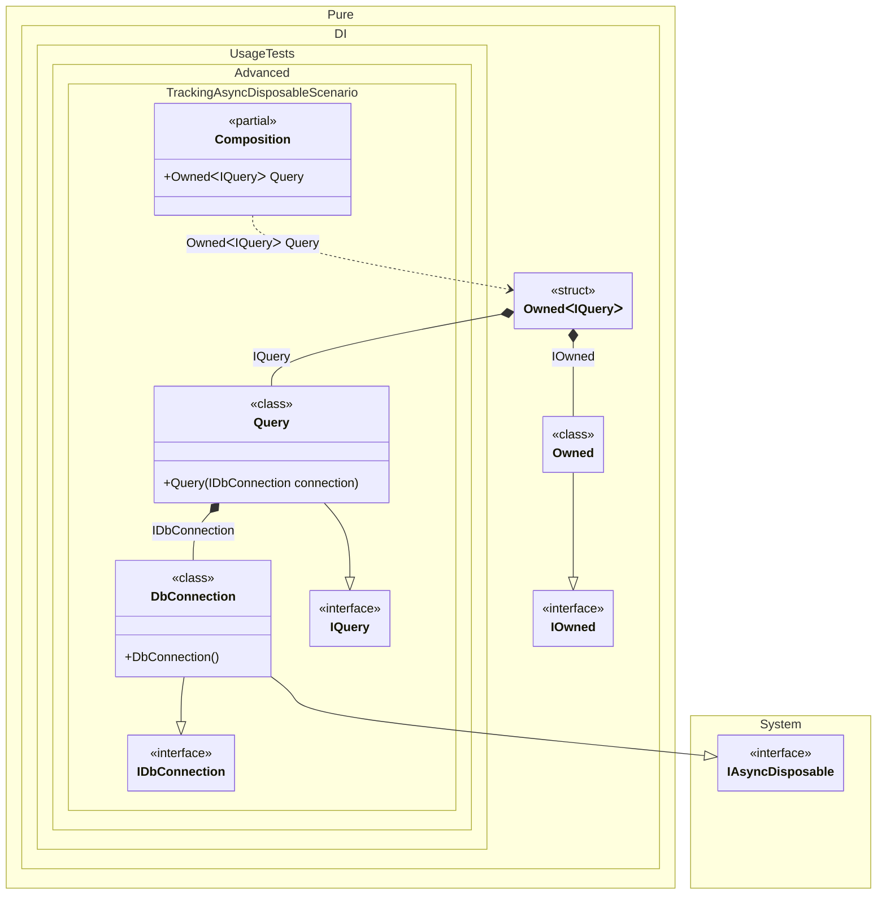

#### Tracking async disposable instances per a composition root

Demonstrates how async disposable instances are tracked per composition root and disposed asynchronously when the composition is disposed.


```c#
using Shouldly;
using Pure.DI;

var composition = new Composition();
// Creates two independent roots (queries), each with its own dependency graph
var query1 = composition.Query;
var query2 = composition.Query;

// Disposes of the second query
await query2.DisposeAsync();

// Checks that the connection associated with the second query has been closed
query2.Value.Connection.IsDisposed.ShouldBeTrue();

// At the same time, the connection of the first query remains active
query1.Value.Connection.IsDisposed.ShouldBeFalse();

// Disposes of the first query
await query1.DisposeAsync();

// Now the first connection is also closed
query1.Value.Connection.IsDisposed.ShouldBeTrue();

// Interface for a resource requiring asynchronous disposal (e.g., DB)
interface IDbConnection
{
    bool IsDisposed { get; }
}

class DbConnection : IDbConnection, IAsyncDisposable
{
    public bool IsDisposed { get; private set; }

    public ValueTask DisposeAsync()
    {
        IsDisposed = true;
        return ValueTask.CompletedTask;
    }
}

interface IQuery
{
    public IDbConnection Connection { get; }
}

class Query(IDbConnection connection) : IQuery
{
    public IDbConnection Connection { get; } = connection;
}

partial class Composition
{
    static void Setup() =>

        DI.Setup()
            .Bind().To<DbConnection>()
            .Bind().To<Query>()

            // A special composition root 'Owned' that allows
            // managing the lifetime of IQuery and its dependencies
            .Root<Owned<IQuery>>("Query");
}
```

<details>
<summary>Running this code sample locally</summary>

- Make sure you have the [.NET SDK 10.0](https://dotnet.microsoft.com/en-us/download/dotnet/10.0) or later installed
```bash
dotnet --list-sdk
```
- Create a net10.0 (or later) console application
```bash
dotnet new console -n Sample
```
- Add references to the NuGet packages
  - [Pure.DI](https://www.nuget.org/packages/Pure.DI)
  - [Shouldly](https://www.nuget.org/packages/Shouldly)
```bash
dotnet add package Pure.DI
dotnet add package Shouldly
```
- Copy the example code into the _Program.cs_ file

You are ready to run the example 🚀
```bash
dotnet run
```

</details>

>[!NOTE]
>Async disposable tracking ensures proper async cleanup of all disposable instances within a composition scope.

The following partial class will be generated:

```c#
partial class Composition
{
#if NET9_0_OR_GREATER
  private readonly Lock _lock = new Lock();
#else
  private readonly Object _lock = new Object();
#endif

  public Owned<IQuery> Query
  {
    [MethodImpl(MethodImplOptions.AggressiveInlining)]
    get
    {
      var perBlockOwned145 = new Owned();
      Owned<IQuery> perBlockOwned144;
      // Creates the owner of an instance
      Owned transientOwned146;
      Owned localOwned3 = perBlockOwned145;
      transientOwned146 = localOwned3;
      lock (_lock)
      {
        perBlockOwned145.Add(transientOwned146);
      }

      IOwned localOwned2 = transientOwned146;
      var transientDbConnection148 = new DbConnection();
      lock (_lock)
      {
        perBlockOwned145.Add(transientDbConnection148);
      }

      IQuery localValue7 = new Query(transientDbConnection148);
      perBlockOwned144 = new Owned<IQuery>(localValue7, localOwned2);
      lock (_lock)
      {
        perBlockOwned145.Add(perBlockOwned144);
      }

      return perBlockOwned144;
    }
  }
}
```

Class diagram:


```mermaid
---
 config:
  maxTextSize: 2147483647
  maxEdges: 2147483647
  class:
   hideEmptyMembersBox: true
---
classDiagram
	Owned --|> IOwned
	DbConnection --|> IDbConnection
	DbConnection --|> IAsyncDisposable
	Query --|> IQuery
	Composition ..> OwnedᐸIQueryᐳ : OwnedᐸIQueryᐳ Query
	Query *--  DbConnection : IDbConnection
	OwnedᐸIQueryᐳ *--  Owned : IOwned
	OwnedᐸIQueryᐳ *--  Query : IQuery
	namespace Pure.DI {
		class IOwned {
			<<interface>>
		}
		class Owned {
				<<class>>
		}
		class OwnedᐸIQueryᐳ {
				<<struct>>
		}
	}
	namespace Pure.DI.UsageTests.Advanced.TrackingAsyncDisposableScenario {
		class Composition {
		<<partial>>
		+OwnedᐸIQueryᐳ Query
		}
		class DbConnection {
				<<class>>
			+DbConnection()
		}
		class IDbConnection {
			<<interface>>
		}
		class IQuery {
			<<interface>>
		}
		class Query {
				<<class>>
			+Query(IDbConnection connection)
		}
	}
	namespace System {
		class IAsyncDisposable {
			<<interface>>
		}
	}
```

