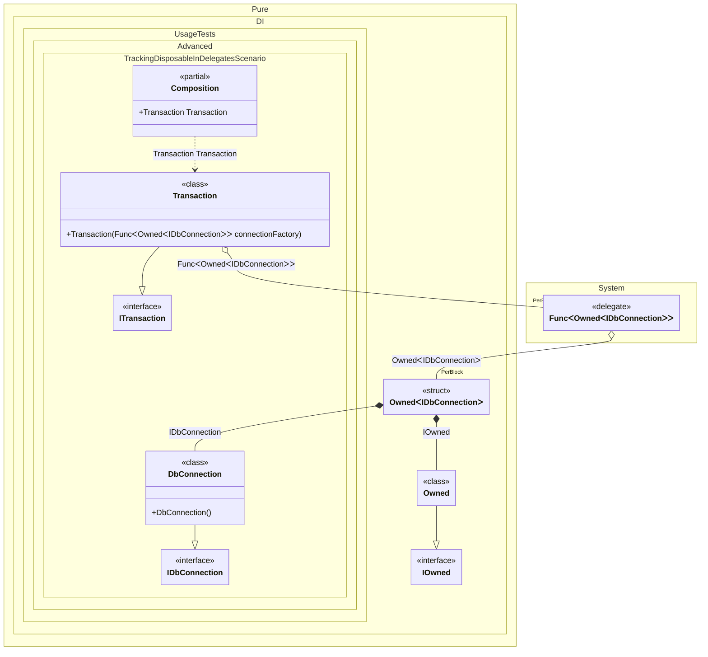

#### Tracking disposable instances in delegates


```c#
using Shouldly;
using Pure.DI;

var composition = new Composition();
var transaction1 = composition.Transaction;
var transaction2 = composition.Transaction;

transaction2.Dispose();

// Checks that the disposable instances
// associated with transaction2 have been disposed of
transaction2.Connection.IsDisposed.ShouldBeTrue();

// Checks that the disposable instances
// associated with transaction1 have not been disposed of
transaction1.Connection.IsDisposed.ShouldBeFalse();

transaction1.Dispose();

// Checks that the disposable instances
// associated with transaction1 have been disposed of
transaction1.Connection.IsDisposed.ShouldBeTrue();

interface IDbConnection
{
    bool IsDisposed { get; }
}

class DbConnection : IDbConnection, IDisposable
{
    public bool IsDisposed { get; private set; }

    public void Dispose() => IsDisposed = true;
}

interface ITransaction
{
    IDbConnection Connection { get; }
}

class Transaction(Func<Owned<IDbConnection>> connectionFactory)
    : ITransaction, IDisposable
{
    private readonly Owned<IDbConnection> _connection = connectionFactory();

    public IDbConnection Connection => _connection.Value;

    public void Dispose() => _connection.Dispose();
}

partial class Composition
{
    static void Setup() =>

        DI.Setup()
            .Bind().To<DbConnection>()
            .Bind().To<Transaction>()

            // Composition root
            .Root<Transaction>("Transaction");
}
```

<details>
<summary>Running this code sample locally</summary>

- Make sure you have the [.NET SDK 10.0](https://dotnet.microsoft.com/en-us/download/dotnet/10.0) or later is installed
```bash
dotnet --list-sdk
```
- Create a net10.0 (or later) console application
```bash
dotnet new console -n Sample
```
- Add references to NuGet packages
  - [Pure.DI](https://www.nuget.org/packages/Pure.DI)
  - [Shouldly](https://www.nuget.org/packages/Shouldly)
```bash
dotnet add package Pure.DI
dotnet add package Shouldly
```
- Copy the example code into the _Program.cs_ file

You are ready to run the example 🚀
```bash
dotnet run
```

</details>

The following partial class will be generated:

```c#
partial class Composition
{
#if NET9_0_OR_GREATER
  private readonly Lock _lock;
#else
  private readonly Object _lock;
#endif

  [OrdinalAttribute(256)]
  public Composition()
  {
#if NET9_0_OR_GREATER
    _lock = new Lock();
#else
    _lock = new Object();
#endif
  }

  internal Composition(Composition parentScope)
  {
    _lock = parentScope._lock;
  }

  public Transaction Transaction
  {
    [MethodImpl(MethodImplOptions.AggressiveInlining)]
    get
    {
      var perBlockOwned2 = new Owned();
      Func<Owned<IDbConnection>> transientFunc1 = new Func<Owned<IDbConnection>>(
      [MethodImpl(MethodImplOptions.AggressiveInlining)]
      () =>
      {
        Owned<IDbConnection> transientOwned3;
        // Creates the owner of an instance
        Owned transientOwned4;
        Owned localOwned5 = perBlockOwned2;
        transientOwned4 = localOwned5;
        lock (_lock)
        {
          perBlockOwned2.Add(transientOwned4);
        }

        IOwned localOwned4 = transientOwned4;
        var transientDbConnection5 = new DbConnection();
        lock (_lock)
        {
          perBlockOwned2.Add(transientDbConnection5);
        }

        IDbConnection localValue5 = transientDbConnection5;
        transientOwned3 = new Owned<IDbConnection>(localValue5, localOwned4);
        lock (_lock)
        {
          perBlockOwned2.Add(transientOwned3);
        }

        Owned<IDbConnection> localValue4 = transientOwned3;
        return localValue4;
      });
      return new Transaction(transientFunc1);
    }
  }
}
```

Class diagram:



