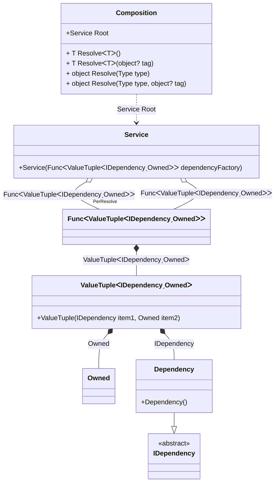

#### Tracking disposable instances in delegates

[](../tests/Pure.DI.UsageTests/Basics/TrackingDisposableInDelegatesScenario.cs)

```c#
interface IDependency
{
    bool IsDisposed { get; }
}

class Dependency : IDependency, IDisposable
{
    public bool IsDisposed { get; private set; }

    public void Dispose() => IsDisposed = true;
}

interface IService
{
    public IDependency Dependency { get; }
}

class Service(Func<(IDependency dependency, Owned owned)> dependencyFactory)
    : IService, IDisposable
{
    private readonly (IDependency value, Owned owned) _dependency = dependencyFactory();

    public IDependency Dependency => _dependency.value;

    public void Dispose() => _dependency.owned.Dispose();
}

partial class Composition
{
    private void Setup() =>
        DI.Setup(nameof(Composition))
            .Bind<IDependency>().To<Dependency>()
            .Bind<IService>().To<Service>()
            .Root<Service>("Root");
}

var composition = new Composition();

var root1 = composition.Root;
var root2 = composition.Root;
        
root2.Dispose();
        
// Checks that the disposable instances
// associated with root1 have been disposed of
root2.Dependency.IsDisposed.ShouldBeTrue();
        
// Checks that the disposable instances
// associated with root2 have not been disposed of
root1.Dependency.IsDisposed.ShouldBeFalse();
        
root1.Dispose();
        
// Checks that the disposable instances
// associated with root2 have been disposed of
root1.Dependency.IsDisposed.ShouldBeTrue();
```

<details open>
<summary>Class Diagram</summary>



</details>

<details>
<summary>Pure.DI-generated partial class Composition</summary><blockquote>

```c#
partial class Composition
{
  private readonly Composition _rootM03D20di;
  private readonly object _lockM03D20di;
  
  public Composition()
  {
    _rootM03D20di = this;
    _lockM03D20di = new object();
  }
  
  internal Composition(Composition baseComposition)
  {
    _rootM03D20di = baseComposition._rootM03D20di;
    _lockM03D20di = _rootM03D20di._lockM03D20di;
  }
  
  public Pure.DI.UsageTests.Basics.TrackingDisposableInDelegatesScenario.Service Root
  {
    get
    {
      var perResolveM03D20di41_Func = default(System.Func<(Pure.DI.UsageTests.Basics.TrackingDisposableInDelegatesScenario.IDependency dependency, Pure.DI.Owned owned)>);
      perResolveM03D20di41_Func = new global::System.Func<(Pure.DI.UsageTests.Basics.TrackingDisposableInDelegatesScenario.IDependency dependency, Pure.DI.Owned owned)>(
      [global::System.Runtime.CompilerServices.MethodImpl((global::System.Runtime.CompilerServices.MethodImplOptions)768)]
      () =>
      {
          var accumulatorM03D20di40 = new Pure.DI.Owned();
          Pure.DI.UsageTests.Basics.TrackingDisposableInDelegatesScenario.Dependency transientM03D20di2_Dependency = new Pure.DI.UsageTests.Basics.TrackingDisposableInDelegatesScenario.Dependency();
          accumulatorM03D20di40.Add(transientM03D20di2_Dependency);
          var factory_M03D20di1 = (transientM03D20di2_Dependency, accumulatorM03D20di40);
          return factory_M03D20di1;
      });
      return new Pure.DI.UsageTests.Basics.TrackingDisposableInDelegatesScenario.Service(perResolveM03D20di41_Func);
    }
  }
  
  public T Resolve<T>()
  {
    return ResolverM03D20di<T>.Value.Resolve(this);
  }
  
  public T Resolve<T>(object? tag)
  {
    return ResolverM03D20di<T>.Value.ResolveByTag(this, tag);
  }
  
  public object Resolve(global::System.Type type)
  {
    var index = (int)(_bucketSizeM03D20di * ((uint)global::System.Runtime.CompilerServices.RuntimeHelpers.GetHashCode(type) % 1));
    var finish = index + _bucketSizeM03D20di;
    do {
      ref var pair = ref _bucketsM03D20di[index];
      if (ReferenceEquals(pair.Key, type))
      {
        return pair.Value.Resolve(this);
      }
    } while (++index < finish);
    
    throw new global::System.InvalidOperationException($"Cannot resolve composition root of type {type}.");
  }
  
  public object Resolve(global::System.Type type, object? tag)
  {
    var index = (int)(_bucketSizeM03D20di * ((uint)global::System.Runtime.CompilerServices.RuntimeHelpers.GetHashCode(type) % 1));
    var finish = index + _bucketSizeM03D20di;
    do {
      ref var pair = ref _bucketsM03D20di[index];
      if (ReferenceEquals(pair.Key, type))
      {
        return pair.Value.ResolveByTag(this, tag);
      }
    } while (++index < finish);
    
    throw new global::System.InvalidOperationException($"Cannot resolve composition root \"{tag}\" of type {type}.");
  }
  
  public override string ToString()
  {
    return
      "classDiagram\n" +
        "  class Composition {\n" +
          "    +Service Root\n" +
          "    + T ResolveᐸTᐳ()\n" +
          "    + T ResolveᐸTᐳ(object? tag)\n" +
          "    + object Resolve(Type type)\n" +
          "    + object Resolve(Type type, object? tag)\n" +
        "  }\n" +
        "  class Owned\n" +
        "  class ValueTupleᐸIDependencyˏOwnedᐳ {\n" +
          "    +ValueTuple(IDependency item1, Owned item2)\n" +
        "  }\n" +
        "  class Service {\n" +
          "    +Service(FuncᐸValueTupleᐸIDependencyˏOwnedᐳᐳ dependencyFactory)\n" +
        "  }\n" +
        "  Dependency --|> IDependency : \n" +
        "  class Dependency {\n" +
          "    +Dependency()\n" +
        "  }\n" +
        "  class FuncᐸValueTupleᐸIDependencyˏOwnedᐳᐳ\n" +
        "  class IDependency {\n" +
          "    <<abstract>>\n" +
        "  }\n" +
        "  ValueTupleᐸIDependencyˏOwnedᐳ *--  Dependency : IDependency\n" +
        "  ValueTupleᐸIDependencyˏOwnedᐳ *--  Owned : Owned\n" +
        "  Service o--  \"PerResolve\" FuncᐸValueTupleᐸIDependencyˏOwnedᐳᐳ : FuncᐸValueTupleᐸIDependencyˏOwnedᐳᐳ\n" +
        "  Service o--  \"PerResolve\" FuncᐸValueTupleᐸIDependencyˏOwnedᐳᐳ : FuncᐸValueTupleᐸIDependencyˏOwnedᐳᐳ\n" +
        "  Composition ..> Service : Service Root\n" +
        "  FuncᐸValueTupleᐸIDependencyˏOwnedᐳᐳ *--  ValueTupleᐸIDependencyˏOwnedᐳ : ValueTupleᐸIDependencyˏOwnedᐳ";
  }
  
  private readonly static int _bucketSizeM03D20di;
  private readonly static global::Pure.DI.Pair<global::System.Type, global::Pure.DI.IResolver<Composition, object>>[] _bucketsM03D20di;
  
  static Composition()
  {
    var valResolverM03D20di_0000 = new ResolverM03D20di_0000();
    ResolverM03D20di<Pure.DI.UsageTests.Basics.TrackingDisposableInDelegatesScenario.Service>.Value = valResolverM03D20di_0000;
    _bucketsM03D20di = global::Pure.DI.Buckets<global::System.Type, global::Pure.DI.IResolver<Composition, object>>.Create(
      1,
      out _bucketSizeM03D20di,
      new global::Pure.DI.Pair<global::System.Type, global::Pure.DI.IResolver<Composition, object>>[1]
      {
         new global::Pure.DI.Pair<global::System.Type, global::Pure.DI.IResolver<Composition, object>>(typeof(Pure.DI.UsageTests.Basics.TrackingDisposableInDelegatesScenario.Service), valResolverM03D20di_0000)
      });
  }
  
  private sealed class ResolverM03D20di<T>: global::Pure.DI.IResolver<Composition, T>
  {
    public static global::Pure.DI.IResolver<Composition, T> Value = new ResolverM03D20di<T>();
    
    public T Resolve(Composition composite)
    {
      throw new global::System.InvalidOperationException($"Cannot resolve composition root of type {typeof(T)}.");
    }
    
    public T ResolveByTag(Composition composite, object tag)
    {
      throw new global::System.InvalidOperationException($"Cannot resolve composition root \"{tag}\" of type {typeof(T)}.");
    }
  }
  
  private sealed class ResolverM03D20di_0000: global::Pure.DI.IResolver<Composition, Pure.DI.UsageTests.Basics.TrackingDisposableInDelegatesScenario.Service>
  {
    public Pure.DI.UsageTests.Basics.TrackingDisposableInDelegatesScenario.Service Resolve(Composition composition)
    {
      return composition.Root;
    }
    
    public Pure.DI.UsageTests.Basics.TrackingDisposableInDelegatesScenario.Service ResolveByTag(Composition composition, object tag)
    {
      switch (tag)
      {
        case null:
          return composition.Root;
      }
      throw new global::System.InvalidOperationException($"Cannot resolve composition root \"{tag}\" of type Pure.DI.UsageTests.Basics.TrackingDisposableInDelegatesScenario.Service.");
    }
  }
}
```

</blockquote></details>

