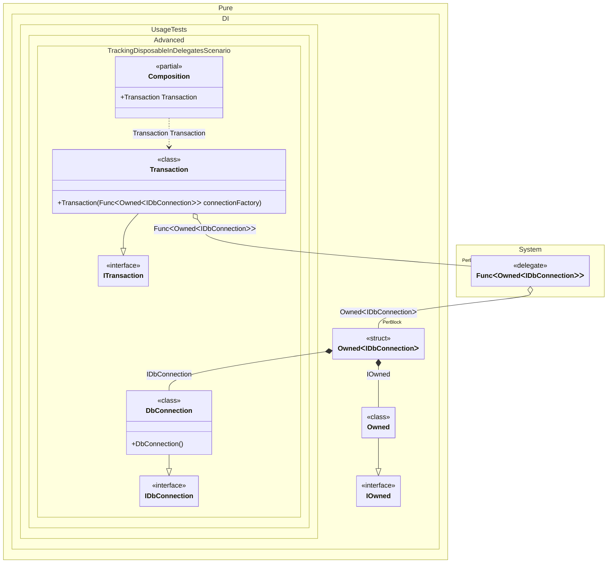

#### Tracking disposable instances in delegates

Demonstrates how disposable instances created within delegate factories are tracked and disposed properly when the composition is disposed.


```c#
using Shouldly;
using Pure.DI;

var composition = new Composition();
var transaction1 = composition.Transaction;
var transaction2 = composition.Transaction;

transaction2.Dispose();

// Checks that the disposable instances
// associated with transaction2 have been disposed of
transaction2.Connection.IsDisposed.ShouldBeTrue();

// Checks that the disposable instances
// associated with transaction1 have not been disposed of
transaction1.Connection.IsDisposed.ShouldBeFalse();

transaction1.Dispose();

// Checks that the disposable instances
// associated with transaction1 have been disposed of
transaction1.Connection.IsDisposed.ShouldBeTrue();

interface IDbConnection
{
    bool IsDisposed { get; }
}

class DbConnection : IDbConnection, IDisposable
{
    public bool IsDisposed { get; private set; }

    public void Dispose() => IsDisposed = true;
}

interface ITransaction
{
    IDbConnection Connection { get; }
}

class Transaction(Func<Owned<IDbConnection>> connectionFactory)
    : ITransaction, IDisposable
{
    private readonly Owned<IDbConnection> _connection = connectionFactory();

    public IDbConnection Connection => _connection.Value;

    public void Dispose() => _connection.Dispose();
}

partial class Composition
{
    static void Setup() =>

        DI.Setup()
            .Bind().To<DbConnection>()
            .Bind().To<Transaction>()

            // Composition root
            .Root<Transaction>("Transaction");
}
```

<details>
<summary>Running this code sample locally</summary>

- Make sure you have the [.NET SDK 10.0](https://dotnet.microsoft.com/en-us/download/dotnet/10.0) or later installed
```bash
dotnet --list-sdk
```
- Create a net10.0 (or later) console application
```bash
dotnet new console -n Sample
```
- Add references to the NuGet packages
  - [Pure.DI](https://www.nuget.org/packages/Pure.DI)
  - [Shouldly](https://www.nuget.org/packages/Shouldly)
```bash
dotnet add package Pure.DI
dotnet add package Shouldly
```
- Copy the example code into the _Program.cs_ file

You are ready to run the example 🚀
```bash
dotnet run
```

</details>

>[!NOTE]
>Disposable tracking in delegates ensures proper cleanup even when instances are created dynamically through factory delegates.

The following partial class will be generated:

```c#
partial class Composition
{
#if NET9_0_OR_GREATER
  private readonly Lock _lock = new Lock();
#else
  private readonly Object _lock = new Object();
#endif

  public Transaction Transaction
  {
    [MethodImpl(MethodImplOptions.AggressiveInlining)]
    get
    {
      var perBlockOwned164 = new Owned();
      Func<Owned<IDbConnection>> perBlockFunc163 = new Func<Owned<IDbConnection>>(
      [MethodImpl(MethodImplOptions.AggressiveInlining)]
      () =>
      {
        Owned<IDbConnection> perBlockOwned165;
        // Creates the owner of an instance
        Owned transientOwned166;
        Owned localOwned5 = perBlockOwned164;
        transientOwned166 = localOwned5;
        lock (_lock)
        {
          perBlockOwned164.Add(transientOwned166);
        }

        IOwned localOwned4 = transientOwned166;
        var transientDbConnection167 = new DbConnection();
        lock (_lock)
        {
          perBlockOwned164.Add(transientDbConnection167);
        }

        IDbConnection localValue9 = transientDbConnection167;
        perBlockOwned165 = new Owned<IDbConnection>(localValue9, localOwned4);
        lock (_lock)
        {
          perBlockOwned164.Add(perBlockOwned165);
        }

        return perBlockOwned165;
      });
      return new Transaction(perBlockFunc163);
    }
  }
}
```

Class diagram:


```mermaid
---
 config:
  maxTextSize: 2147483647
  maxEdges: 2147483647
  class:
   hideEmptyMembersBox: true
---
classDiagram
	Owned --|> IOwned
	DbConnection --|> IDbConnection
	Transaction --|> ITransaction
	Composition ..> Transaction : Transaction Transaction
	Transaction o-- "PerBlock" FuncᐸOwnedᐸIDbConnectionᐳᐳ : FuncᐸOwnedᐸIDbConnectionᐳᐳ
	FuncᐸOwnedᐸIDbConnectionᐳᐳ o-- "PerBlock" OwnedᐸIDbConnectionᐳ : OwnedᐸIDbConnectionᐳ
	OwnedᐸIDbConnectionᐳ *--  Owned : IOwned
	OwnedᐸIDbConnectionᐳ *--  DbConnection : IDbConnection
	namespace Pure.DI {
		class IOwned {
			<<interface>>
		}
		class Owned {
				<<class>>
		}
		class OwnedᐸIDbConnectionᐳ {
				<<struct>>
		}
	}
	namespace Pure.DI.UsageTests.Advanced.TrackingDisposableInDelegatesScenario {
		class Composition {
		<<partial>>
		+Transaction Transaction
		}
		class DbConnection {
				<<class>>
			+DbConnection()
		}
		class IDbConnection {
			<<interface>>
		}
		class ITransaction {
			<<interface>>
		}
		class Transaction {
				<<class>>
			+Transaction(FuncᐸOwnedᐸIDbConnectionᐳᐳ connectionFactory)
		}
	}
	namespace System {
		class FuncᐸOwnedᐸIDbConnectionᐳᐳ {
				<<delegate>>
		}
	}
```

