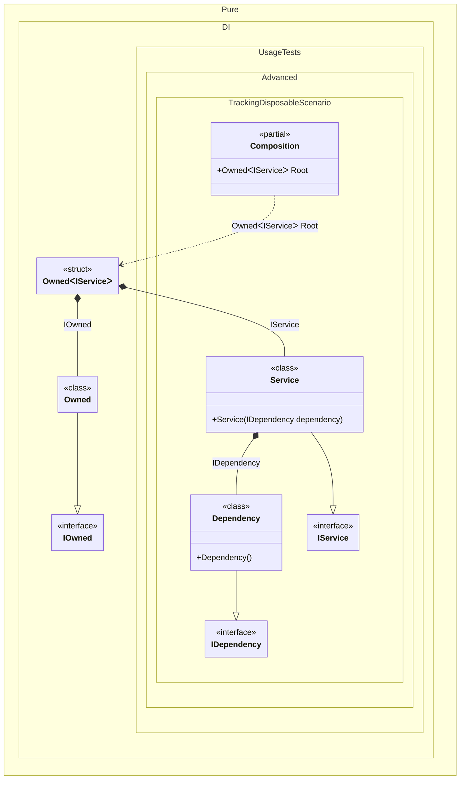

#### Tracking disposable instances per a composition root


```c#
using Shouldly;
using Pure.DI;

var composition = new Composition();
var root1 = composition.Root;
var root2 = composition.Root;

root2.Dispose();

// Checks that the disposable instances
// associated with root1 have been disposed of
root2.Value.Dependency.IsDisposed.ShouldBeTrue();

// Checks that the disposable instances
// associated with root2 have not been disposed of
root1.Value.Dependency.IsDisposed.ShouldBeFalse();

root1.Dispose();

// Checks that the disposable instances
// associated with root2 have been disposed of
root1.Value.Dependency.IsDisposed.ShouldBeTrue();

interface IDependency
{
    bool IsDisposed { get; }
}

class Dependency : IDependency, IDisposable
{
    public bool IsDisposed { get; private set; }

    public void Dispose() => IsDisposed = true;
}

interface IService
{
    public IDependency Dependency { get; }
}

class Service(IDependency dependency) : IService
{
    public IDependency Dependency { get; } = dependency;
}

partial class Composition
{
    static void Setup() =>

        DI.Setup()
            .Bind().To<Dependency>()
            .Bind().To<Service>()

            // A special composition root
            // that allows to manage disposable dependencies
            .Root<Owned<IService>>("Root");
}
```

<details>
<summary>Running this code sample locally</summary>

- Make sure you have the [.NET SDK 9.0](https://dotnet.microsoft.com/en-us/download/dotnet/9.0) or later is installed
```bash
dotnet --list-sdk
```
- Create a net9.0 (or later) console application
```bash
dotnet new console -n Sample
```
- Add references to NuGet packages
  - [Pure.DI](https://www.nuget.org/packages/Pure.DI)
  - [Shouldly](https://www.nuget.org/packages/Shouldly)
```bash
dotnet add package Pure.DI
dotnet add package Shouldly
```
- Copy the example code into the _Program.cs_ file

You are ready to run the example 🚀
```bash
dotnet run
```

</details>

The following partial class will be generated:

```c#
partial class Composition
{
  private readonly Composition _root;
  private readonly Lock _lock;

  [OrdinalAttribute(256)]
  public Composition()
  {
    _root = this;
    _lock = new Lock();
  }

  internal Composition(Composition parentScope)
  {
    _root = (parentScope ?? throw new ArgumentNullException(nameof(parentScope)))._root;
    _lock = _root._lock;
  }

  public Owned<IService> Root
  {
    [MethodImpl(MethodImplOptions.AggressiveInlining)]
    get
    {
      var accumulator54 = new Owned();
      Owned transientOwned1;
      Owned localOwned59 = accumulator54;
      transientOwned1 = localOwned59;
      using (_lock.EnterScope())
      {
        accumulator54.Add(transientOwned1);
      }

      Dependency transientDependency3 = new Dependency();
      using (_lock.EnterScope())
      {
        accumulator54.Add(transientDependency3);
      }

      Owned<IService> perBlockOwned0;
      // Creates the owner of an instance
      IOwned localOwned60 = transientOwned1;
      IService localValue61 = new Service(transientDependency3);
      perBlockOwned0 = new Owned<IService>(localValue61, localOwned60);
      using (_lock.EnterScope())
      {
        accumulator54.Add(perBlockOwned0);
      }

      return perBlockOwned0;
    }
  }
}
```

Class diagram:



