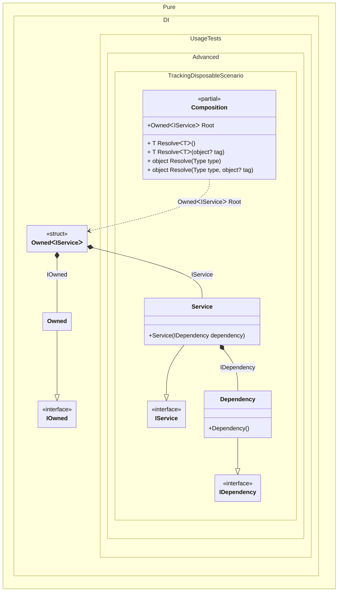

#### Tracking disposable instances per a composition root

[](../tests/Pure.DI.UsageTests/Advanced/TrackingDisposableScenario.cs)


```c#
using Pure.DI;
using Shouldly;

var composition = new Composition();
var root1 = composition.Root;
var root2 = composition.Root;

root2.Dispose();

// Checks that the disposable instances
// associated with root1 have been disposed of
root2.Value.Dependency.IsDisposed.ShouldBeTrue();

// Checks that the disposable instances
// associated with root2 have not been disposed of
root1.Value.Dependency.IsDisposed.ShouldBeFalse();

root1.Dispose();

// Checks that the disposable instances
// associated with root2 have been disposed of
root1.Value.Dependency.IsDisposed.ShouldBeTrue();

interface IDependency
{
    bool IsDisposed { get; }
}

class Dependency : IDependency, IDisposable
{
    public bool IsDisposed { get; private set; }

    public void Dispose() => IsDisposed = true;
}

interface IService
{
    public IDependency Dependency { get; }
}

class Service(IDependency dependency) : IService
{
    public IDependency Dependency { get; } = dependency;
}

partial class Composition
{
    static void Setup() =>
        DI.Setup()
            .Bind().To<Dependency>()
            .Bind().To<Service>()

            // A special composition root
            // that allows to manage disposable dependencies
            .Root<Owned<IService>>("Root");
}
```


Class diagram:



