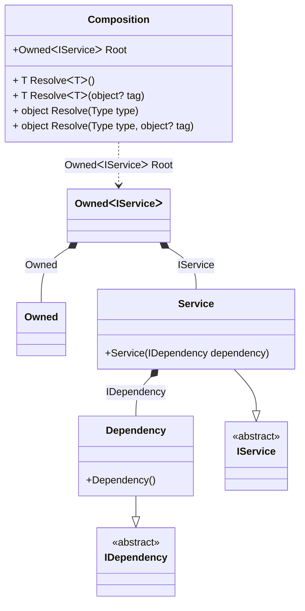

#### Tracking disposable instances per a composition root

[](../tests/Pure.DI.UsageTests/Basics/TrackingDisposableScenario.cs)

```c#
interface IDependency
{
    bool IsDisposed { get; }
}

class Dependency : IDependency, IDisposable
{
    public bool IsDisposed { get; private set; }

    public void Dispose() => IsDisposed = true;
}

interface IService
{
    public IDependency Dependency { get; }
}

class Service(IDependency dependency) : IService
{
    public IDependency Dependency { get; } = dependency;
}

partial class Composition
{
    private void Setup() =>
        DI.Setup(nameof(Composition))
            .Bind().To<Dependency>()
            .Bind().To<Service>()

            // A special composition root
            // that allows to manage disposable dependencies
            .Root<Owned<IService>>("Root");
}

var composition = new Composition();
var root1 = composition.Root;
var root2 = composition.Root;
        
root2.Dispose();
        
// Checks that the disposable instances
// associated with root1 have been disposed of
root2.Value.Dependency.IsDisposed.ShouldBeTrue();
        
// Checks that the disposable instances
// associated with root2 have not been disposed of
root1.Value.Dependency.IsDisposed.ShouldBeFalse();
        
root1.Dispose();
        
// Checks that the disposable instances
// associated with root2 have been disposed of
root1.Value.Dependency.IsDisposed.ShouldBeTrue();
```

<details open>
<summary>Class Diagram</summary>



</details>

<details>
<summary>Pure.DI-generated partial class Composition</summary><blockquote>

```c#
partial class Composition
{
  private readonly Composition _rootM03D27di;
  
  public Composition()
  {
    _rootM03D27di = this;
  }
  
  internal Composition(Composition baseComposition)
  {
    _rootM03D27di = baseComposition._rootM03D27di;
  }
  
  public Pure.DI.Owned<Pure.DI.UsageTests.Basics.TrackingDisposableScenario.IService> Root
  {
    get
    {
      var accumulatorM03D27di39 = new Pure.DI.Owned();
      Pure.DI.UsageTests.Basics.TrackingDisposableScenario.Dependency transientM03D27di3_Dependency = new Pure.DI.UsageTests.Basics.TrackingDisposableScenario.Dependency();
      accumulatorM03D27di39.Add(transientM03D27di3_Dependency);
      Pure.DI.Owned<Pure.DI.UsageTests.Basics.TrackingDisposableScenario.IService> perBlockM03D27di0_Owned;
      {
          var owned_M03D27di1 = accumulatorM03D27di39;
          var value_M03D27di2 = new Pure.DI.UsageTests.Basics.TrackingDisposableScenario.Service(transientM03D27di3_Dependency);
          perBlockM03D27di0_Owned = new Owned<Pure.DI.UsageTests.Basics.TrackingDisposableScenario.IService>(value_M03D27di2, owned_M03D27di1);
      }
      accumulatorM03D27di39.Add(perBlockM03D27di0_Owned);
      return perBlockM03D27di0_Owned;
    }
  }
  
  public T Resolve<T>()
  {
    return ResolverM03D27di<T>.Value.Resolve(this);
  }
  
  public T Resolve<T>(object? tag)
  {
    return ResolverM03D27di<T>.Value.ResolveByTag(this, tag);
  }
  
  public object Resolve(global::System.Type type)
  {
    throw new global::System.InvalidOperationException($"Cannot resolve composition root of type {type}.");
  }
  
  public object Resolve(global::System.Type type, object? tag)
  {
    throw new global::System.InvalidOperationException($"Cannot resolve composition root \"{tag}\" of type {type}.");
  }
  
  public override string ToString()
  {
    return
      "classDiagram\n" +
        "  class Composition {\n" +
          "    +OwnedᐸIServiceᐳ Root\n" +
          "    + T ResolveᐸTᐳ()\n" +
          "    + T ResolveᐸTᐳ(object? tag)\n" +
          "    + object Resolve(Type type)\n" +
          "    + object Resolve(Type type, object? tag)\n" +
        "  }\n" +
        "  class Owned\n" +
        "  Dependency --|> IDependency : \n" +
        "  class Dependency {\n" +
          "    +Dependency()\n" +
        "  }\n" +
        "  Service --|> IService : \n" +
        "  class Service {\n" +
          "    +Service(IDependency dependency)\n" +
        "  }\n" +
        "  class IDependency {\n" +
          "    <<abstract>>\n" +
        "  }\n" +
        "  class IService {\n" +
          "    <<abstract>>\n" +
        "  }\n" +
        "  Service *--  Dependency : IDependency\n" +
        "  Composition ..> OwnedᐸIServiceᐳ : OwnedᐸIServiceᐳ Root\n" +
        "  OwnedᐸIServiceᐳ *--  Owned : Owned\n" +
        "  OwnedᐸIServiceᐳ *--  Service : IService";
  }
  
  
  private sealed class ResolverM03D27di<T>: global::Pure.DI.IResolver<Composition, T>
  {
    public static global::Pure.DI.IResolver<Composition, T> Value = new ResolverM03D27di<T>();
    
    public T Resolve(Composition composite)
    {
      throw new global::System.InvalidOperationException($"Cannot resolve composition root of type {typeof(T)}.");
    }
    
    public T ResolveByTag(Composition composite, object tag)
    {
      throw new global::System.InvalidOperationException($"Cannot resolve composition root \"{tag}\" of type {typeof(T)}.");
    }
  }
}
```

</blockquote></details>

