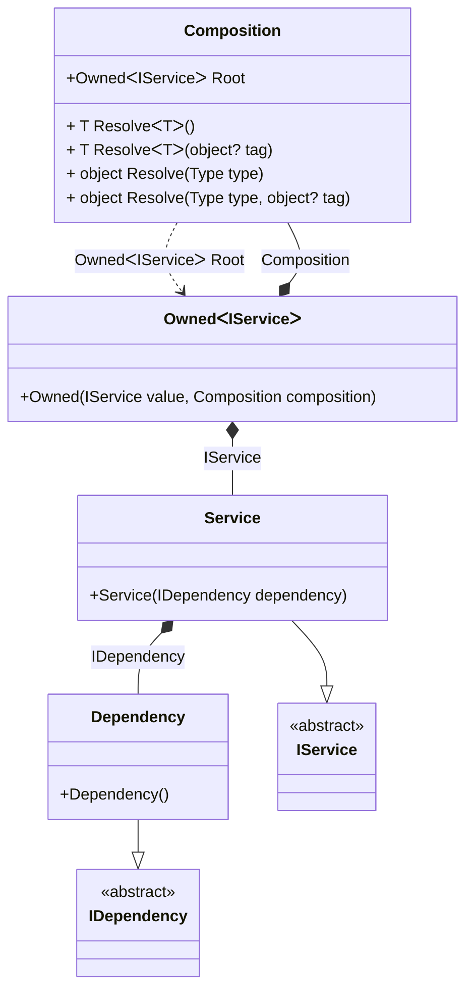

#### Tracking disposable instances per a composition root

[](../tests/Pure.DI.UsageTests/Hints/TrackingDisposableInstancesPerRootScenario.cs)

```c#
interface IDependency
{
    bool IsDisposed { get; }
}

class Dependency : IDependency, IDisposable
{
    public bool IsDisposed { get; private set; }

    public void Dispose() => IsDisposed = true;
}

interface IService
{
    public IDependency Dependency { get; }
}

class Service(IDependency dependency) : IService
{
    public IDependency Dependency { get; } = dependency;
}

partial class Composition
{
    private ConcurrentDictionary<int, List<IDisposable>> _disposables = [];

    private void Setup() =>
        DI.Setup(nameof(Composition))
            // Specifies to call the partial method OnNewInstance
            // when an instance is created
            .Hint(Hint.OnNewInstance, "On")

            .Bind<IDependency>().To<Dependency>()
            .Bind<IService>().To<Service>()
            .Root<Owned<IService>>("Root");

    partial void OnNewInstance<T>(ref T value, object? tag, Lifetime lifetime)
    {
        if (value is IOwned || value is not IDisposable disposable
            || lifetime is Lifetime.Singleton or Lifetime.Scoped)
        {
            return;
        }

        _disposables.GetOrAdd(Environment.CurrentManagedThreadId, _ => [])
            .Add(disposable);
    }

    public interface IOwned;

    public readonly struct Owned<T>: IDisposable, IOwned
    {
        public readonly T Value;
        private readonly List<IDisposable> _disposable;

        public Owned(T value, Composition composition)
        {
            Value = value;
            _disposable = composition._disposables.TryRemove(Environment.CurrentManagedThreadId, out var disposables)
                ? disposables
                : [];

            composition._disposables = [];
        }

        public void Dispose()
        {
            _disposable.Reverse();
            _disposable.ForEach(i => i.Dispose());
        }
    }
}

var composition = new Composition();

var root1 = composition.Root;
var root2 = composition.Root;
        
root2.Dispose();
        
// Checks that the disposable instances
// associated with root1 have been disposed of
root2.Value.Dependency.IsDisposed.ShouldBeTrue();
        
// Checks that the disposable instances
// associated with root2 have not been disposed of
root1.Value.Dependency.IsDisposed.ShouldBeFalse();
        
root1.Dispose();
        
// Checks that the disposable instances
// associated with root2 have been disposed of
root1.Value.Dependency.IsDisposed.ShouldBeTrue();
```

<details open>
<summary>Class Diagram</summary>



</details>

<details>
<summary>Pure.DI-generated partial class Composition</summary><blockquote>

```c#
partial class Composition
{
  private readonly Composition _rootM03D19di;
  
  public Composition()
  {
    _rootM03D19di = this;
  }
  
  internal Composition(Composition baseComposition)
  {
    _rootM03D19di = baseComposition._rootM03D19di;
  }
  
  public Pure.DI.UsageTests.Hints.TrackingDisposableInstancesPerRootScenario.Composition.Owned<Pure.DI.UsageTests.Hints.TrackingDisposableInstancesPerRootScenario.IService> Root
  {
    get
    {
      Pure.DI.UsageTests.Hints.TrackingDisposableInstancesPerRootScenario.Dependency transientM03D19di3_Dependency = new Pure.DI.UsageTests.Hints.TrackingDisposableInstancesPerRootScenario.Dependency();
      OnNewInstance<Pure.DI.UsageTests.Hints.TrackingDisposableInstancesPerRootScenario.Dependency>(ref transientM03D19di3_Dependency, null, Pure.DI.Lifetime.Transient);
      Pure.DI.UsageTests.Hints.TrackingDisposableInstancesPerRootScenario.Composition transientM03D19di2_Composition = this;
      Pure.DI.UsageTests.Hints.TrackingDisposableInstancesPerRootScenario.Service transientM03D19di1_Service = new Pure.DI.UsageTests.Hints.TrackingDisposableInstancesPerRootScenario.Service(transientM03D19di3_Dependency);
      OnNewInstance<Pure.DI.UsageTests.Hints.TrackingDisposableInstancesPerRootScenario.Service>(ref transientM03D19di1_Service, null, Pure.DI.Lifetime.Transient);
      Pure.DI.UsageTests.Hints.TrackingDisposableInstancesPerRootScenario.Composition.Owned<Pure.DI.UsageTests.Hints.TrackingDisposableInstancesPerRootScenario.IService> transientM03D19di0_Owned = new Pure.DI.UsageTests.Hints.TrackingDisposableInstancesPerRootScenario.Composition.Owned<Pure.DI.UsageTests.Hints.TrackingDisposableInstancesPerRootScenario.IService>(transientM03D19di1_Service, transientM03D19di2_Composition);
      OnNewInstance<Pure.DI.UsageTests.Hints.TrackingDisposableInstancesPerRootScenario.Composition.Owned<Pure.DI.UsageTests.Hints.TrackingDisposableInstancesPerRootScenario.IService>>(ref transientM03D19di0_Owned, null, Pure.DI.Lifetime.Transient);
      return transientM03D19di0_Owned;
    }
  }
  
  public T Resolve<T>()
  {
    return ResolverM03D19di<T>.Value.Resolve(this);
  }
  
  public T Resolve<T>(object? tag)
  {
    return ResolverM03D19di<T>.Value.ResolveByTag(this, tag);
  }
  
  public object Resolve(global::System.Type type)
  {
    var index = (int)(_bucketSizeM03D19di * ((uint)global::System.Runtime.CompilerServices.RuntimeHelpers.GetHashCode(type) % 1));
    var finish = index + _bucketSizeM03D19di;
    do {
      ref var pair = ref _bucketsM03D19di[index];
      if (ReferenceEquals(pair.Key, type))
      {
        return pair.Value.Resolve(this);
      }
    } while (++index < finish);
    
    throw new global::System.InvalidOperationException($"Cannot resolve composition root of type {type}.");
  }
  
  public object Resolve(global::System.Type type, object? tag)
  {
    var index = (int)(_bucketSizeM03D19di * ((uint)global::System.Runtime.CompilerServices.RuntimeHelpers.GetHashCode(type) % 1));
    var finish = index + _bucketSizeM03D19di;
    do {
      ref var pair = ref _bucketsM03D19di[index];
      if (ReferenceEquals(pair.Key, type))
      {
        return pair.Value.ResolveByTag(this, tag);
      }
    } while (++index < finish);
    
    throw new global::System.InvalidOperationException($"Cannot resolve composition root \"{tag}\" of type {type}.");
  }
  
  partial void OnNewInstance<T>(ref T value, object? tag, global::Pure.DI.Lifetime lifetime);
  
  public override string ToString()
  {
    return
      "classDiagram\n" +
        "  class Composition {\n" +
          "    +OwnedᐸIServiceᐳ Root\n" +
          "    + T ResolveᐸTᐳ()\n" +
          "    + T ResolveᐸTᐳ(object? tag)\n" +
          "    + object Resolve(Type type)\n" +
          "    + object Resolve(Type type, object? tag)\n" +
        "  }\n" +
        "  class Composition\n" +
        "  class OwnedᐸIServiceᐳ {\n" +
          "    +Owned(IService value, Composition composition)\n" +
        "  }\n" +
        "  Dependency --|> IDependency : \n" +
        "  class Dependency {\n" +
          "    +Dependency()\n" +
        "  }\n" +
        "  Service --|> IService : \n" +
        "  class Service {\n" +
          "    +Service(IDependency dependency)\n" +
        "  }\n" +
        "  class IDependency {\n" +
          "    <<abstract>>\n" +
        "  }\n" +
        "  class IService {\n" +
          "    <<abstract>>\n" +
        "  }\n" +
        "  OwnedᐸIServiceᐳ *--  Service : IService\n" +
        "  OwnedᐸIServiceᐳ *--  Composition : Composition\n" +
        "  Service *--  Dependency : IDependency\n" +
        "  Composition ..> OwnedᐸIServiceᐳ : OwnedᐸIServiceᐳ Root";
  }
  
  private readonly static int _bucketSizeM03D19di;
  private readonly static global::Pure.DI.Pair<global::System.Type, global::Pure.DI.IResolver<Composition, object>>[] _bucketsM03D19di;
  
  static Composition()
  {
    var valResolverM03D19di_0000 = new ResolverM03D19di_0000();
    ResolverM03D19di<Pure.DI.UsageTests.Hints.TrackingDisposableInstancesPerRootScenario.Composition.Owned<Pure.DI.UsageTests.Hints.TrackingDisposableInstancesPerRootScenario.IService>>.Value = valResolverM03D19di_0000;
    _bucketsM03D19di = global::Pure.DI.Buckets<global::System.Type, global::Pure.DI.IResolver<Composition, object>>.Create(
      1,
      out _bucketSizeM03D19di,
      new global::Pure.DI.Pair<global::System.Type, global::Pure.DI.IResolver<Composition, object>>[1]
      {
         new global::Pure.DI.Pair<global::System.Type, global::Pure.DI.IResolver<Composition, object>>(typeof(Pure.DI.UsageTests.Hints.TrackingDisposableInstancesPerRootScenario.Composition.Owned<Pure.DI.UsageTests.Hints.TrackingDisposableInstancesPerRootScenario.IService>), valResolverM03D19di_0000)
      });
  }
  
  private sealed class ResolverM03D19di<T>: global::Pure.DI.IResolver<Composition, T>
  {
    public static global::Pure.DI.IResolver<Composition, T> Value = new ResolverM03D19di<T>();
    
    public T Resolve(Composition composite)
    {
      throw new global::System.InvalidOperationException($"Cannot resolve composition root of type {typeof(T)}.");
    }
    
    public T ResolveByTag(Composition composite, object tag)
    {
      throw new global::System.InvalidOperationException($"Cannot resolve composition root \"{tag}\" of type {typeof(T)}.");
    }
  }
  
  private sealed class ResolverM03D19di_0000: global::Pure.DI.IResolver<Composition, Pure.DI.UsageTests.Hints.TrackingDisposableInstancesPerRootScenario.Composition.Owned<Pure.DI.UsageTests.Hints.TrackingDisposableInstancesPerRootScenario.IService>>, global::Pure.DI.IResolver<Composition, object>
  {
    public Pure.DI.UsageTests.Hints.TrackingDisposableInstancesPerRootScenario.Composition.Owned<Pure.DI.UsageTests.Hints.TrackingDisposableInstancesPerRootScenario.IService> Resolve(Composition composition)
    {
      return composition.Root;
    }
    
    public Pure.DI.UsageTests.Hints.TrackingDisposableInstancesPerRootScenario.Composition.Owned<Pure.DI.UsageTests.Hints.TrackingDisposableInstancesPerRootScenario.IService> ResolveByTag(Composition composition, object tag)
    {
      switch (tag)
      {
        case null:
          return composition.Root;
      }
      throw new global::System.InvalidOperationException($"Cannot resolve composition root \"{tag}\" of type Pure.DI.UsageTests.Hints.TrackingDisposableInstancesPerRootScenario.Composition.Owned<Pure.DI.UsageTests.Hints.TrackingDisposableInstancesPerRootScenario.IService>.");
    }
    object global::Pure.DI.IResolver<Composition, object>.Resolve(Composition composition)
    {
      return Resolve(composition);
    }
    
    object global::Pure.DI.IResolver<Composition, object>.ResolveByTag(Composition composition, object tag)
    {
      return ResolveByTag(composition, tag);
    }
  }
}
```

</blockquote></details>

