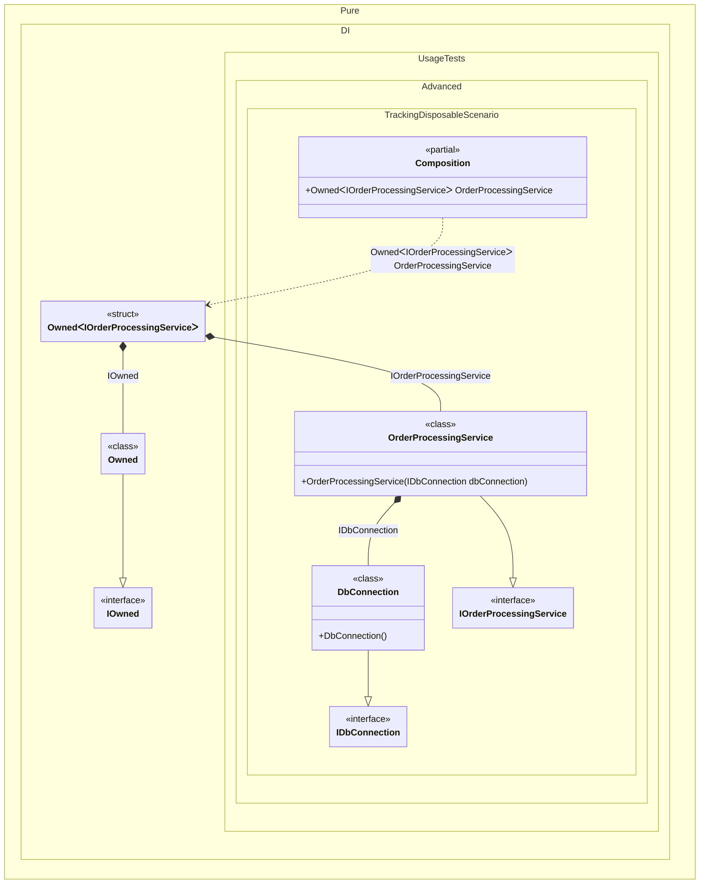

#### Tracking disposable instances per a composition root


```c#
using Shouldly;
using Pure.DI;

var composition = new Composition();
var orderProcessingService1 = composition.OrderProcessingService;
var orderProcessingService2 = composition.OrderProcessingService;

orderProcessingService2.Dispose();

// Checks that the disposable instances
// associated with orderProcessingService2 have been disposed of
orderProcessingService2.Value.DbConnection.IsDisposed.ShouldBeTrue();

// Checks that the disposable instances
// associated with orderProcessingService1 have not been disposed of
orderProcessingService1.Value.DbConnection.IsDisposed.ShouldBeFalse();

orderProcessingService1.Dispose();

// Checks that the disposable instances
// associated with orderProcessingService1 have been disposed of
orderProcessingService1.Value.DbConnection.IsDisposed.ShouldBeTrue();

interface IDbConnection
{
    bool IsDisposed { get; }
}

class DbConnection : IDbConnection, IDisposable
{
    public bool IsDisposed { get; private set; }

    public void Dispose() => IsDisposed = true;
}

interface IOrderProcessingService
{
    public IDbConnection DbConnection { get; }
}

class OrderProcessingService(IDbConnection dbConnection) : IOrderProcessingService
{
    public IDbConnection DbConnection { get; } = dbConnection;
}

partial class Composition
{
    static void Setup() =>

        DI.Setup()
            .Bind().To<DbConnection>()
            .Bind().To<OrderProcessingService>()

            // A special composition root
            // that allows to manage disposable dependencies
            .Root<Owned<IOrderProcessingService>>("OrderProcessingService");
}
```

<details>
<summary>Running this code sample locally</summary>

- Make sure you have the [.NET SDK 10.0](https://dotnet.microsoft.com/en-us/download/dotnet/10.0) or later is installed
```bash
dotnet --list-sdk
```
- Create a net10.0 (or later) console application
```bash
dotnet new console -n Sample
```
- Add references to NuGet packages
  - [Pure.DI](https://www.nuget.org/packages/Pure.DI)
  - [Shouldly](https://www.nuget.org/packages/Shouldly)
```bash
dotnet add package Pure.DI
dotnet add package Shouldly
```
- Copy the example code into the _Program.cs_ file

You are ready to run the example 🚀
```bash
dotnet run
```

</details>

The following partial class will be generated:

```c#
partial class Composition
{
#if NET9_0_OR_GREATER
  private readonly Lock _lock = new Lock();
#else
  private readonly Object _lock = new Object();
#endif

  public Owned<IOrderProcessingService> OrderProcessingService
  {
    [MethodImpl(MethodImplOptions.AggressiveInlining)]
    get
    {
      var perBlockOwned1 = new Owned();
      Owned<IOrderProcessingService> transientOwned;
      // Creates the owner of an instance
      Owned transientOwned2;
      Owned localOwned7 = perBlockOwned1;
      transientOwned2 = localOwned7;
      lock (_lock)
      {
        perBlockOwned1.Add(transientOwned2);
      }

      IOwned localOwned6 = transientOwned2;
      var transientDbConnection4 = new DbConnection();
      lock (_lock)
      {
        perBlockOwned1.Add(transientDbConnection4);
      }

      IOrderProcessingService localValue6 = new OrderProcessingService(transientDbConnection4);
      transientOwned = new Owned<IOrderProcessingService>(localValue6, localOwned6);
      lock (_lock)
      {
        perBlockOwned1.Add(transientOwned);
      }

      return transientOwned;
    }
  }
}
```

Class diagram:



