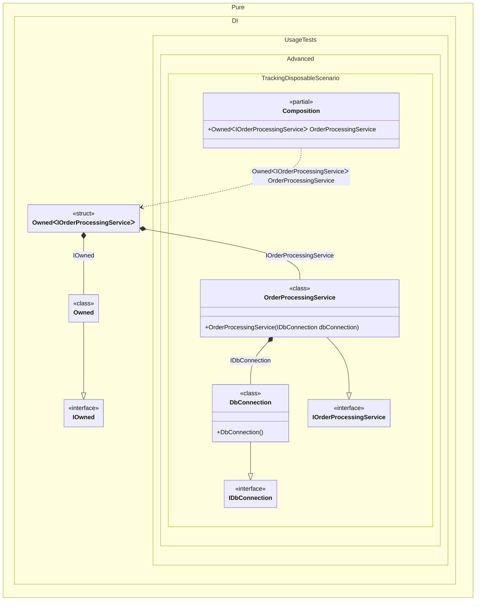

#### Tracking disposable instances per a composition root

The special `Owned<T>` type lets you track and dispose of disposable instances per composition root rather than per composition. Declare a root as `Root<Owned<T>>`: each access returns an `Owned<T>` that owns every disposable created for that dependency graph, and calling its `Dispose()` cleans up exactly those instances without affecting other roots.


```c#
using Shouldly;
using Pure.DI;

var composition = new Composition();
var orderProcessingService1 = composition.OrderProcessingService;
var orderProcessingService2 = composition.OrderProcessingService;

orderProcessingService2.Dispose();

// Checks that the disposable instances
// associated with orderProcessingService2 have been disposed of
orderProcessingService2.Value.DbConnection.IsDisposed.ShouldBeTrue();

// Checks that the disposable instances
// associated with orderProcessingService1 have not been disposed of
orderProcessingService1.Value.DbConnection.IsDisposed.ShouldBeFalse();

orderProcessingService1.Dispose();

// Checks that the disposable instances
// associated with orderProcessingService1 have been disposed of
orderProcessingService1.Value.DbConnection.IsDisposed.ShouldBeTrue();

interface IDbConnection
{
    bool IsDisposed { get; }
}

class DbConnection : IDbConnection, IDisposable
{
    public bool IsDisposed { get; private set; }

    public void Dispose() => IsDisposed = true;
}

interface IOrderProcessingService
{
    public IDbConnection DbConnection { get; }
}

class OrderProcessingService(IDbConnection dbConnection) : IOrderProcessingService
{
    public IDbConnection DbConnection { get; } = dbConnection;
}

partial class Composition
{
    static void Setup() =>

        DI.Setup()
            .Bind().To<DbConnection>()
            .Bind().To<OrderProcessingService>()

            // A special composition root
            // that allows to manage disposable dependencies
            .Root<Owned<IOrderProcessingService>>("OrderProcessingService");
}
```

<details>
<summary>Running this code sample locally</summary>

- Make sure you have the [.NET SDK 10.0](https://dotnet.microsoft.com/en-us/download/dotnet/10.0) or later installed
```bash
dotnet --list-sdk
```
- Create a net10.0 (or later) console application
```bash
dotnet new console -n Sample
```
- Add references to the NuGet packages
  - [Pure.DI](https://www.nuget.org/packages/Pure.DI)
  - [Shouldly](https://www.nuget.org/packages/Shouldly)
```bash
dotnet add package Pure.DI
dotnet add package Shouldly
```
- Copy the example code into the _Program.cs_ file

You are ready to run the example 🚀
```bash
dotnet run
```

</details>

>[!NOTE]
>Disposable tracking ensures proper cleanup of all disposable instances within a composition scope.

<details>
<summary>The following partial class will be generated</summary>

```c#
partial class Composition
{
#if NET9_0_OR_GREATER
  private readonly Lock _lock = new Lock();
#else
  private readonly Object _lock = new Object();
#endif

  public Owned<IOrderProcessingService> OrderProcessingService
  {
    [MethodImpl(MethodImplOptions.AggressiveInlining)]
    get
    {
      var perBlockOwned = new Owned(1, _lock);
      try
      {
        Owned<IOrderProcessingService> perBlockOwnedIOrderProcessingService;
        // Tracks owned disposables
        Owned transientOwned;
        Owned localOwned1 = perBlockOwned;
        transientOwned = localOwned1;
        IOwned localOwned = transientOwned;
        // Creates the owned value
        var transientDbConnection = new DbConnection();
        lock (_lock)
        {
          perBlockOwned.Add(transientDbConnection);
        }

        IOrderProcessingService localValue = new OrderProcessingService(transientDbConnection);
        perBlockOwnedIOrderProcessingService = new Owned<IOrderProcessingService>(localValue, localOwned);
        lock (_lock)
        {
          perBlockOwned.Add(perBlockOwnedIOrderProcessingService);
        }

        return perBlockOwnedIOrderProcessingService;
      }
      catch
      {
        if (!Object.ReferenceEquals(perBlockOwned, null))
        {
          try
          {
            ((IDisposable)perBlockOwned).Dispose();
          }
          catch
          {
          // Preserve the original graph construction exception.
          }
        }

        throw;
      }
    }
  }
}
```

</details>

Class diagram:


```mermaid
---
 config:
  class:
   hideEmptyMembersBox: true
---
classDiagram
	Owned --|> IOwned
	DbConnection --|> IDbConnection
	OrderProcessingService --|> IOrderProcessingService
	Composition ..> OwnedᐸIOrderProcessingServiceᐳ : OwnedᐸIOrderProcessingServiceᐳ OrderProcessingService
	OrderProcessingService *-- DbConnection : IDbConnection
	OwnedᐸIOrderProcessingServiceᐳ *-- Owned : IOwned
	OwnedᐸIOrderProcessingServiceᐳ *-- OrderProcessingService : IOrderProcessingService
	namespace Pure.DI {
		class IOwned {
			<<interface>>
		}
		class Owned {
				<<class>>
		}
		class OwnedᐸIOrderProcessingServiceᐳ {
				<<struct>>
		}
	}
	namespace Pure.DI.UsageTests.Advanced.TrackingDisposableScenario {
		class Composition {
		<<partial>>
		+OwnedᐸIOrderProcessingServiceᐳ OrderProcessingService
		}
		class DbConnection {
				<<class>>
			+DbConnection()
		}
		class IDbConnection {
			<<interface>>
		}
		class IOrderProcessingService {
			<<interface>>
		}
		class OrderProcessingService {
				<<class>>
			+OrderProcessingService(IDbConnection dbConnection)
		}
	}
```

See also:

- [Tracking disposable instances in delegates](tracking-disposable-instances-in-delegates.md)
- [Tracking disposable instances with different lifetimes](tracking-disposable-instances-with-different-lifetimes.md)
- [Disposable singleton](disposable-singleton.md)

