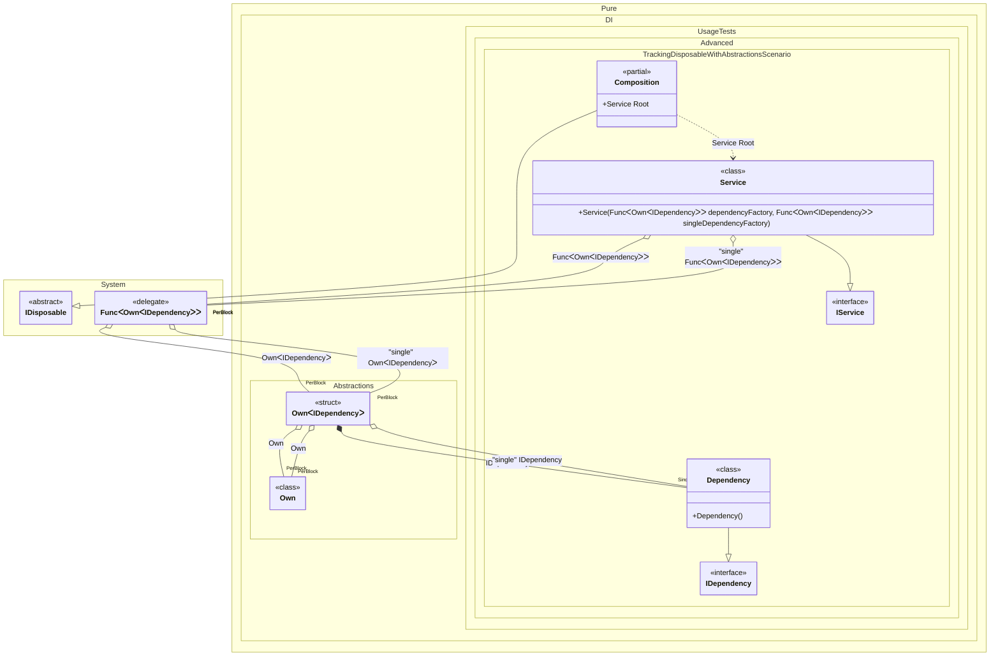

#### Tracking disposable instances using pre-built classes

If you want ready-made classes for tracking disposable objects in your libraries but don't want to create your own, you can add this package to your projects:

[](https://www.nuget.org/packages/Pure.DI.Abstractions)

It contains attributes like `Inject` and `Inject<T>` that work for constructors and their arguments, methods and their arguments, properties and fields. They allow you to setup all injection parameters.


```c#
using Shouldly;
using Pure.DI.Abstractions;
using Pure.DI;

var composition = new Composition();
var root1 = composition.Root;
var root2 = composition.Root;
root1.Dependency.ShouldNotBe(root2.Dependency);
root1.SingleDependency.ShouldBe(root2.SingleDependency);

root2.Dispose();

// Checks that the disposable instances
// associated with root1 have been disposed of
root2.Dependency.IsDisposed.ShouldBeTrue();

// But the singleton is still not disposed of
root2.SingleDependency.IsDisposed.ShouldBeFalse();

// Checks that the disposable instances
// associated with root2 have not been disposed of
root1.Dependency.IsDisposed.ShouldBeFalse();
root1.SingleDependency.IsDisposed.ShouldBeFalse();

root1.Dispose();

// Checks that the disposable instances
// associated with root2 have been disposed of
root1.Dependency.IsDisposed.ShouldBeTrue();

// But the singleton is still not disposed of
root1.SingleDependency.IsDisposed.ShouldBeFalse();
        
composition.Dispose();
root1.SingleDependency.IsDisposed.ShouldBeTrue();

interface IDependency
{
    bool IsDisposed { get; }
}

class Dependency : IDependency, IDisposable
{
    public bool IsDisposed { get; private set; }

    public void Dispose() => IsDisposed = true;
}

interface IService
{
    public IDependency Dependency { get; }

    public IDependency SingleDependency { get; }
}

class Service(
    Func<Own<IDependency>> dependencyFactory,
    [Tag("single")] Func<Own<IDependency>> singleDependencyFactory)
    : IService, IDisposable
{
    private readonly Own<IDependency> _dependency = dependencyFactory();
    private readonly Own<IDependency> _singleDependency = singleDependencyFactory();

    public IDependency Dependency => _dependency.Value;

    public IDependency SingleDependency => _singleDependency.Value;

    public void Dispose()
    {
        _dependency.Dispose();
        _singleDependency.Dispose();
    }
}

partial class Composition
{
    static void Setup() =>

        DI.Setup()
            .Bind().To<Dependency>()
            .Bind("single").As(Lifetime.Singleton).To<Dependency>()
            .Bind().To<Service>()

            // Composition root
            .Root<Service>("Root");
}
```

<details>
<summary>Running this code sample locally</summary>

- Make sure you have the [.NET SDK 9.0](https://dotnet.microsoft.com/en-us/download/dotnet/9.0) or later is installed
```bash
dotnet --list-sdk
```
- Create a net9.0 (or later) console application
```bash
dotnet new console -n Sample
```
- Add references to NuGet packages
  - [Pure.DI](https://www.nuget.org/packages/Pure.DI)
  - [Shouldly](https://www.nuget.org/packages/Shouldly)
  - [Pure.DI.Abstractions](https://www.nuget.org/packages/Pure.DI.Abstractions)
```bash
dotnet add package Pure.DI
dotnet add package Shouldly
dotnet add package Pure.DI.Abstractions
```
- Copy the example code into the _Program.cs_ file

You are ready to run the example 🚀
```bash
dotnet run
```

</details>

This package should also be included in a project:

[](https://www.nuget.org/packages/Pure.DI)

The following partial class will be generated:

```c#
partial class Composition: IDisposable
{
  private readonly Composition _root;
#if NET9_0_OR_GREATER
  private readonly Lock _lock;
#else
  private readonly Object _lock;
#endif
  private object[] _disposables;
  private int _disposeIndex;

  private Dependency? _singleDependency53;

  [OrdinalAttribute(256)]
  public Composition()
  {
    _root = this;
#if NET9_0_OR_GREATER
    _lock = new Lock();
#else
    _lock = new Object();
#endif
    _disposables = new object[1];
  }

  internal Composition(Composition parentScope)
  {
    _root = (parentScope ?? throw new ArgumentNullException(nameof(parentScope)))._root;
    _lock = parentScope._lock;
    _disposables = parentScope._disposables;
  }

  public Service Root
  {
    [MethodImpl(MethodImplOptions.AggressiveInlining)]
    get
    {
      var blockOwn3 = new Abstractions.Own();
      Func<Abstractions.Own<IDependency>> blockFunc1 = new Func<Abstractions.Own<IDependency>>(
      [MethodImpl(MethodImplOptions.AggressiveInlining)]
      () =>
      {
        Abstractions.Own<IDependency> blockOwn4; // Creates the owner of an instance
        Abstractions.Own localOwn = blockOwn3;
        var transDependency5 = new Dependency();
        lock (_lock)
        {
          blockOwn3.Add(transDependency5);
        }

        IDependency localValue8 = transDependency5;
        blockOwn4 = new Abstractions.Own<IDependency>(localValue8, localOwn);
        lock (_lock)
        {
          blockOwn3.Add(blockOwn4);
        }

        Abstractions.Own<IDependency> localValue7 = blockOwn4;
        return localValue7;
      });
      var blockOwn6 = new Abstractions.Own();
      Func<Abstractions.Own<IDependency>> blockFunc2 = new Func<Abstractions.Own<IDependency>>(
      [MethodImpl(MethodImplOptions.AggressiveInlining)]
      () =>
      {
        Abstractions.Own<IDependency> blockOwn7; // Creates the owner of an instance
        Abstractions.Own localOwn1 = blockOwn6;
        if (_root._singleDependency53 is null)
          lock (_lock)
            if (_root._singleDependency53 is null)
            {
              _root._singleDependency53 = new Dependency();
              _root._disposables[_root._disposeIndex++] = _root._singleDependency53;
            }

        IDependency localValue10 = _root._singleDependency53;
        blockOwn7 = new Abstractions.Own<IDependency>(localValue10, localOwn1);
        lock (_lock)
        {
          blockOwn6.Add(blockOwn7);
        }

        Abstractions.Own<IDependency> localValue9 = blockOwn7;
        return localValue9;
      });
      return new Service(blockFunc1, blockFunc2);
    }
  }

  public void Dispose()
  {
    int disposeIndex;
    object[] disposables;
    lock (_lock)
    {
      disposeIndex = _disposeIndex;
      _disposeIndex = 0;
      disposables = _disposables;
      _disposables = new object[1];
      _singleDependency53 = default(Dependency);
      }

      while (disposeIndex-- > 0)
      {
        switch (disposables[disposeIndex])
        {
          case IDisposable disposableInstance:
            try
            {
              disposableInstance.Dispose();
            }
            catch (Exception exception)
            {
              OnDisposeException(disposableInstance, exception);
            }
            break;
        }
      }
    }

    partial void OnDisposeException<T>(T disposableInstance, Exception exception) where T : IDisposable;
}
```

Class diagram:



