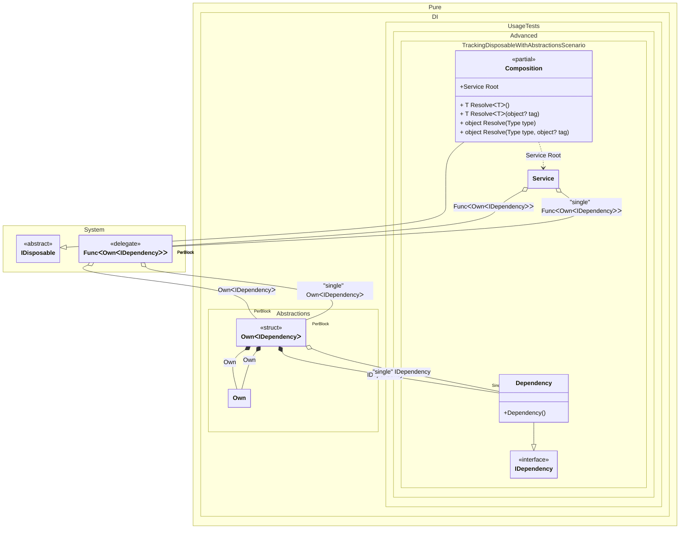

#### Tracking disposable instances using pre-built classes

[](../tests/Pure.DI.UsageTests/Advanced/TrackingDisposableWithAbstractionsScenario.cs)

If you want ready-made classes for tracking disposable objects in your libraries but don't want to create your own, you can add this package to your projects:

[](https://www.nuget.org/packages/Pure.DI.Abstractions)

It contains attributes like `Inject` and `Inject<T>` that work for constructors and their arguments, methods and their arguments, properties and fields. They allow you to setup all injection parameters.


```c#
using Pure.DI;
using Pure.DI.Abstractions;
using Shouldly;

var composition = new Composition();
var root1 = composition.Root;
var root2 = composition.Root;
root1.Dependency.ShouldNotBe(root2.Dependency);
root1.SingleDependency.ShouldBe(root2.SingleDependency);

root2.Dispose();

// Checks that the disposable instances
// associated with root1 have been disposed of
root2.Dependency.IsDisposed.ShouldBeTrue();

// But the singleton is still not disposed of
root2.SingleDependency.IsDisposed.ShouldBeFalse();

// Checks that the disposable instances
// associated with root2 have not been disposed of
root1.Dependency.IsDisposed.ShouldBeFalse();
root1.SingleDependency.IsDisposed.ShouldBeFalse();

root1.Dispose();

// Checks that the disposable instances
// associated with root2 have been disposed of
root1.Dependency.IsDisposed.ShouldBeTrue();

// But the singleton is still not disposed of
root1.SingleDependency.IsDisposed.ShouldBeFalse();
        
composition.Dispose();
root1.SingleDependency.IsDisposed.ShouldBeTrue();

interface IDependency
{
    bool IsDisposed { get; }
}

class Dependency : IDependency, IDisposable
{
    public bool IsDisposed { get; private set; }

    public void Dispose() => IsDisposed = true;
}

interface IService
{
    public IDependency Dependency { get; }

    public IDependency SingleDependency { get; }
}

class Service(
    Func<Own<IDependency>> dependencyFactory,
    [Tag("single")] Func<Own<IDependency>> singleDependencyFactory)
    : IService, IDisposable
{
    private readonly Own<IDependency> _dependency = dependencyFactory();
    private readonly Own<IDependency> _singleDependency = singleDependencyFactory();

    public IDependency Dependency => _dependency.Value;

    public IDependency SingleDependency => _singleDependency.Value;

    public void Dispose()
    {
        _dependency.Dispose();
        _singleDependency.Dispose();
    }
}

partial class Composition
{
    static void Setup() =>
        DI.Setup()
            .Bind().To<Dependency>()
            .Bind("single").As(Lifetime.Singleton).To<Dependency>()
            .Bind().To<Service>()

            // Composition root
            .Root<Service>("Root");
}
```

This package should also be included in a project:

[](https://www.nuget.org/packages/Pure.DI)


Class diagram:



