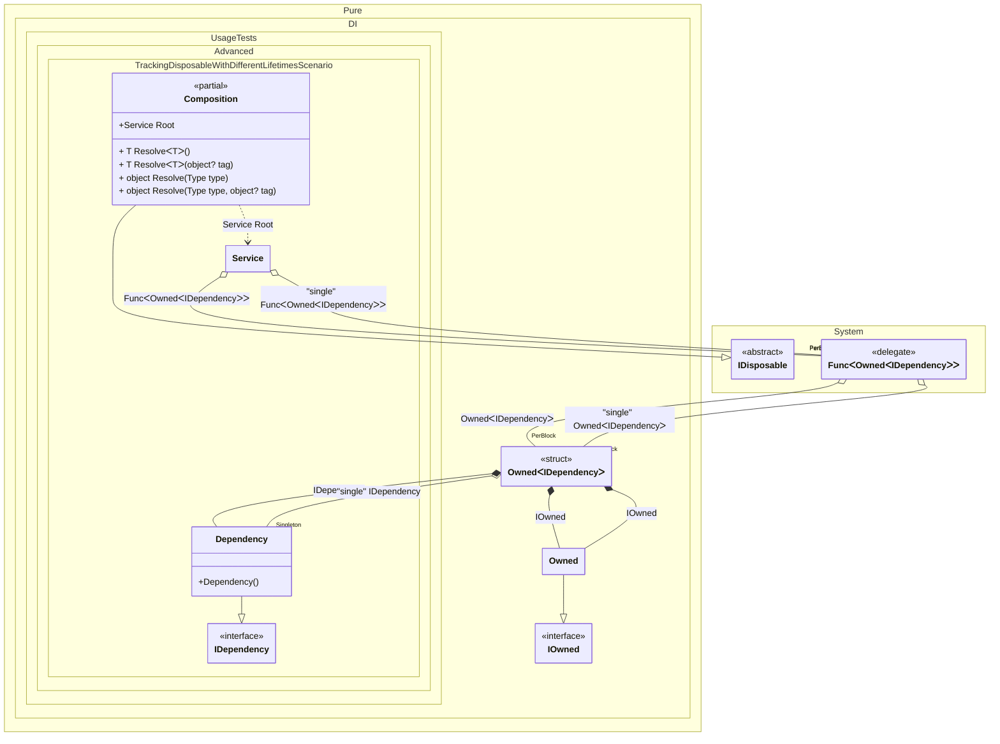

#### Tracking disposable instances with different lifetimes

[](../tests/Pure.DI.UsageTests/Advanced/TrackingDisposableWithDifferentLifetimesScenario.cs)


```c#
using Shouldly;
using Pure.DI;

var composition = new Composition();
var root1 = composition.Root;
var root2 = composition.Root;
root1.Dependency.ShouldNotBe(root2.Dependency);
root1.SingleDependency.ShouldBe(root2.SingleDependency);

root2.Dispose();

// Checks that the disposable instances
// associated with root1 have been disposed of
root2.Dependency.IsDisposed.ShouldBeTrue();

// But the singleton is still not disposed of
root2.SingleDependency.IsDisposed.ShouldBeFalse();

// Checks that the disposable instances
// associated with root2 have not been disposed of
root1.Dependency.IsDisposed.ShouldBeFalse();
root1.SingleDependency.IsDisposed.ShouldBeFalse();

root1.Dispose();

// Checks that the disposable instances
// associated with root2 have been disposed of
root1.Dependency.IsDisposed.ShouldBeTrue();

// But the singleton is still not disposed of
root1.SingleDependency.IsDisposed.ShouldBeFalse();
        
composition.Dispose();
root1.SingleDependency.IsDisposed.ShouldBeTrue();

interface IDependency
{
    bool IsDisposed { get; }
}

class Dependency : IDependency, IDisposable
{
    public bool IsDisposed { get; private set; }

    public void Dispose() => IsDisposed = true;
}

interface IService
{
    public IDependency Dependency { get; }

    public IDependency SingleDependency { get; }
}

class Service(
    Func<Owned<IDependency>> dependencyFactory,
    [Tag("single")] Func<Owned<IDependency>> singleDependencyFactory)
    : IService, IDisposable
{
    private readonly Owned<IDependency> _dependency = dependencyFactory();
    private readonly Owned<IDependency> _singleDependency = singleDependencyFactory();

    public IDependency Dependency => _dependency.Value;

    public IDependency SingleDependency => _singleDependency.Value;

    public void Dispose()
    {
        _dependency.Dispose();
        _singleDependency.Dispose();
    }
}

partial class Composition
{
    static void Setup() =>
        DI.Setup()
            .Bind().To<Dependency>()
            .Bind("single").As(Lifetime.Singleton).To<Dependency>()
            .Bind().To<Service>()

            // Composition root
            .Root<Service>("Root");
}
```

<details>
<summary>Running this code sample locally</summary>

- Make sure you have the [.NET SDK 9.0](https://dotnet.microsoft.com/en-us/download/dotnet/9.0) or later is installed
- Create a net9.0 (or later) console application
- Add references to NuGet packages
  - [Pure.DI](https://www.nuget.org/packages/Pure.DI)
  - [Shouldly](https://www.nuget.org/packages/Shouldly)
- Copy the example code into the _Program.cs_ file

You are ready to run the example!

</details>


Class diagram:



