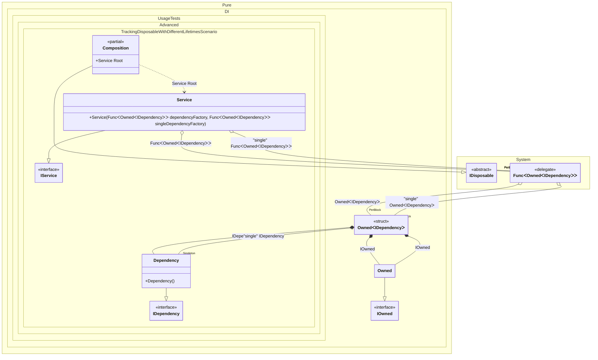

#### Tracking disposable instances with different lifetimes


```c#
using Shouldly;
using Pure.DI;

var composition = new Composition();
var root1 = composition.Root;
var root2 = composition.Root;
root1.Dependency.ShouldNotBe(root2.Dependency);
root1.SingleDependency.ShouldBe(root2.SingleDependency);

root2.Dispose();

// Checks that the disposable instances
// associated with root1 have been disposed of
root2.Dependency.IsDisposed.ShouldBeTrue();

// But the singleton is still not disposed of
root2.SingleDependency.IsDisposed.ShouldBeFalse();

// Checks that the disposable instances
// associated with root2 have not been disposed of
root1.Dependency.IsDisposed.ShouldBeFalse();
root1.SingleDependency.IsDisposed.ShouldBeFalse();

root1.Dispose();

// Checks that the disposable instances
// associated with root2 have been disposed of
root1.Dependency.IsDisposed.ShouldBeTrue();

// But the singleton is still not disposed of
root1.SingleDependency.IsDisposed.ShouldBeFalse();
        
composition.Dispose();
root1.SingleDependency.IsDisposed.ShouldBeTrue();

interface IDependency
{
    bool IsDisposed { get; }
}

class Dependency : IDependency, IDisposable
{
    public bool IsDisposed { get; private set; }

    public void Dispose() => IsDisposed = true;
}

interface IService
{
    public IDependency Dependency { get; }

    public IDependency SingleDependency { get; }
}

class Service(
    Func<Owned<IDependency>> dependencyFactory,
    [Tag("single")] Func<Owned<IDependency>> singleDependencyFactory)
    : IService, IDisposable
{
    private readonly Owned<IDependency> _dependency = dependencyFactory();
    private readonly Owned<IDependency> _singleDependency = singleDependencyFactory();

    public IDependency Dependency => _dependency.Value;

    public IDependency SingleDependency => _singleDependency.Value;

    public void Dispose()
    {
        _dependency.Dispose();
        _singleDependency.Dispose();
    }
}

partial class Composition
{
    static void Setup() =>

        DI.Setup()
            .Bind().To<Dependency>()
            .Bind("single").As(Lifetime.Singleton).To<Dependency>()
            .Bind().To<Service>()

            // Composition root
            .Root<Service>("Root");
}
```

<details>
<summary>Running this code sample locally</summary>

- Make sure you have the [.NET SDK 9.0](https://dotnet.microsoft.com/en-us/download/dotnet/9.0) or later is installed
```bash
dotnet --list-sdk
```
- Create a net9.0 (or later) console application
```bash
dotnet new console -n Sample
```
- Add references to NuGet packages
  - [Pure.DI](https://www.nuget.org/packages/Pure.DI)
  - [Shouldly](https://www.nuget.org/packages/Shouldly)
```bash
dotnet add package Pure.DI
dotnet add package Shouldly
```
- Copy the example code into the _Program.cs_ file

You are ready to run the example 🚀
```bash
dotnet run
```

</details>

The following partial class will be generated:

```c#
partial class Composition: IDisposable
{
  private readonly Composition _root;
  private readonly Lock _lock;
  private object[] _disposables;
  private int _disposeIndex;

  private Dependency? _singletonDependency52;

  [OrdinalAttribute(256)]
  public Composition()
  {
    _root = this;
    _lock = new Lock();
    _disposables = new object[1];
  }

  internal Composition(Composition parentScope)
  {
    _root = (parentScope ?? throw new ArgumentNullException(nameof(parentScope)))._root;
    _lock = _root._lock;
    _disposables = parentScope._disposables;
  }

  public Service Root
  {
    [MethodImpl(MethodImplOptions.AggressiveInlining)]
    get
    {
      var accumulator58 = new Owned();
      Func<Owned<IDependency>> perBlockFunc1 = new Func<Owned<IDependency>>(
      [MethodImpl(MethodImplOptions.AggressiveInlining)]
      () =>
      {
        var accumulator58 = new Owned();
        Owned transientOwned7;
        Owned localOwned69 = accumulator58;
        transientOwned7 = localOwned69;
        using (_lock.EnterScope())
        {
          accumulator58.Add(transientOwned7);
        }

        Dependency transientDependency8 = new Dependency();
        using (_lock.EnterScope())
        {
          accumulator58.Add(transientDependency8);
        }

        Owned<IDependency> perBlockOwned6;
        // Creates the owner of an instance
        IOwned localOwned70 = transientOwned7;
        IDependency localValue71 = transientDependency8;
        perBlockOwned6 = new Owned<IDependency>(localValue71, localOwned70);
        using (_lock.EnterScope())
        {
          accumulator58.Add(perBlockOwned6);
        }

        Owned<IDependency> localValue68 = perBlockOwned6;
        return localValue68;
      });
      Func<Owned<IDependency>> perBlockFunc2 = new Func<Owned<IDependency>>(
      [MethodImpl(MethodImplOptions.AggressiveInlining)]
      () =>
      {
        var accumulator58 = new Owned();
        Owned transientOwned4;
        Owned localOwned73 = accumulator58;
        transientOwned4 = localOwned73;
        using (_lock.EnterScope())
        {
          accumulator58.Add(transientOwned4);
        }

        if (_root._singletonDependency52 is null)
        {
          using (_lock.EnterScope())
          {
            if (_root._singletonDependency52 is null)
            {
              _root._singletonDependency52 = new Dependency();
              _root._disposables[_root._disposeIndex++] = _root._singletonDependency52;
            }
          }
        }

        Owned<IDependency> perBlockOwned3;
        // Creates the owner of an instance
        IOwned localOwned74 = transientOwned4;
        IDependency localValue75 = _root._singletonDependency52;
        perBlockOwned3 = new Owned<IDependency>(localValue75, localOwned74);
        using (_lock.EnterScope())
        {
          accumulator58.Add(perBlockOwned3);
        }

        Owned<IDependency> localValue72 = perBlockOwned3;
        return localValue72;
      });
      Service transientService0 = new Service(perBlockFunc1, perBlockFunc2);
      using (_lock.EnterScope())
      {
        accumulator58.Add(transientService0);
      }

      return transientService0;
    }
  }

  public void Dispose()
  {
    int disposeIndex;
    object[] disposables;
    using (_lock.EnterScope())
    {
      disposeIndex = _disposeIndex;
      _disposeIndex = 0;
      disposables = _disposables;
      _disposables = new object[1];
      _singletonDependency52 = null;
      }

      while (disposeIndex-- > 0)
      {
        switch (disposables[disposeIndex])
        {
          case IDisposable disposableInstance:
            try
            {
              disposableInstance.Dispose();
            }
            catch (Exception exception)
            {
              OnDisposeException(disposableInstance, exception);
            }
            break;
        }
      }
    }

    partial void OnDisposeException<T>(T disposableInstance, Exception exception) where T : IDisposable;
}
```

Class diagram:



