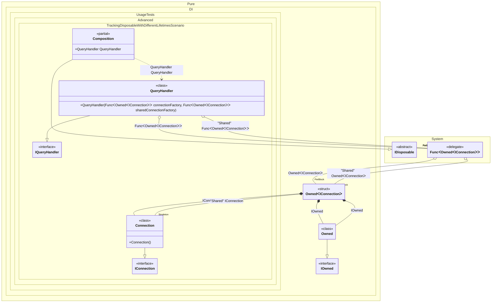

#### Tracking disposable instances with different lifetimes


```c#
using Shouldly;
using Pure.DI;

var composition = new Composition();
var queryHandler1 = composition.QueryHandler;
var queryHandler2 = composition.QueryHandler;

// The exclusive connection is created for each handler
queryHandler1.ExclusiveConnection.ShouldNotBe(queryHandler2.ExclusiveConnection);

// The shared connection is the same for all handlers
queryHandler1.SharedConnection.ShouldBe(queryHandler2.SharedConnection);

// Disposing the second handler
queryHandler2.Dispose();

// Checks that the exclusive connection
// associated with queryHandler2 has been disposed of
queryHandler2.ExclusiveConnection.IsDisposed.ShouldBeTrue();

// But the shared connection is still alive (not disposed)
// because it is a Singleton and shared with other consumers
queryHandler2.SharedConnection.IsDisposed.ShouldBeFalse();

// Checks that the connections associated with root1
// are not affected by queryHandler2 disposal
queryHandler1.ExclusiveConnection.IsDisposed.ShouldBeFalse();
queryHandler1.SharedConnection.IsDisposed.ShouldBeFalse();

// Disposing the first handler
queryHandler1.Dispose();

// Its exclusive connection is now disposed
queryHandler1.ExclusiveConnection.IsDisposed.ShouldBeTrue();

// The shared connection is STILL alive
queryHandler1.SharedConnection.IsDisposed.ShouldBeFalse();

// Disposing the composition root container
// This should dispose all Singletons
composition.Dispose();

// Now the shared connection is disposed
queryHandler1.SharedConnection.IsDisposed.ShouldBeTrue();

interface IConnection
{
    bool IsDisposed { get; }
}

class Connection : IConnection, IDisposable
{
    public bool IsDisposed { get; private set; }

    public void Dispose() => IsDisposed = true;
}

interface IQueryHandler
{
    public IConnection ExclusiveConnection { get; }

    public IConnection SharedConnection { get; }
}

class QueryHandler(
    Func<Owned<IConnection>> connectionFactory,
    [Tag("Shared")] Func<Owned<IConnection>> sharedConnectionFactory)
    : IQueryHandler, IDisposable
{
    private readonly Owned<IConnection> _exclusiveConnection = connectionFactory();
    private readonly Owned<IConnection> _sharedConnection = sharedConnectionFactory();

    public IConnection ExclusiveConnection => _exclusiveConnection.Value;

    public IConnection SharedConnection => _sharedConnection.Value;

    public void Dispose()
    {
        // Disposes the owned instances.
        // For the exclusive connection (Transient), this disposes the actual connection.
        // For the shared connection (Singleton), this just releases the ownership
        // but does NOT dispose the underlying singleton instance until the container is disposed.
        _exclusiveConnection.Dispose();
        _sharedConnection.Dispose();
    }
}

partial class Composition
{
    static void Setup() =>

        DI.Setup()
            .Bind().To<Connection>()
            .Bind("Shared").As(Lifetime.Singleton).To<Connection>()
            .Bind().To<QueryHandler>()

            // Composition root
            .Root<QueryHandler>("QueryHandler");
}
```

<details>
<summary>Running this code sample locally</summary>

- Make sure you have the [.NET SDK 10.0](https://dotnet.microsoft.com/en-us/download/dotnet/10.0) or later is installed
```bash
dotnet --list-sdk
```
- Create a net10.0 (or later) console application
```bash
dotnet new console -n Sample
```
- Add references to NuGet packages
  - [Pure.DI](https://www.nuget.org/packages/Pure.DI)
  - [Shouldly](https://www.nuget.org/packages/Shouldly)
```bash
dotnet add package Pure.DI
dotnet add package Shouldly
```
- Copy the example code into the _Program.cs_ file

You are ready to run the example 🚀
```bash
dotnet run
```

</details>

The following partial class will be generated:

```c#
partial class Composition: IDisposable
{
#if NET9_0_OR_GREATER
  private readonly Lock _lock = new Lock();
#else
  private readonly Object _lock = new Object();
#endif
  private object[] _disposables = new object[1];
  private int _disposeIndex;

  private Connection? _singletonConnection52;

  public QueryHandler QueryHandler
  {
    [MethodImpl(MethodImplOptions.AggressiveInlining)]
    get
    {
      var perBlockOwned3 = new Owned();
      Func<Owned<IConnection>> transientFunc1 = new Func<Owned<IConnection>>(
      [MethodImpl(MethodImplOptions.AggressiveInlining)]
      () =>
      {
        Owned<IConnection> transientOwned4;
        // Creates the owner of an instance
        Owned transientOwned5;
        Owned localOwned9 = perBlockOwned3;
        transientOwned5 = localOwned9;
        lock (_lock)
        {
          perBlockOwned3.Add(transientOwned5);
        }

        IOwned localOwned8 = transientOwned5;
        var transientConnection6 = new Connection();
        lock (_lock)
        {
          perBlockOwned3.Add(transientConnection6);
        }

        IConnection localValue12 = transientConnection6;
        transientOwned4 = new Owned<IConnection>(localValue12, localOwned8);
        lock (_lock)
        {
          perBlockOwned3.Add(transientOwned4);
        }

        Owned<IConnection> localValue11 = transientOwned4;
        return localValue11;
      });
      var perBlockOwned7 = new Owned();
      Func<Owned<IConnection>> transientFunc2 = new Func<Owned<IConnection>>(
      [MethodImpl(MethodImplOptions.AggressiveInlining)]
      () =>
      {
        Owned<IConnection> transientOwned8;
        // Creates the owner of an instance
        Owned transientOwned9;
        Owned localOwned11 = perBlockOwned7;
        transientOwned9 = localOwned11;
        lock (_lock)
        {
          perBlockOwned7.Add(transientOwned9);
        }

        IOwned localOwned10 = transientOwned9;
        if (_singletonConnection52 is null)
          lock (_lock)
            if (_singletonConnection52 is null)
            {
              _singletonConnection52 = new Connection();
              _disposables[_disposeIndex++] = _singletonConnection52;
            }

        IConnection localValue14 = _singletonConnection52;
        transientOwned8 = new Owned<IConnection>(localValue14, localOwned10);
        lock (_lock)
        {
          perBlockOwned7.Add(transientOwned8);
        }

        Owned<IConnection> localValue13 = transientOwned8;
        return localValue13;
      });
      return new QueryHandler(transientFunc1, transientFunc2);
    }
  }

  public void Dispose()
  {
    int disposeIndex;
    object[] disposables;
    lock (_lock)
    {
      disposeIndex = _disposeIndex;
      _disposeIndex = 0;
      disposables = _disposables;
      _disposables = new object[1];
      _singletonConnection52 = null;
    }

    while (disposeIndex-- > 0)
    {
      switch (disposables[disposeIndex])
      {
        case IDisposable disposableInstance:
          try
          {
            disposableInstance.Dispose();
          }
          catch (Exception exception)
          {
            OnDisposeException(disposableInstance, exception);
          }
          break;
      }
    }
  }

  partial void OnDisposeException<T>(T disposableInstance, Exception exception) where T : IDisposable;
}
```

Class diagram:



