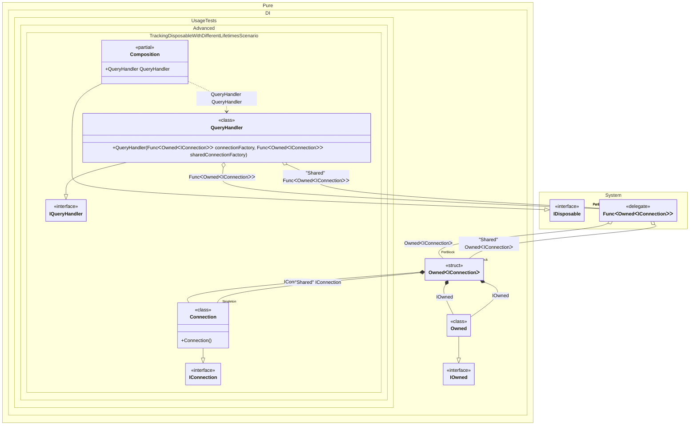

#### Tracking disposable instances with different lifetimes

`Owned<T>` tracking respects lifetimes. Disposing an `Owned<T>` immediately disposes the transient dependencies created for that graph, while for a `Singleton` dependency it only releases ownership — the shared instance stays alive for other consumers and is disposed only when the composition itself is disposed.


```c#
using Shouldly;
using Pure.DI;

var composition = new Composition();
var queryHandler1 = composition.QueryHandler;
var queryHandler2 = composition.QueryHandler;

// The exclusive connection is created for each handler
queryHandler1.ExclusiveConnection.ShouldNotBe(queryHandler2.ExclusiveConnection);

// The shared connection is the same for all handlers
queryHandler1.SharedConnection.ShouldBe(queryHandler2.SharedConnection);

// Disposing the second handler
queryHandler2.Dispose();

// Checks that the exclusive connection
// associated with queryHandler2 has been disposed of
queryHandler2.ExclusiveConnection.IsDisposed.ShouldBeTrue();

// But the shared connection is still alive (not disposed)
// because it is a Singleton and shared with other consumers
queryHandler2.SharedConnection.IsDisposed.ShouldBeFalse();

// Checks that the connections associated with root1
// are not affected by queryHandler2 disposal
queryHandler1.ExclusiveConnection.IsDisposed.ShouldBeFalse();
queryHandler1.SharedConnection.IsDisposed.ShouldBeFalse();

// Disposing the first handler
queryHandler1.Dispose();

// Its exclusive connection is now disposed
queryHandler1.ExclusiveConnection.IsDisposed.ShouldBeTrue();

// The shared connection is STILL alive
queryHandler1.SharedConnection.IsDisposed.ShouldBeFalse();

// Disposing the  root composition
// This should dispose all Singletons
composition.Dispose();

// Now the shared connection is disposed
queryHandler1.SharedConnection.IsDisposed.ShouldBeTrue();

interface IConnection
{
    bool IsDisposed { get; }
}

class Connection : IConnection, IDisposable
{
    public bool IsDisposed { get; private set; }

    public void Dispose() => IsDisposed = true;
}

interface IQueryHandler
{
    public IConnection ExclusiveConnection { get; }

    public IConnection SharedConnection { get; }
}

class QueryHandler(
    Func<Owned<IConnection>> connectionFactory,
    [Tag("Shared")] Func<Owned<IConnection>> sharedConnectionFactory)
    : IQueryHandler, IDisposable
{
    private readonly Owned<IConnection> _exclusiveConnection = connectionFactory();
    private readonly Owned<IConnection> _sharedConnection = sharedConnectionFactory();

    public IConnection ExclusiveConnection => _exclusiveConnection.Value;

    public IConnection SharedConnection => _sharedConnection.Value;

    public void Dispose()
    {
        // Disposes the owned instances.
        // For the exclusive connection (Transient), this disposes the actual connection.
        // For the shared connection (Singleton), this just releases the ownership
        // but does NOT dispose the underlying singleton instance until the composition is disposed.
        _exclusiveConnection.Dispose();
        _sharedConnection.Dispose();
    }
}

partial class Composition
{
    static void Setup() =>

        DI.Setup()
            .Bind().To<Connection>()
            .Bind("Shared").As(Lifetime.Singleton).To<Connection>()
            .Bind().To<QueryHandler>()

            // Composition root
            .Root<QueryHandler>("QueryHandler");
}
```

<details>
<summary>Running this code sample locally</summary>

- Make sure you have the [.NET SDK 10.0](https://dotnet.microsoft.com/en-us/download/dotnet/10.0) or later installed
```bash
dotnet --list-sdk
```
- Create a net10.0 (or later) console application
```bash
dotnet new console -n Sample
```
- Add references to the NuGet packages
  - [Pure.DI](https://www.nuget.org/packages/Pure.DI)
  - [Shouldly](https://www.nuget.org/packages/Shouldly)
```bash
dotnet add package Pure.DI
dotnet add package Shouldly
```
- Copy the example code into the _Program.cs_ file

You are ready to run the example 🚀
```bash
dotnet run
```

</details>

>[!NOTE]
>The tracking mechanism respects lifetime semantics, ensuring that transient instances are disposed immediately while singleton instances persist until composition disposal.

<details>
<summary>The following partial class will be generated</summary>

```c#
partial class Composition: IDisposable
{
#if NET9_0_OR_GREATER
  private readonly Lock _lock = new Lock();
#else
  private readonly Object _lock = new Object();
#endif
  private object[] _disposables = new object[1];
  private int _disposeIndex;

  private Connection? _singletonCompositionWithGenericRootsAndArgsInOtherProject;

  public QueryHandler QueryHandler
  {
    [MethodImpl(MethodImplOptions.AggressiveInlining)]
    get
    {
      Func<Owned<IConnection>> perBlockFuncOwnedIConnection = new Func<Owned<IConnection>>(
      [MethodImpl(MethodImplOptions.AggressiveInlining)]
      () =>
      {
        // Creates a deferred value
        var perBlockOwned = new Owned();
        ((IAccumulator)perBlockOwned).Initialize(_lock);
        Owned<IConnection> perBlockOwnedIConnection;
        // Tracks owned disposables
        Owned transientOwned;
        Owned localOwned1 = perBlockOwned;
        transientOwned = localOwned1;
        lock (_lock)
        {
          perBlockOwned.Add(transientOwned);
        }

        IOwned localOwned = transientOwned;
        // Creates the owned value
        var transientConnection = new Connection();
        lock (_lock)
        {
          perBlockOwned.Add(transientConnection);
        }

        IConnection localValue1 = transientConnection;
        perBlockOwnedIConnection = new Owned<IConnection>(localValue1, localOwned);
        lock (_lock)
        {
          perBlockOwned.Add(perBlockOwnedIConnection);
        }

        return perBlockOwnedIConnection;
      });
      Func<Owned<IConnection>> perBlockFuncOwnedIConnection1 = new Func<Owned<IConnection>>(
      [MethodImpl(MethodImplOptions.AggressiveInlining)]
      () =>
      {
        // Creates a deferred value
        var perBlockOwned1 = new Owned();
        ((IAccumulator)perBlockOwned1).Initialize(_lock);
        Owned<IConnection> perBlockOwnedIConnection1;
        // Tracks owned disposables
        Owned transientOwned1;
        Owned localOwned3 = perBlockOwned1;
        transientOwned1 = localOwned3;
        lock (_lock)
        {
          perBlockOwned1.Add(transientOwned1);
        }

        IOwned localOwned2 = transientOwned1;
        // Creates the owned value
        if (_singletonCompositionWithGenericRootsAndArgsInOtherProject is null)
          lock (_lock)
            if (_singletonCompositionWithGenericRootsAndArgsInOtherProject is null)
            {
              _singletonCompositionWithGenericRootsAndArgsInOtherProject = new Connection();
              _disposables[_disposeIndex++] = _singletonCompositionWithGenericRootsAndArgsInOtherProject;
            }

        IConnection localValue3 = _singletonCompositionWithGenericRootsAndArgsInOtherProject;
        perBlockOwnedIConnection1 = new Owned<IConnection>(localValue3, localOwned2);
        lock (_lock)
        {
          perBlockOwned1.Add(perBlockOwnedIConnection1);
        }

        return perBlockOwnedIConnection1;
      });
      return new QueryHandler(perBlockFuncOwnedIConnection, perBlockFuncOwnedIConnection1);
    }
  }

  public void Dispose()
  {
    int disposeIndex;
    object[] disposables;
    lock (_lock)
    {
      disposeIndex = _disposeIndex;
      _disposeIndex = 0;
      disposables = _disposables;
      _disposables = new object[1];
      _singletonCompositionWithGenericRootsAndArgsInOtherProject = null;
    }

    while (disposeIndex-- > 0)
    {
      switch (disposables[disposeIndex])
      {
        case IDisposable disposableInstance:
          try
          {
            disposableInstance.Dispose();
          }
          catch (Exception exception)
          {
            OnDisposeException(disposableInstance, exception);
          }
          break;
      }
    }
  }

  partial void OnDisposeException<T>(T disposableInstance, Exception exception) where T : IDisposable;
}
```

</details>

Class diagram:


```mermaid
---
 config:
  class:
   hideEmptyMembersBox: true
---
classDiagram
	Composition --|> IDisposable
	Owned --|> IOwned
	Connection --|> IConnection
	QueryHandler --|> IQueryHandler
	Composition ..> QueryHandler : QueryHandler QueryHandler
	QueryHandler o-- "PerBlock" FuncᐸOwnedᐸIConnectionᐳᐳ : FuncᐸOwnedᐸIConnectionᐳᐳ
	QueryHandler o-- "PerBlock" FuncᐸOwnedᐸIConnectionᐳᐳ : "Shared" FuncᐸOwnedᐸIConnectionᐳᐳ
	FuncᐸOwnedᐸIConnectionᐳᐳ o-- "PerBlock" OwnedᐸIConnectionᐳ : OwnedᐸIConnectionᐳ
	FuncᐸOwnedᐸIConnectionᐳᐳ o-- "PerBlock" OwnedᐸIConnectionᐳ : "Shared" OwnedᐸIConnectionᐳ
	OwnedᐸIConnectionᐳ *-- Owned : IOwned
	OwnedᐸIConnectionᐳ *-- Connection : IConnection
	OwnedᐸIConnectionᐳ *-- Owned : IOwned
	OwnedᐸIConnectionᐳ o-- "Singleton" Connection : "Shared" IConnection
	namespace Pure.DI {
		class IOwned {
			<<interface>>
		}
		class Owned {
				<<class>>
		}
		class OwnedᐸIConnectionᐳ {
				<<struct>>
		}
	}
	namespace Pure.DI.UsageTests.Advanced.TrackingDisposableWithDifferentLifetimesScenario {
		class Composition {
		<<partial>>
		+QueryHandler QueryHandler
		}
		class Connection {
				<<class>>
			+Connection()
		}
		class IConnection {
			<<interface>>
		}
		class IQueryHandler {
			<<interface>>
		}
		class QueryHandler {
				<<class>>
			+QueryHandler(FuncᐸOwnedᐸIConnectionᐳᐳ connectionFactory, FuncᐸOwnedᐸIConnectionᐳᐳ sharedConnectionFactory)
		}
	}
	namespace System {
		class FuncᐸOwnedᐸIConnectionᐳᐳ {
				<<delegate>>
		}
		class IDisposable {
			<<interface>>
		}
	}
```

See also:

- [Tracking disposable instances per a composition root](tracking-disposable-instances-per-a-composition-root.md)

