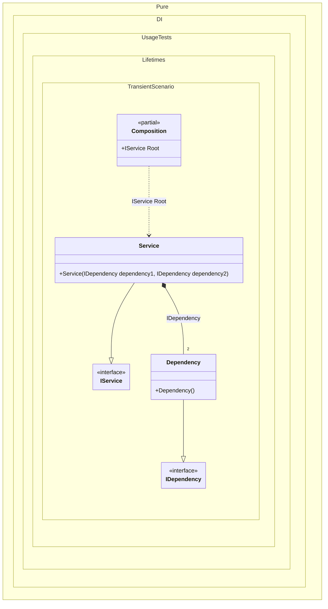

#### Transient

[](../tests/Pure.DI.UsageTests/Lifetimes/TransientScenario.cs)

The _Transient_ lifetime specifies to create a new dependency instance each time. It is the default lifetime and can be omitted.


```c#
interface IDependency;

class Dependency : IDependency;

interface IService
{
    public IDependency Dependency1 { get; }

    public IDependency Dependency2 { get; }
}

class Service(
    IDependency dependency1,
    IDependency dependency2)
    : IService
{
    public IDependency Dependency1 { get; } = dependency1;

    public IDependency Dependency2 { get; } = dependency2;
}

DI.Setup(nameof(Composition))
    // This hint indicates to not generate methods such as Resolve
    .Hint(Hint.Resolve, "Off")
    .Bind().As(Lifetime.Transient).To<Dependency>()
    .Bind().To<Service>()
    .Root<IService>("Root");

var composition = new Composition();
var service1 = composition.Root;
var service2 = composition.Root;
service1.Dependency1.ShouldNotBe(service1.Dependency2);
service2.Dependency1.ShouldNotBe(service1.Dependency1);
```

The _Transient_ lifetime is the safest and is used by default. Yes, its widespread use can cause a lot of memory traffic, but if there are doubts about thread safety, the _Transient_ lifetime is preferable because each consumer has its own instance of the dependency. The following nuances should be considered when choosing the _Transient_ lifetime:

- There will be unnecessary memory overhead that could be avoided.

- Every object created must be disposed of, and this will waste CPU resources, at least when the GC does its memory-clearing job.

- Poorly designed constructors can run slowly, perform functions that are not their own, and greatly hinder the efficient creation of compositions of multiple objects.

> [!IMPORTANT]
> The following very important rule, in my opinion, will help in the last point. Now, when a constructor is used to implement dependencies, it should not be loaded with other tasks. Accordingly, constructors should be free of all logic except for checking arguments and saving them for later use. Following this rule, even the largest compositions of objects will be built quickly.

The following partial class will be generated:

```c#
partial class Composition
{
  private readonly Composition _root;

  [OrdinalAttribute(256)]
  public Composition()
  {
    _root = this;
  }

  internal Composition(Composition parentScope)
  {
    _root = (parentScope ?? throw new ArgumentNullException(nameof(parentScope)))._root;
  }

  public IService Root
  {
    [MethodImpl(MethodImplOptions.AggressiveInlining)]
    get
    {
      return new Service(new Dependency(), new Dependency());
    }
  }
}
```

Class diagram:



