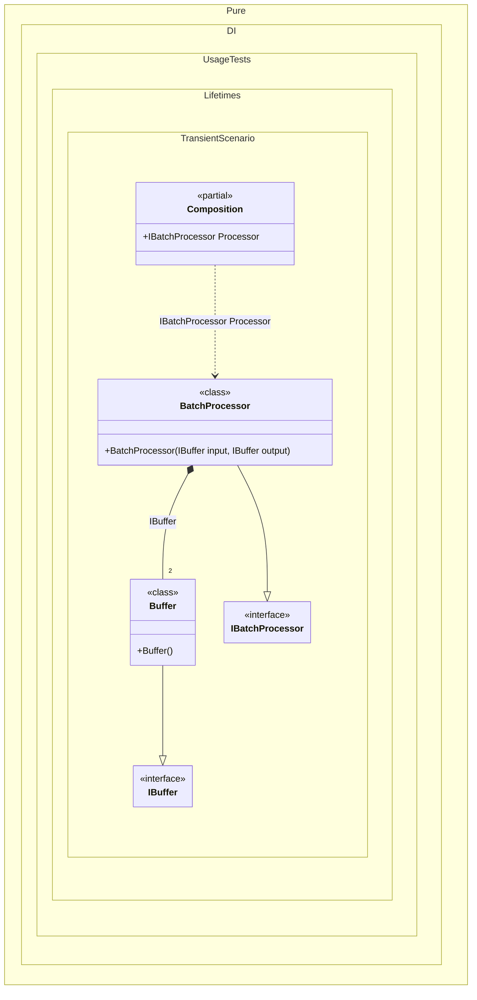

#### Transient

The _Transient_ lifetime specifies to create a new dependency instance each time. It is the default lifetime and can be omitted.


```c#
using Shouldly;
using Pure.DI;
using static Pure.DI.Lifetime;

DI.Setup(nameof(Composition))
    .Bind().As(Transient).To<Buffer>()
    .Bind().To<BatchProcessor>()
    .Root<IBatchProcessor>("Processor");

var composition = new Composition();
var processor = composition.Processor;

// Verify that input and output buffers are different instances.
// This is critical for the batch processor to avoid data corruption
// during reading. The Transient lifetime ensures a new instance
// is created for each dependency injection.
processor.Input.ShouldNotBe(processor.Output);

// Represents a memory buffer that should be unique for each operation
interface IBuffer;

class Buffer : IBuffer;

interface IBatchProcessor
{
    public IBuffer Input { get; }

    public IBuffer Output { get; }
}

class BatchProcessor(
    IBuffer input,
    IBuffer output)
    : IBatchProcessor
{
    public IBuffer Input { get; } = input;

    public IBuffer Output { get; } = output;
}
```

<details>
<summary>Running this code sample locally</summary>

- Make sure you have the [.NET SDK 10.0](https://dotnet.microsoft.com/en-us/download/dotnet/10.0) or later is installed
```bash
dotnet --list-sdk
```
- Create a net10.0 (or later) console application
```bash
dotnet new console -n Sample
```
- Add references to NuGet packages
  - [Pure.DI](https://www.nuget.org/packages/Pure.DI)
  - [Shouldly](https://www.nuget.org/packages/Shouldly)
```bash
dotnet add package Pure.DI
dotnet add package Shouldly
```
- Copy the example code into the _Program.cs_ file

You are ready to run the example 🚀
```bash
dotnet run
```

</details>

The _Transient_ lifetime is the safest and is used by default. Yes, its widespread use can cause a lot of memory traffic, but if there are doubts about thread safety, the _Transient_ lifetime is preferable because each consumer has its own instance of the dependency. The following nuances should be considered when choosing the _Transient_ lifetime:

- There will be unnecessary memory overhead that could be avoided.

- Every object created must be disposed of, and this will waste CPU resources, at least when the GC does its memory-clearing job.

- Poorly designed constructors can run slowly, perform functions that are not their own, and greatly hinder the efficient creation of compositions of multiple objects.

> [!IMPORTANT]
> The following very important rule, in my opinion, will help in the last point. Now, when a constructor is used to implement dependencies, it should not be loaded with other tasks. Accordingly, constructors should be free of all logic except for checking arguments and saving them for later use. Following this rule, even the largest compositions of objects will be built quickly.

The following partial class will be generated:

```c#
partial class Composition
{
  public IBatchProcessor Processor
  {
    [MethodImpl(MethodImplOptions.AggressiveInlining)]
    get
    {
      return new BatchProcessor(new Buffer(), new Buffer());
    }
  }
}
```

Class diagram:



