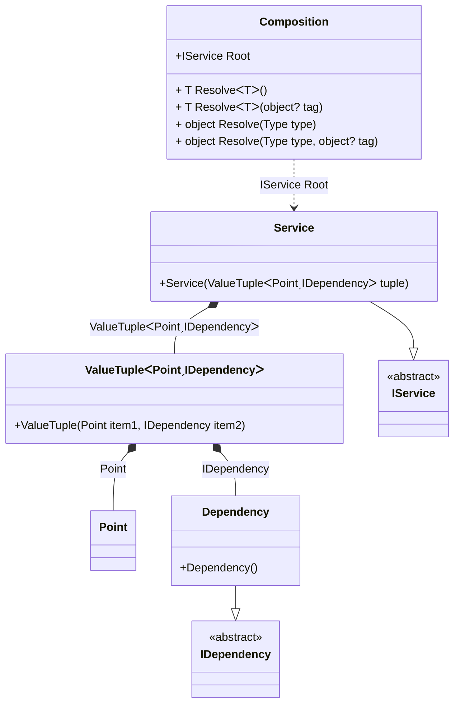

#### Tuple

[](../tests/Pure.DI.UsageTests/BaseClassLibrary/TupleScenario.cs)

The tuples feature provides concise syntax to group multiple data elements in a lightweight data structure. The following example shows how a type can ask to inject a tuple argument into it:

```c#
interface IDependency;

class Dependency : IDependency;

readonly record struct Point(int X, int Y);

interface IService
{
    IDependency Dependency { get; }
}

class Service((Point Point, IDependency Dependency) tuple) : IService
{
    public IDependency Dependency { get; } = tuple.Dependency;
}

DI.Setup(nameof(Composition))
    .Bind<IDependency>().To<Dependency>()
    .Bind<Point>().To(_ => new Point(7, 9))
    .Bind<IService>().To<Service>().Root<IService>("Root");

var composition = new Composition();
var root = composition.Root;
```

<details open>
<summary>Class Diagram</summary>



</details>

<details>
<summary>Pure.DI-generated partial class Composition</summary><blockquote>

```c#
/// <para>
/// Composition roots:<br/>
/// <list type="table">
/// <listheader>
/// <term>Root</term>
/// <description>Description</description>
/// </listheader>
/// <item>
/// <term>
/// <see cref="Pure.DI.UsageTests.BCL.TupleScenario.Service"/> Root
/// </term>
/// <description>
/// </description>
/// </item>
/// </list>
/// </para>
/// <example>
/// This shows how to get an instance of type <see cref="Pure.DI.UsageTests.BCL.TupleScenario.Service"/> using the composition root <see cref="Root"/>:
/// <code>
/// var composition = new Composition();
/// var instance = composition.Root;
/// </code>
/// </example>
/// <a href="https://mermaid.live/view#pako:eNqdVEFuwjAQ_Irlcw80HNJyg4RK3Coa9eSLSVbUNImjxEFCiDeUv_TSP_QV_KSxnWCThBJxWdm7Ozvr2ZX3OOQR4AkOY1oUPqPrnCYkJ6m6I48nGS-YYDxFpByN3JmMyZMzW7xBvmUhoCXnwrhRgJZQ8HgLp-NPcDp-K_eTss830_hqA6GQ5_ELEnTdgemEBqtBwS4DJCpzR7aH_qd0faPGO41LCMoslj2_cpaK36-FDxmkEaThrnpERyQD0eQKhZiA5LGmtwoov3OdX4Hl1YKobN9Y11MvmV_UVa4pMpVaMbtjE-obnG6nmfx1cjvjgtkO2LS1X3MOEFqcNe2Vqv16QzXWPXp0VYic1oOf17avUn_Hw8sM3BpnaquJ9LAb_c6Tv7NYdxcsUGeiLfBAzqro7UzJ1f5UHCWbttXutFan883gB5xAnlAWVd_WnmDxAQkQPCE4ovknwQd8-APMPbh1">Class diagram</a><br/>
/// This class was created by <a href="https://github.com/DevTeam/Pure.DI">Pure.DI</a> source code generator.
/// </summary>
/// <seealso cref="Pure.DI.DI.Setup"/>
[global::System.Diagnostics.CodeAnalysis.ExcludeFromCodeCoverage]
partial class Composition
{
  private readonly Composition _rootM03D11di;
  
  /// <summary>
  /// This constructor creates a new instance of <see cref="Composition"/>.
  /// </summary>
  public Composition()
  {
    _rootM03D11di = this;
  }
  
  /// <summary>
  /// This constructor creates a new instance of <see cref="Composition"/> scope based on <paramref name="baseComposition"/>. This allows the <see cref="Lifetime.Scoped"/> life time to be applied.
  /// </summary>
  /// <param name="baseComposition">Base composition.</param>
  internal Composition(Composition baseComposition)
  {
    _rootM03D11di = baseComposition._rootM03D11di;
  }
  
  #region Composition Roots
  public Pure.DI.UsageTests.BCL.TupleScenario.IService Root
  {
    #if NETSTANDARD2_0_OR_GREATER || NETCOREAPP || NET40_OR_GREATER || NET
    [global::System.Diagnostics.Contracts.Pure]
    #endif
    get
    {
      Pure.DI.UsageTests.BCL.TupleScenario.Point transientM03D11di2_Point = new Point(7, 9);
      return new Pure.DI.UsageTests.BCL.TupleScenario.Service((transientM03D11di2_Point, new Pure.DI.UsageTests.BCL.TupleScenario.Dependency()));
    }
  }
  #endregion
  
  #region API
  /// <summary>
  /// Resolves the composition root.
  /// </summary>
  /// <typeparam name="T">The type of the composition root.</typeparam>
  /// <returns>A composition root.</returns>
  #if NETSTANDARD2_0_OR_GREATER || NETCOREAPP || NET40_OR_GREATER || NET
  [global::System.Diagnostics.Contracts.Pure]
  #endif
  public T Resolve<T>()
  {
    return ResolverM03D11di<T>.Value.Resolve(this);
  }
  
  /// <summary>
  /// Resolves the composition root by tag.
  /// </summary>
  /// <typeparam name="T">The type of the composition root.</typeparam>
  /// <param name="tag">The tag of a composition root.</param>
  /// <returns>A composition root.</returns>
  #if NETSTANDARD2_0_OR_GREATER || NETCOREAPP || NET40_OR_GREATER || NET
  [global::System.Diagnostics.Contracts.Pure]
  #endif
  public T Resolve<T>(object? tag)
  {
    return ResolverM03D11di<T>.Value.ResolveByTag(this, tag);
  }
  
  /// <summary>
  /// Resolves the composition root.
  /// </summary>
  /// <param name="type">The type of the composition root.</param>
  /// <returns>A composition root.</returns>
  #if NETSTANDARD2_0_OR_GREATER || NETCOREAPP || NET40_OR_GREATER || NET
  [global::System.Diagnostics.Contracts.Pure]
  #endif
  public object Resolve(global::System.Type type)
  {
    var index = (int)(_bucketSizeM03D11di * ((uint)global::System.Runtime.CompilerServices.RuntimeHelpers.GetHashCode(type) % 1));
    var finish = index + _bucketSizeM03D11di;
    do {
      ref var pair = ref _bucketsM03D11di[index];
      if (ReferenceEquals(pair.Key, type))
      {
        return pair.Value.Resolve(this);
      }
    } while (++index < finish);
    
    throw new global::System.InvalidOperationException($"Cannot resolve composition root of type {type}.");
  }
  
  /// <summary>
  /// Resolves the composition root by tag.
  /// </summary>
  /// <param name="type">The type of the composition root.</param>
  /// <param name="tag">The tag of a composition root.</param>
  /// <returns>A composition root.</returns>
  #if NETSTANDARD2_0_OR_GREATER || NETCOREAPP || NET40_OR_GREATER || NET
  [global::System.Diagnostics.Contracts.Pure]
  #endif
  public object Resolve(global::System.Type type, object? tag)
  {
    var index = (int)(_bucketSizeM03D11di * ((uint)global::System.Runtime.CompilerServices.RuntimeHelpers.GetHashCode(type) % 1));
    var finish = index + _bucketSizeM03D11di;
    do {
      ref var pair = ref _bucketsM03D11di[index];
      if (ReferenceEquals(pair.Key, type))
      {
        return pair.Value.ResolveByTag(this, tag);
      }
    } while (++index < finish);
    
    throw new global::System.InvalidOperationException($"Cannot resolve composition root \"{tag}\" of type {type}.");
  }
  #endregion
  
  /// <summary>
  /// This method provides a class diagram in mermaid format. To see this diagram, simply call the method and copy the text to this site https://mermaid.live/.
  /// </summary>
  public override string ToString()
  {
    return
      "classDiagram\n" +
        "  class Composition {\n" +
          "    +IService Root\n" +
          "    + T ResolveᐸTᐳ()\n" +
          "    + T ResolveᐸTᐳ(object? tag)\n" +
          "    + object Resolve(Type type)\n" +
          "    + object Resolve(Type type, object? tag)\n" +
        "  }\n" +
        "  class ValueTupleᐸPointˏIDependencyᐳ {\n" +
          "    +ValueTuple(Point item1, IDependency item2)\n" +
        "  }\n" +
        "  class Point\n" +
        "  Dependency --|> IDependency : \n" +
        "  class Dependency {\n" +
          "    +Dependency()\n" +
        "  }\n" +
        "  Service --|> IService : \n" +
        "  class Service {\n" +
          "    +Service(ValueTupleᐸPointˏIDependencyᐳ tuple)\n" +
        "  }\n" +
        "  class IDependency {\n" +
          "    <<abstract>>\n" +
        "  }\n" +
        "  class IService {\n" +
          "    <<abstract>>\n" +
        "  }\n" +
        "  ValueTupleᐸPointˏIDependencyᐳ *--  Point : Point\n" +
        "  ValueTupleᐸPointˏIDependencyᐳ *--  Dependency : IDependency\n" +
        "  Service *--  ValueTupleᐸPointˏIDependencyᐳ : ValueTupleᐸPointˏIDependencyᐳ\n" +
        "  Composition ..> Service : IService Root";
  }
  
  private readonly static int _bucketSizeM03D11di;
  private readonly static global::Pure.DI.Pair<global::System.Type, global::Pure.DI.IResolver<Composition, object>>[] _bucketsM03D11di;
  
  static Composition()
  {
    var valResolverM03D11di_0000 = new ResolverM03D11di_0000();
    ResolverM03D11di<Pure.DI.UsageTests.BCL.TupleScenario.IService>.Value = valResolverM03D11di_0000;
    _bucketsM03D11di = global::Pure.DI.Buckets<global::System.Type, global::Pure.DI.IResolver<Composition, object>>.Create(
      1,
      out _bucketSizeM03D11di,
      new global::Pure.DI.Pair<global::System.Type, global::Pure.DI.IResolver<Composition, object>>[1]
      {
         new global::Pure.DI.Pair<global::System.Type, global::Pure.DI.IResolver<Composition, object>>(typeof(Pure.DI.UsageTests.BCL.TupleScenario.IService), valResolverM03D11di_0000)
      });
  }
  
  #region Resolvers
  private sealed class ResolverM03D11di<T>: global::Pure.DI.IResolver<Composition, T>
  {
    public static global::Pure.DI.IResolver<Composition, T> Value = new ResolverM03D11di<T>();
    
    public T Resolve(Composition composite)
    {
      throw new global::System.InvalidOperationException($"Cannot resolve composition root of type {typeof(T)}.");
    }
    
    public T ResolveByTag(Composition composite, object tag)
    {
      throw new global::System.InvalidOperationException($"Cannot resolve composition root \"{tag}\" of type {typeof(T)}.");
    }
  }
  
  private sealed class ResolverM03D11di_0000: global::Pure.DI.IResolver<Composition, Pure.DI.UsageTests.BCL.TupleScenario.IService>
  {
    public Pure.DI.UsageTests.BCL.TupleScenario.IService Resolve(Composition composition)
    {
      return composition.Root;
    }
    
    public Pure.DI.UsageTests.BCL.TupleScenario.IService ResolveByTag(Composition composition, object tag)
    {
      switch (tag)
      {
        case null:
          return composition.Root;
      }
      throw new global::System.InvalidOperationException($"Cannot resolve composition root \"{tag}\" of type Pure.DI.UsageTests.BCL.TupleScenario.IService.");
    }
  }
  #endregion
}
```

</blockquote></details>

