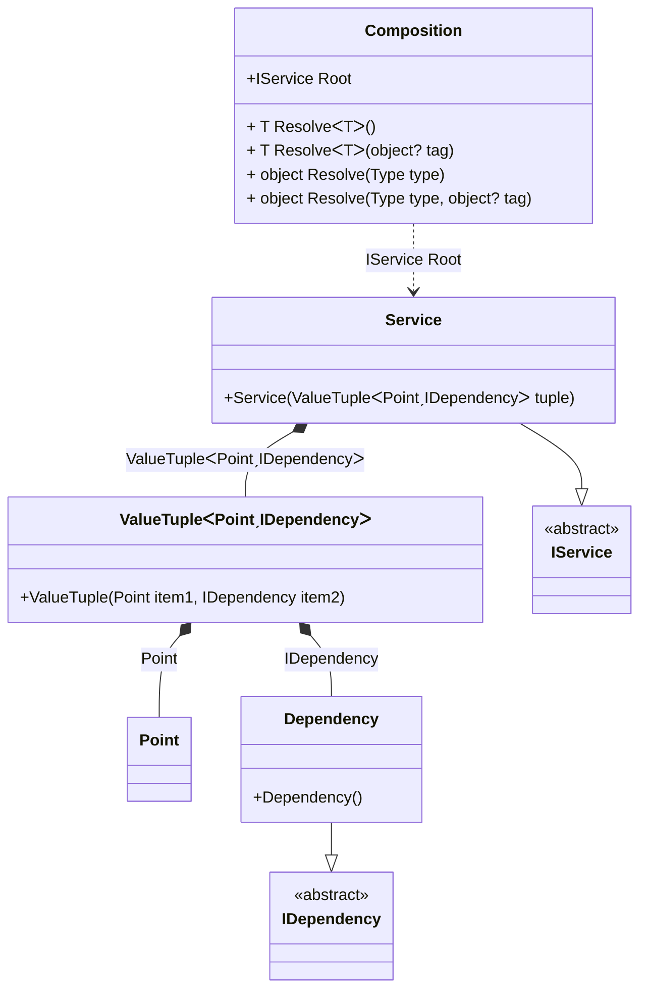

#### Tuple

[](../tests/Pure.DI.UsageTests/BaseClassLibrary/TupleScenario.cs)

The tuples feature provides concise syntax to group multiple data elements in a lightweight data structure. The following example shows how a type can ask to inject a tuple argument into it:

```c#
interface IDependency;

class Dependency : IDependency;

readonly record struct Point(int X, int Y);

interface IService
{
    IDependency Dependency { get; }
}

class Service((Point Point, IDependency Dependency) tuple) : IService
{
    public IDependency Dependency { get; } = tuple.Dependency;
}

DI.Setup(nameof(Composition))
    .Bind<IDependency>().To<Dependency>()
    .Bind<Point>().To(_ => new Point(7, 9))
    .Bind<IService>().To<Service>()

    // Composition root
    .Root<IService>("Root");

var composition = new Composition();
var root = composition.Root;
```

<details open>
<summary>Class Diagram</summary>



</details>

<details>
<summary>Pure.DI-generated partial class Composition</summary><blockquote>

```c#
partial class Composition
{
  private readonly Composition _rootM04D26di;
  
  public Composition()
  {
    _rootM04D26di = this;
  }
  
  internal Composition(Composition baseComposition)
  {
    _rootM04D26di = baseComposition._rootM04D26di;
  }
  
  public Pure.DI.UsageTests.BCL.TupleScenario.IService Root
  {
    [global::System.Runtime.CompilerServices.MethodImpl((global::System.Runtime.CompilerServices.MethodImplOptions)0x100)]
    get
    {
      Pure.DI.UsageTests.BCL.TupleScenario.Point transientM04D26di2_Point = new Point(7, 9);
      return new Pure.DI.UsageTests.BCL.TupleScenario.Service((transientM04D26di2_Point, new Pure.DI.UsageTests.BCL.TupleScenario.Dependency()));
    }
  }
  
  [global::System.Runtime.CompilerServices.MethodImpl((global::System.Runtime.CompilerServices.MethodImplOptions)0x100)]
  public T Resolve<T>()
  {
    return ResolverM04D26di<T>.Value.Resolve(this);
  }
  
  [global::System.Runtime.CompilerServices.MethodImpl((global::System.Runtime.CompilerServices.MethodImplOptions)0x100)]
  public T Resolve<T>(object? tag)
  {
    return ResolverM04D26di<T>.Value.ResolveByTag(this, tag);
  }
  
  [global::System.Runtime.CompilerServices.MethodImpl((global::System.Runtime.CompilerServices.MethodImplOptions)0x100)]
  public object Resolve(global::System.Type type)
  {
    var index = (int)(_bucketSizeM04D26di * ((uint)global::System.Runtime.CompilerServices.RuntimeHelpers.GetHashCode(type) % 1));
    ref var pair = ref _bucketsM04D26di[index];
    return pair.Key == type ? pair.Value.Resolve(this) : ResolveM04D26di(type, index);
  }
  
  [global::System.Runtime.CompilerServices.MethodImpl((global::System.Runtime.CompilerServices.MethodImplOptions)0x8)]
  private object ResolveM04D26di(global::System.Type type, int index)
  {
    var finish = index + _bucketSizeM04D26di;
    while (++index < finish)
    {
      ref var pair = ref _bucketsM04D26di[index];
      if (pair.Key == type)
      {
        return pair.Value.Resolve(this);
      }
    }
    
    throw new global::System.InvalidOperationException($"Cannot resolve composition root of type {type}.");
  }
  
  [global::System.Runtime.CompilerServices.MethodImpl((global::System.Runtime.CompilerServices.MethodImplOptions)0x100)]
  public object Resolve(global::System.Type type, object? tag)
  {
    var index = (int)(_bucketSizeM04D26di * ((uint)global::System.Runtime.CompilerServices.RuntimeHelpers.GetHashCode(type) % 1));
    ref var pair = ref _bucketsM04D26di[index];
    return pair.Key == type ? pair.Value.ResolveByTag(this, tag) : ResolveM04D26di(type, tag, index);
  }
  
  [global::System.Runtime.CompilerServices.MethodImpl((global::System.Runtime.CompilerServices.MethodImplOptions)0x8)]
  private object ResolveM04D26di(global::System.Type type, object? tag, int index)
  {
    var finish = index + _bucketSizeM04D26di;
    while (++index < finish)
    {
      ref var pair = ref _bucketsM04D26di[index];
      if (pair.Key == type)
      {
        return pair.Value.ResolveByTag(this, tag);
      }
    }
    
    throw new global::System.InvalidOperationException($"Cannot resolve composition root \"{tag}\" of type {type}.");
  }
  public override string ToString()
  {
    return
      "classDiagram\n" +
        "  class Composition {\n" +
          "    +IService Root\n" +
          "    + T ResolveᐸTᐳ()\n" +
          "    + T ResolveᐸTᐳ(object? tag)\n" +
          "    + object Resolve(Type type)\n" +
          "    + object Resolve(Type type, object? tag)\n" +
        "  }\n" +
        "  class ValueTupleᐸPointˏIDependencyᐳ {\n" +
          "    +ValueTuple(Point item1, IDependency item2)\n" +
        "  }\n" +
        "  class Point\n" +
        "  Dependency --|> IDependency : \n" +
        "  class Dependency {\n" +
          "    +Dependency()\n" +
        "  }\n" +
        "  Service --|> IService : \n" +
        "  class Service {\n" +
          "    +Service(ValueTupleᐸPointˏIDependencyᐳ tuple)\n" +
        "  }\n" +
        "  class IDependency {\n" +
          "    <<abstract>>\n" +
        "  }\n" +
        "  class IService {\n" +
          "    <<abstract>>\n" +
        "  }\n" +
        "  ValueTupleᐸPointˏIDependencyᐳ *--  Point : Point\n" +
        "  ValueTupleᐸPointˏIDependencyᐳ *--  Dependency : IDependency\n" +
        "  Service *--  ValueTupleᐸPointˏIDependencyᐳ : ValueTupleᐸPointˏIDependencyᐳ\n" +
        "  Composition ..> Service : IService Root";
  }
  
  private readonly static int _bucketSizeM04D26di;
  private readonly static global::Pure.DI.Pair<global::System.Type, global::Pure.DI.IResolver<Composition, object>>[] _bucketsM04D26di;
  
  static Composition()
  {
    var valResolverM04D26di_0000 = new ResolverM04D26di_0000();
    ResolverM04D26di<Pure.DI.UsageTests.BCL.TupleScenario.IService>.Value = valResolverM04D26di_0000;
    _bucketsM04D26di = global::Pure.DI.Buckets<global::System.Type, global::Pure.DI.IResolver<Composition, object>>.Create(
      1,
      out _bucketSizeM04D26di,
      new global::Pure.DI.Pair<global::System.Type, global::Pure.DI.IResolver<Composition, object>>[1]
      {
         new global::Pure.DI.Pair<global::System.Type, global::Pure.DI.IResolver<Composition, object>>(typeof(Pure.DI.UsageTests.BCL.TupleScenario.IService), valResolverM04D26di_0000)
      });
  }
  
  private sealed class ResolverM04D26di<T>: global::Pure.DI.IResolver<Composition, T>
  {
    public static global::Pure.DI.IResolver<Composition, T> Value = new ResolverM04D26di<T>();
    
    public T Resolve(Composition composite)
    {
      throw new global::System.InvalidOperationException($"Cannot resolve composition root of type {typeof(T)}.");
    }
    
    public T ResolveByTag(Composition composite, object tag)
    {
      throw new global::System.InvalidOperationException($"Cannot resolve composition root \"{tag}\" of type {typeof(T)}.");
    }
  }
  
  private sealed class ResolverM04D26di_0000: global::Pure.DI.IResolver<Composition, Pure.DI.UsageTests.BCL.TupleScenario.IService>
  {
    public Pure.DI.UsageTests.BCL.TupleScenario.IService Resolve(Composition composition)
    {
      return composition.Root;
    }
    
    public Pure.DI.UsageTests.BCL.TupleScenario.IService ResolveByTag(Composition composition, object tag)
    {
      switch (tag)
      {
        case null:
          return composition.Root;
        default:
          throw new global::System.InvalidOperationException($"Cannot resolve composition root \"{tag}\" of type Pure.DI.UsageTests.BCL.TupleScenario.IService.");
      }
    }
  }
}
```

</blockquote></details>

