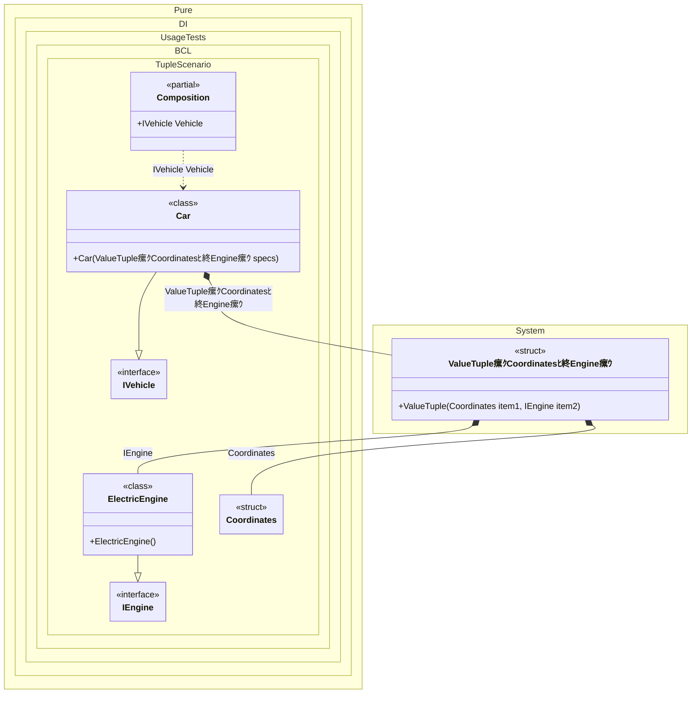

#### Tuple

The tuples feature provides concise syntax to group multiple data elements in a lightweight data structure. The following example shows how a type can ask to inject a tuple argument into it:


```c#
using Pure.DI;

DI.Setup(nameof(Composition))
    .Bind<IEngine>().To<ElectricEngine>()
    .Bind<Coordinates>().To(_ => new Coordinates(10, 20))
    .Bind<IVehicle>().To<Car>()

    // Composition root
    .Root<IVehicle>("Vehicle");

var composition = new Composition();
var vehicle = composition.Vehicle;

interface IEngine;

class ElectricEngine : IEngine;

readonly record struct Coordinates(int X, int Y);

interface IVehicle
{
    IEngine Engine { get; }
}

class Car((Coordinates StartPosition, IEngine Engine) specs) : IVehicle
{
    // The tuple 'specs' groups the initialization data (like coordinates)
    // and dependencies (like engine) into a single lightweight argument.
    public IEngine Engine { get; } = specs.Engine;
}
```

<details>
<summary>Running this code sample locally</summary>

- Make sure you have the [.NET SDK 10.0](https://dotnet.microsoft.com/en-us/download/dotnet/10.0) or later is installed
```bash
dotnet --list-sdk
```
- Create a net10.0 (or later) console application
```bash
dotnet new console -n Sample
```
- Add reference to NuGet package
  - [Pure.DI](https://www.nuget.org/packages/Pure.DI)
```bash
dotnet add package Pure.DI
```
- Copy the example code into the _Program.cs_ file

You are ready to run the example 🚀
```bash
dotnet run
```

</details>

The following partial class will be generated:

```c#
partial class Composition
{
  [OrdinalAttribute(256)]
  public Composition()
  {
  }

  internal Composition(Composition parentScope)
  {
  }

  public IVehicle Vehicle
  {
    [MethodImpl(MethodImplOptions.AggressiveInlining)]
    get
    {
      Coordinates transientCoordinates2 = new Coordinates(10, 20);
      return new Car((transientCoordinates2, new ElectricEngine()));
    }
  }
}
```

Class diagram:



