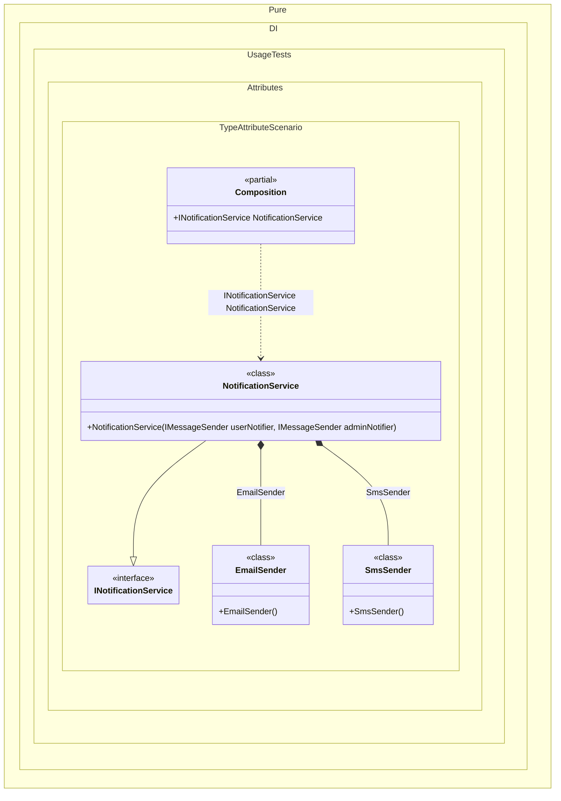

#### Type attribute

The injection type can be defined manually using the `Type` attribute. This attribute explicitly overrides an injected type, otherwise it would be determined automatically based on the type of the constructor/method, property, or field parameter.


```c#
using Shouldly;
using Pure.DI;

DI.Setup(nameof(Composition))
    .Bind().To<NotificationService>()

    // Composition root
    .Root<INotificationService>("NotificationService");

var composition = new Composition();
var notificationService = composition.NotificationService;
notificationService.UserNotifier.ShouldBeOfType<EmailSender>();
notificationService.AdminNotifier.ShouldBeOfType<SmsSender>();

interface IMessageSender;

class EmailSender : IMessageSender;

class SmsSender : IMessageSender;

interface INotificationService
{
    IMessageSender UserNotifier { get; }

    IMessageSender AdminNotifier { get; }
}

class NotificationService(
    // The [Type] attribute forces the injection of a specific type,
    // overriding the default resolution behavior.
    [Type(typeof(EmailSender))] IMessageSender userNotifier,
    [Type(typeof(SmsSender))] IMessageSender adminNotifier)
    : INotificationService
{
    public IMessageSender UserNotifier { get; } = userNotifier;

    public IMessageSender AdminNotifier { get; } = adminNotifier;
}
```

<details>
<summary>Running this code sample locally</summary>

- Make sure you have the [.NET SDK 10.0](https://dotnet.microsoft.com/en-us/download/dotnet/10.0) or later is installed
```bash
dotnet --list-sdk
```
- Create a net10.0 (or later) console application
```bash
dotnet new console -n Sample
```
- Add references to NuGet packages
  - [Pure.DI](https://www.nuget.org/packages/Pure.DI)
  - [Shouldly](https://www.nuget.org/packages/Shouldly)
```bash
dotnet add package Pure.DI
dotnet add package Shouldly
```
- Copy the example code into the _Program.cs_ file

You are ready to run the example 🚀
```bash
dotnet run
```

</details>

This attribute is part of the API, but you can use your own attribute at any time, and this allows you to define them in the assembly and namespace you want.

The following partial class will be generated:

```c#
partial class Composition
{
  [OrdinalAttribute(256)]
  public Composition()
  {
  }

  internal Composition(Composition parentScope)
  {
  }

  public INotificationService NotificationService
  {
    [MethodImpl(MethodImplOptions.AggressiveInlining)]
    get
    {
      return new NotificationService(new EmailSender(), new SmsSender());
    }
  }
}
```

Class diagram:



