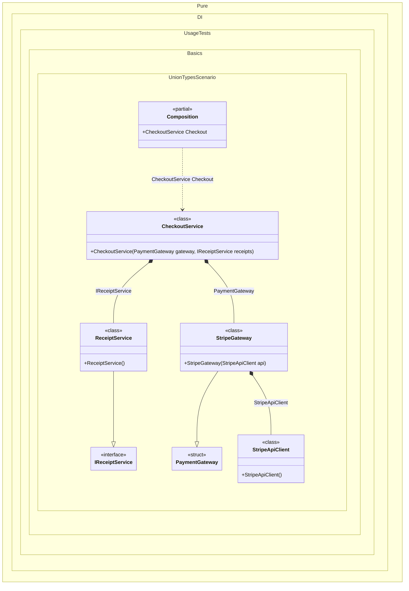

#### Union types

A union types C# feature allows declaring a union type such as `union PaymentGateway(StripeGateway, BankGateway);`. Each case type is implicitly convertible to the union, and Pure.DI uses this conversion to treat a case implementation as an implementation of the union DI contract. Unlike an interface contract, the case types do not have to share any common abstraction — they may even be third-party SDK types you cannot change. The checkout service below depends only on the `PaymentGateway` union and pattern matches over its cases, while the composition decides which gateway is used and builds the whole dependency graph of the selected case.


```c#
using Shouldly;
using Pure.DI;

DI.Setup(nameof(Composition))
    .Bind<IReceiptService>().To<ReceiptService>()

    // The composition decides which payment gateway
    // stands behind the union contract
    .Bind<PaymentGateway>().To<StripeGateway>()

    // Composition root
    .Root<CheckoutService>("Checkout");

var composition = new Composition();
var checkout = composition.Checkout;
checkout.Pay(4999).ShouldBe("Receipt: stripe/api charge 4999");

// The case types are independent classes, possibly from
// different vendor SDKs, and share no common interface.
// Each of them has its own dependencies that the composition
// builds behind the union contract.
class StripeApiClient
{
    public string Post(string request) => $"stripe/api {request}";
}

class StripeGateway(StripeApiClient api)
{
    public string Charge(int amountInCents) =>
        api.Post($"charge {amountInCents}");
}

class BankAccount
{
    public string Iban => "DE00 1234 5678";
}

class BankGateway(BankAccount account)
{
    public string Transfer(int amountInCents) =>
        $"bank transfer {amountInCents} from {account.Iban}";
}

// A union type: its case types are implicitly convertible
// to the union, and Pure.DI uses this conversion
// to satisfy the union contract
union PaymentGateway(StripeGateway, BankGateway);

interface IReceiptService
{
    string Print(string confirmation);
}

class ReceiptService : IReceiptService
{
    public string Print(string confirmation) => $"Receipt: {confirmation}";
}

// The service depends on the union contract instead of
// a specific gateway and handles each case explicitly
class CheckoutService(PaymentGateway gateway, IReceiptService receipts)
{
    public string Pay(int amountInCents)
    {
        var confirmation = gateway switch
        {
            StripeGateway stripe => stripe.Charge(amountInCents),
            BankGateway bank => bank.Transfer(amountInCents),
            _ => throw new InvalidOperationException("Unknown payment gateway.")
        };

        return receipts.Print(confirmation);
    }
}
```

<details>
<summary>Running this code sample locally</summary>

- Make sure you have the [.NET SDK 11.0](https://dotnet.microsoft.com/en-us/download/dotnet/11.0) or later installed
```bash
dotnet --list-sdk
```
- Create a net11.0 (or later) console application
```bash
dotnet new console -n Sample
```
- Add references to the NuGet packages
  - [Pure.DI](https://www.nuget.org/packages/Pure.DI)
  - [Shouldly](https://www.nuget.org/packages/Shouldly)
```bash
dotnet add package Pure.DI
dotnet add package Shouldly
```
- Copy the example code into the _Program.cs_ file

You are ready to run the example 🚀
```bash
dotnet run
```

</details>

Swapping the payment provider is a one-line change in the setup: `.Bind<PaymentGateway>().To<BankGateway>()` makes the same checkout root transfer money through the bank gateway together with its own dependencies.
If there is no explicit union binding and exactly one registered binding can be implicitly converted to the requested union, Pure.DI resolves the union through that single case automatically:
```c#
DI.Setup(nameof(Composition))
    .Bind<StripeGateway>().To<StripeGateway>()
    .Root<PaymentGateway>("Gateway");
```
When several case bindings are applicable to the same union contract and tag, Pure.DI reports error `DIE050` instead of picking a case arbitrarily. Bind the union contract explicitly, use distinct tags, or remove one of the candidate bindings.
Composition arguments and root arguments can also provide a case value. For example, `.Arg<StripeGateway>("gateway")` can satisfy a `PaymentGateway` dependency, while `.RootArg<StripeGateway>("gateway")` produces a root method that converts the supplied gateway on each call.
Generic unions are supported in bindings, factories, and both closed and generic roots. Pure.DI substitutes the requested type arguments and asks Roslyn whether the resulting case type converts to the closed union. Generic constraints are preserved on generated roots.
On-demand factories work for `Func<PaymentGateway>`, `Func<StripeGateway, PaymentGateway>`, and custom delegates. Delegate arguments are normal Pure.DI overrides: the case value is converted inside the delegate invocation and is not captured by the composition.
The case binding remains the owner of its lifetime and disposal behavior. `Singleton`, `Scoped`, and `PerResolve` are not replaced by the transient conversion node. A disposable singleton case is disposed exactly once by the composition, including when it is reached through a delegate or a collection. A disposable case supplied as a delegate argument is an external override and remains owned by the caller.
Direct nested unions are supported when an inner union is the actual source contract, for example `Bind<CardPayment>().To<Visa>()` followed by a `Payment` root whose case is `CardPayment`. Pure.DI materializes `CardPayment` before converting it to `Payment`. C# deliberately forbids chaining `Visa -> CardPayment -> Payment` when only a `Visa` binding exists, and Pure.DI reports the unresolved outer contract.
Collections deliberately keep the normal Pure.DI multi-binding rules. Register case bindings with `Tag.Unique` and request `IEnumerable<PaymentGateway>`, `PaymentGateway[]`, `List<PaymentGateway>`, `IReadOnlyList<PaymentGateway>`, immutable collections, `ReadOnlySpan<PaymentGateway>`, or `IAsyncEnumerable<PaymentGateway>` to receive every registered case converted to the union. Generic union elements and their tags are handled in the same way. A tag on the collection injection selects that collection dependency but does not filter its elements, matching the established Pure.DI collection semantics. A single `PaymentGateway` request with several matching cases remains ambiguous and reports `DIE050`.
Pure.DI follows Roslyn's standard-conversion rules before a case-to-union conversion, including derived-to-base, interface, boxing, and nullable conversions. User-defined conversion operators still shadow union conversions, while union conversions are never chained.
The preview specification also defines custom union member providers through a nested public `IUnionMembers` interface with static `Create` methods. Pure.DI keeps provider handling compiler-driven: Roslyn 5.6 does not yet classify these provider conversions as union conversions, so Pure.DI does not emulate them. The integration suite contains pending positive scenarios for generic and `in`-parameter providers, plus an active compiler-level guard that will signal when Roslyn support becomes available.
For `DIE050`, every candidate is shown with its case type, effective lifetime, and binding expression; related locations point to the ambiguous root or injection and to each candidate binding.
The generated code stays statically typed: the case instance is converted to the union by the C# compiler at the injection site, so lifetimes of case bindings remain visible to lifetime validation.
This scenario requires the preview language version and .NET 11 Preview 5 or later, where the union runtime types are available.

<details>
<summary>The following partial class will be generated</summary>

```c#
partial class Composition
{
  public CheckoutService Checkout
  {
    [MethodImpl(MethodImplOptions.AggressiveInlining)]
    get
    {
      return new CheckoutService(new StripeGateway(new StripeApiClient()), new ReceiptService());
    }
  }
}
```

</details>

Class diagram:



