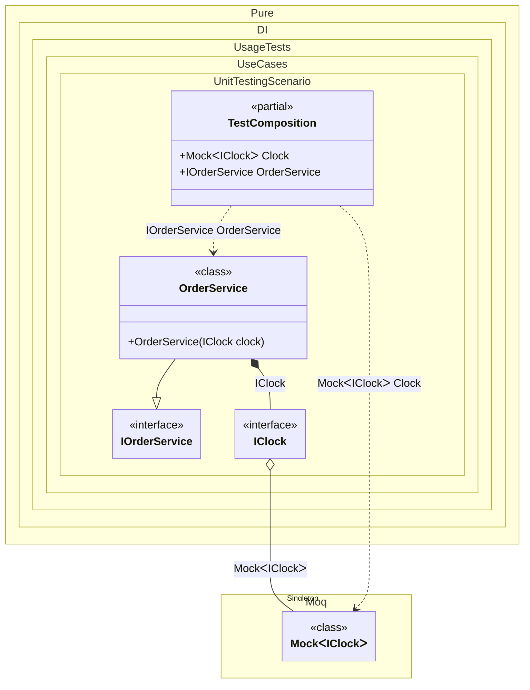

#### Unit testing

A key benefit of dependency injection is testability: to test a service, replace its dependencies with deterministic test doubles. With Pure.DI, this substitution happens in the setup code and is verified at compile time. Put the bindings shared by the application and the tests into a `CompositionKind.Internal` setup, and let each composition — the production one and the test one — add its environment-specific bindings via `DependsOn(...)`.
To use a mocking library such as _Moq_, bind a configured `Mock<T>` as a singleton, map the contract to `mock.Object`, and expose the mock itself as a composition root — the test then reaches the mock through that root to arrange behavior and verify calls.


```c#
using Shouldly;
using Moq;
using Pure.DI;
using static Pure.DI.CompositionKind;

// Bindings shared by the application and the tests
DI.Setup("Shared", Internal)
    .Bind<IOrderService>().To<OrderService>();

// The production composition uses the real clock
DI.Setup(nameof(Composition))
    .DependsOn("Shared")
    .Singleton<SystemClock>()
    .Root<IOrderService>("OrderService");

// The test composition binds a configured mock instead of the real clock
// and exposes it as the "Clock" root so the test can access it
DI.Setup(nameof(TestComposition))
    .DependsOn("Shared")
    .Singleton(_ => {
        // The test replaces the clock with a deterministic mock
        var clock = new Mock<IClock>();
        clock.SetupGet(i => i.Now)
            .Returns(new DateTimeOffset(2024, 1, 1, 12, 0, 0, TimeSpan.Zero));
        return clock;
    }).Root<Mock<IClock>>("Clock")
    .Transient((Mock<IClock> mock) => mock.Object)
    .Root<IOrderService>("OrderService");

// And verifies the service logic against the fixed time
var composition = new TestComposition();
var orderService = composition.OrderService;

// An order placed 31 days before the mocked "now" is expired
orderService.IsExpired(composition.Clock.Object.Now.AddDays(-31)).ShouldBeTrue();

// An order placed 1 day before the mocked "now" is still valid
orderService.IsExpired(composition.Clock.Object.Now.AddDays(-1)).ShouldBeFalse();

// The contract is public so that the mocking library can create a proxy for it
public interface IClock
{
    DateTimeOffset Now { get; }
}

// The real clock used by the application
class SystemClock : IClock
{
    public DateTimeOffset Now => DateTimeOffset.Now;
}

interface IOrderService
{
    bool IsExpired(DateTimeOffset orderDate);
}

// The service under test knows nothing about test doubles
class OrderService(IClock clock) : IOrderService
{
    public bool IsExpired(DateTimeOffset orderDate) =>
        clock.Now - orderDate > TimeSpan.FromDays(30);
}
```

<details>
<summary>Running this code sample locally</summary>

- Make sure you have the [.NET SDK 10.0](https://dotnet.microsoft.com/en-us/download/dotnet/10.0) or later installed
```bash
dotnet --list-sdk
```
- Create a net10.0 (or later) console application
```bash
dotnet new console -n Sample
```
- Add references to the NuGet packages
  - [Pure.DI](https://www.nuget.org/packages/Pure.DI)
  - [Shouldly](https://www.nuget.org/packages/Shouldly)
  - [Moq](https://www.nuget.org/packages/Moq)
```bash
dotnet add package Pure.DI
dotnet add package Shouldly
dotnet add package Moq
```
- Copy the example code into the _Program.cs_ file

You are ready to run the example 🚀
```bash
dotnet run
```

</details>

>[!TIP]
>If you prefer to avoid mocking libraries, bind a hand-written fake in the test setup instead: `.Bind<IClock>().To<FakeClock>()`.

<details>
<summary>The following partial class will be generated</summary>

```c#
partial class Composition
{
#if NET9_0_OR_GREATER
  private readonly Lock _lock = new Lock();
#else
  private readonly Object _lock = new Object();
#endif

  private SystemClock? _singletonCompositionWithGenericRootsAndArgsInOtherProject;

  public IOrderService OrderService
  {
    [MethodImpl(MethodImplOptions.AggressiveInlining)]
    get
    {
      if (_singletonCompositionWithGenericRootsAndArgsInOtherProject is null)
        lock (_lock)
          if (_singletonCompositionWithGenericRootsAndArgsInOtherProject is null)
          {
            _singletonCompositionWithGenericRootsAndArgsInOtherProject = new SystemClock();
          }

      return new OrderService(_singletonCompositionWithGenericRootsAndArgsInOtherProject);
    }
  }
}
```

</details>
<details>
<summary>The following partial class will be generated</summary>

```c#
partial class TestComposition
{
#if NET9_0_OR_GREATER
  private readonly Lock _lock = new Lock();
#else
  private readonly Object _lock = new Object();
#endif

  private Moq.Mock<IClock>? _singletonCompositionWithGenericRootsAndArgsInOtherProject;

  public IOrderService OrderService
  {
    [MethodImpl(MethodImplOptions.AggressiveInlining)]
    get
    {
      IClock transientIClock;
      if (_singletonCompositionWithGenericRootsAndArgsInOtherProject is null)
        lock (_lock)
          if (_singletonCompositionWithGenericRootsAndArgsInOtherProject is null)
          {
            // The test replaces the clock with a deterministic mock
            var localClock = new Mock<IClock>();
            localClock.SetupGet(i => i.Now).Returns(new DateTimeOffset(2024, 1, 1, 12, 0, 0, TimeSpan.Zero));
            _singletonCompositionWithGenericRootsAndArgsInOtherProject = localClock;
          }

      Moq.Mock<IClock> localMock = _singletonCompositionWithGenericRootsAndArgsInOtherProject;
      transientIClock = localMock.Object;
      return new OrderService(transientIClock);
    }
  }

  public Moq.Mock<IClock> Clock
  {
    [MethodImpl(MethodImplOptions.AggressiveInlining)]
    get
    {
      if (_singletonCompositionWithGenericRootsAndArgsInOtherProject is null)
        lock (_lock)
          if (_singletonCompositionWithGenericRootsAndArgsInOtherProject is null)
          {
            // The test replaces the clock with a deterministic mock
            var localClock = new Mock<IClock>();
            localClock.SetupGet(i => i.Now).Returns(new DateTimeOffset(2024, 1, 1, 12, 0, 0, TimeSpan.Zero));
            _singletonCompositionWithGenericRootsAndArgsInOtherProject = localClock;
          }

      return _singletonCompositionWithGenericRootsAndArgsInOtherProject;
    }
  }
}
```

</details>

Class diagram:



See also:

- [Dependent compositions](dependent-compositions.md)
- [Composition arguments](composition-arguments.md)
- [Root arguments](root-arguments.md)

