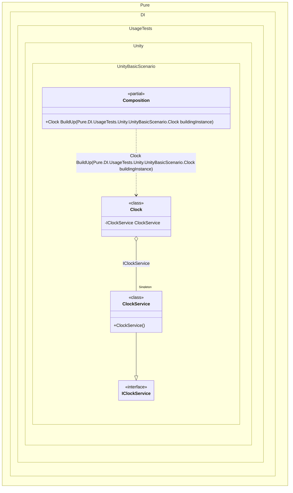

#### Unity Basics


```c#
using Pure.DI;
using UnityEngine;

public class Clock : MonoBehaviour
{
    const float HoursToDegrees = -30f, MinutesToDegrees = -6f, SecondsToDegrees = -6f;
    [SerializeField] Scope scope;
    [SerializeField] Transform hoursPivot;
    [SerializeField] Transform minutesPivot;
    [SerializeField] Transform secondsPivot;

    [Dependency]
    public IClockService ClockService { private get; set; }

    public void Awake()
    {
        scope.BuildUp(this);
    }

    public void Update()
    {
        var now = ClockService.Now.TimeOfDay;
        hoursPivot.localRotation = Quaternion.Euler(0f, 0f, HoursToDegrees * (float)now.TotalHours);
        minutesPivot.localRotation = Quaternion.Euler(0f, 0f, MinutesToDegrees * (float)now.TotalMinutes);
        secondsPivot.localRotation = Quaternion.Euler(0f, 0f, SecondsToDegrees * (float)now.TotalSeconds);
    }
}

public interface IClockConfig
{
    TimeSpan Offset { get; }
}

[CreateAssetMenu(fileName = "ClockConfig", menuName = "Clock/Config")]
public class ClockConfig : ScriptableObject, IClockConfig
{
    [SerializeField] int offsetHours;

    public TimeSpan Offset => TimeSpan.FromHours(offsetHours);
}

public interface IClockService
{
    DateTime Now { get; }
}

public class ClockService : IClockService, IDisposable
{
    private readonly IClockConfig _config;

    public DateTime Now => DateTime.UtcNow + _config.Offset;

    public ClockService(IClockConfig config)
    {
        _config = config;
    }

    public void Dispose()
    {
        // Perform any necessary cleanup here
    }
}

public partial class Scope : MonoBehaviour
{
    [SerializeField] ClockConfig clockConfig;

    void Setup() =>
        DI.Setup()
        .Bind().To(_ => clockConfig)
        .Bind().As(Lifetime.Singleton).To<ClockService>()
        .Builders<MonoBehaviour>();

    void OnDestroy()
    {
        Dispose();
    }
}
```

<details>
<summary>Running this code sample locally</summary>

- Make sure you have the [.NET SDK 10.0](https://dotnet.microsoft.com/en-us/download/dotnet/10.0) or later is installed
```bash
dotnet --list-sdk
```
- Create a net10.0 (or later) console application
```bash
dotnet new console -n Sample
```
- Add reference to NuGet package
  - [Pure.DI](https://www.nuget.org/packages/Pure.DI)
```bash
dotnet add package Pure.DI
```
- Copy the example code into the _Program.cs_ file

You are ready to run the example 🚀
```bash
dotnet run
```

</details>

The following partial class will be generated:

```c#
partial class Scope: IDisposable
{
#if NET9_0_OR_GREATER
  private readonly Lock _lock = new Lock();
#else
  private readonly Object _lock = new Object();
#endif
  private object[] _disposables = new object[1];
  private int _disposeIndex;

  private ClockService? _singletonClockService52;

  [MethodImpl(MethodImplOptions.AggressiveInlining)]
  public Clock BuildUp(Clock buildingInstance)
  {
    if (buildingInstance is null) throw new ArgumentNullException(nameof(buildingInstance));
    Clock transientClock2;
    Clock localBuildingInstance13 = buildingInstance;
    if (_singletonClockService52 is null)
      lock (_lock)
        if (_singletonClockService52 is null)
        {
          ClockConfig transientClockConfig5 = clockConfig;
          _singletonClockService52 = new ClockService(transientClockConfig5);
          _disposables[_disposeIndex++] = _singletonClockService52;
        }

    localBuildingInstance13.ClockService = _singletonClockService52;
    transientClock2 = localBuildingInstance13;
    return transientClock2;
  }

  #pragma warning disable CS0162
  [MethodImpl(MethodImplOptions.NoInlining)]
  public UnityEngine.MonoBehaviour BuildUp(UnityEngine.MonoBehaviour buildingInstance)
  {
    if (buildingInstance is null) throw new ArgumentNullException(nameof(buildingInstance));
    switch (buildingInstance)
    {
      case Clock Clock:
        return BuildUp(Clock);
      default:
        throw new ArgumentException($"Unable to build an instance of typeof type {buildingInstance.GetType()}.", "buildingInstance");
    }
    return buildingInstance;
  }
  #pragma warning restore CS0162

  [MethodImpl(MethodImplOptions.AggressiveInlining)]
  public T Resolve<T>()
  {
    return Resolver<T>.Value.Resolve(this);
  }

  [MethodImpl(MethodImplOptions.AggressiveInlining)]
  public T Resolve<T>(object? tag)
  {
    return Resolver<T>.Value.ResolveByTag(this, tag);
  }

  [MethodImpl(MethodImplOptions.AggressiveInlining)]
  public object Resolve(Type type)
  {
    throw new CannotResolveException($"{CannotResolveMessage} {OfTypeMessage} {type}.", type, null);
  }

  [MethodImpl(MethodImplOptions.AggressiveInlining)]
  public object Resolve(Type type, object? tag)
  {
    throw new CannotResolveException($"{CannotResolveMessage} \"{tag}\" {OfTypeMessage} {type}.", type, tag);
  }

  public void Dispose()
  {
    int disposeIndex;
    object[] disposables;
    lock (_lock)
    {
      disposeIndex = _disposeIndex;
      _disposeIndex = 0;
      disposables = _disposables;
      _disposables = new object[1];
      _singletonClockService52 = null;
    }

    while (disposeIndex-- > 0)
    {
      switch (disposables[disposeIndex])
      {
        case IDisposable disposableInstance:
          try
          {
            disposableInstance.Dispose();
          }
          catch (Exception exception)
          {
            OnDisposeException(disposableInstance, exception);
          }
          break;
      }
    }
  }

  partial void OnDisposeException<T>(T disposableInstance, Exception exception) where T : IDisposable;

  private const string CannotResolveMessage = "Cannot resolve composition root ";
  private const string OfTypeMessage = "of type ";

  private class Resolver<T>: IResolver<Scope, T>
  {
    public static IResolver<Scope, T> Value = new Resolver<T>();

    public virtual T Resolve(Scope composite)
    {
      throw new CannotResolveException($"{CannotResolveMessage}{OfTypeMessage}{typeof(T)}.", typeof(T), null);
    }

    public virtual T ResolveByTag(Scope composite, object tag)
    {
      throw new CannotResolveException($"{CannotResolveMessage}\"{tag}\" {OfTypeMessage}{typeof(T)}.", typeof(T), tag);
    }
  }
}
```

Class diagram:



