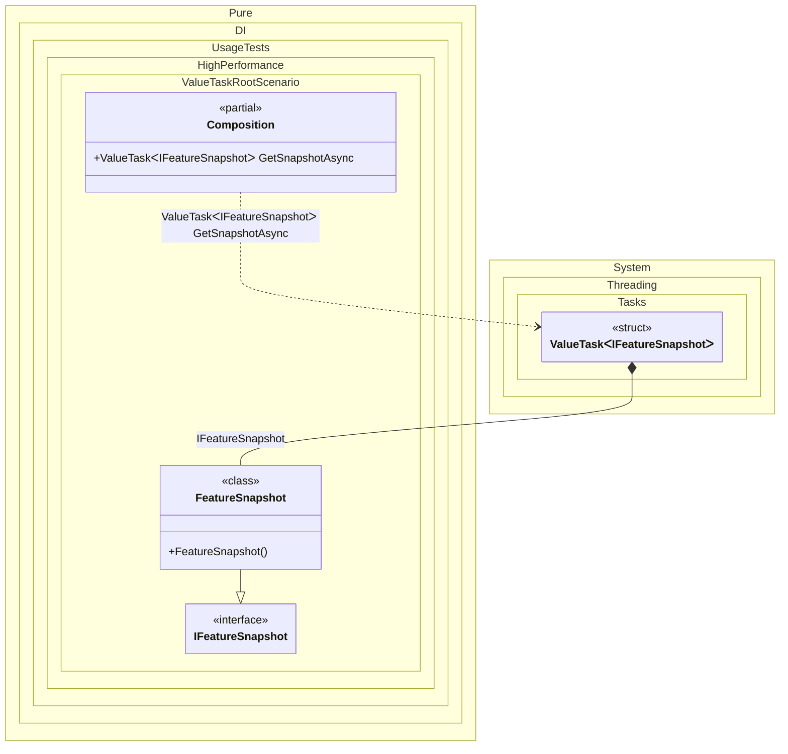

#### ValueTask root

A root can return `ValueTask<T>` when the caller naturally awaits the result but most executions complete synchronously. This avoids allocating a `Task<T>` for the fast path while still allowing the same API to grow into asynchronous initialization later.
The example models a feature flag snapshot used by request routing. The snapshot is normally available from an in-memory cache, so the composition root returns a completed `ValueTask<IFeatureSnapshot>` and the caller can await it without forcing a heap allocation for the common case.


```c#
using Shouldly;
using Pure.DI;

DI.Setup(nameof(Composition))
    .Bind<IFeatureSnapshot>().To<FeatureSnapshot>()
    .Root<ValueTask<IFeatureSnapshot>>("GetSnapshotAsync");

var composition = new Composition();

var snapshot = await composition.GetSnapshotAsync;
snapshot.IsEnabled("checkout-v2").ShouldBeTrue();

interface IFeatureSnapshot
{
    bool IsEnabled(string name);
}

sealed class FeatureSnapshot : IFeatureSnapshot
{
    private readonly HashSet<string> _enabled =
    [
        "checkout-v2",
        "new-search"
    ];

    public bool IsEnabled(string name) => _enabled.Contains(name);
}
```

<details>
<summary>Running this code sample locally</summary>

- Make sure you have the [.NET SDK 10.0](https://dotnet.microsoft.com/en-us/download/dotnet/10.0) or later installed
```bash
dotnet --list-sdk
```
- Create a net10.0 (or later) console application
```bash
dotnet new console -n Sample
```
- Add references to the NuGet packages
  - [Pure.DI](https://www.nuget.org/packages/Pure.DI)
  - [Shouldly](https://www.nuget.org/packages/Shouldly)
```bash
dotnet add package Pure.DI
dotnet add package Shouldly
```
- Copy the example code into the _Program.cs_ file

You are ready to run the example 🚀
```bash
dotnet run
```

</details>

Use `ValueTask<T>` for roots that are awaited frequently and usually complete synchronously. Keep the usual `ValueTask<T>` rules: await it once, do not store it for later, and use `Task<T>` when the result is naturally shared or awaited multiple times.
Pure.DI still generates regular strongly typed code; the performance benefit comes from choosing an allocation-friendly asynchronous shape at the root boundary.

<details>
<summary>The following partial class will be generated</summary>

```c#
partial class Composition
{
  public ValueTask<IFeatureSnapshot> GetSnapshotAsync
  {
    [MethodImpl(MethodImplOptions.AggressiveInlining)]
    get
    {
      ValueTask<IFeatureSnapshot> transientValueTaskIFeatureSnapshot;
      // Creates the task result
      IFeatureSnapshot localValue = new FeatureSnapshot();
      // Wraps it in ValueTask<T>
      transientValueTaskIFeatureSnapshot = new ValueTask<IFeatureSnapshot>(localValue);
      return transientValueTaskIFeatureSnapshot;
    }
  }
}
```

</details>

Class diagram:



See also:

- [ValueTask](valuetask.md)
- [Async Root](async-root.md)

