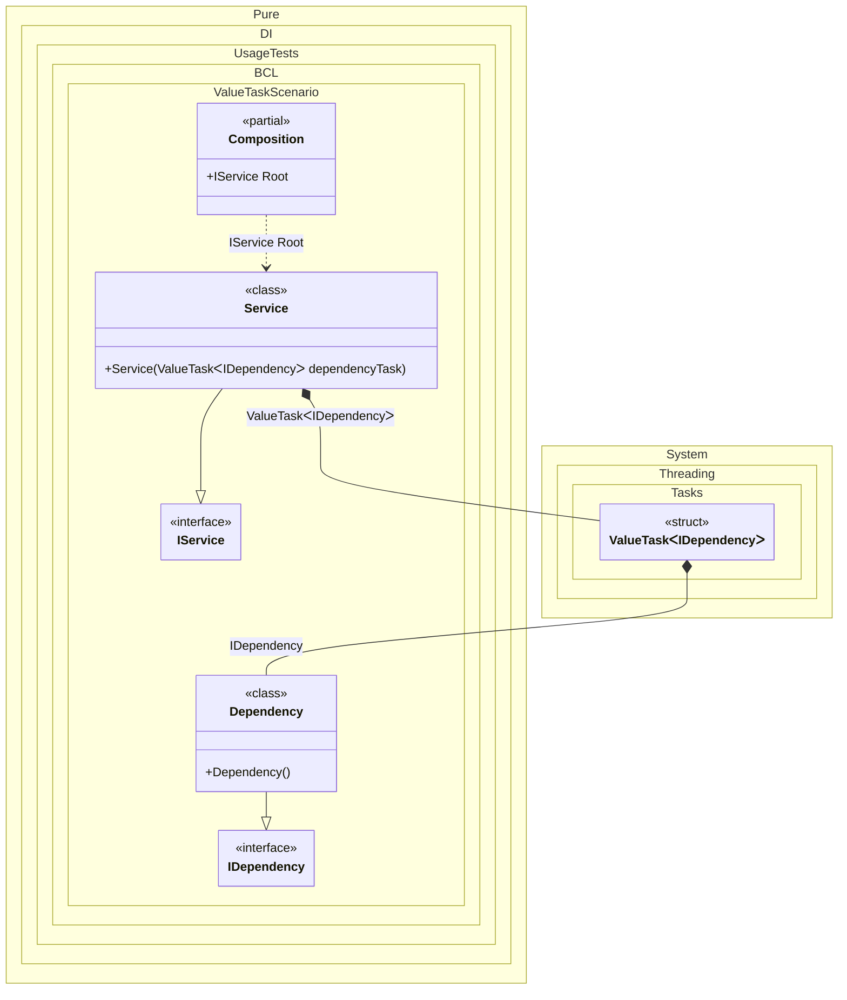

#### ValueTask


```c#
using Pure.DI;

DI.Setup(nameof(Composition))
    .Bind<IDependency>().To<Dependency>()
    .Bind<IService>().To<Service>()

    // Composition root
    .Root<IService>("Root");

var composition = new Composition();
var service = composition.Root;
await service.RunAsync();

interface IDependency
{
    ValueTask DoSomething();
}

class Dependency : IDependency
{
    public ValueTask DoSomething() => ValueTask.CompletedTask;
}

interface IService
{
    ValueTask RunAsync();
}

class Service(ValueTask<IDependency> dependencyTask) : IService
{
    public async ValueTask RunAsync()
    {
        var dependency = await dependencyTask;
        await dependency.DoSomething();
    }
}
```

<details>
<summary>Running this code sample locally</summary>

- Make sure you have the [.NET SDK 9.0](https://dotnet.microsoft.com/en-us/download/dotnet/9.0) or later is installed
```bash
dotnet --list-sdk
```
- Create a net9.0 (or later) console application
```bash
dotnet new console -n Sample
```
- Add reference to NuGet package
  - [Pure.DI](https://www.nuget.org/packages/Pure.DI)
```bash
dotnet add package Pure.DI
```
- Copy the example code into the _Program.cs_ file

You are ready to run the example 🚀
```bash
dotnet run
```

</details>

The following partial class will be generated:

```c#
partial class Composition
{
  [OrdinalAttribute(256)]
  public Composition()
  {
  }

  internal Composition(Composition parentScope)
  {
  }

  public IService Root
  {
    [MethodImpl(MethodImplOptions.AggressiveInlining)]
    get
    {
      ValueTask<IDependency> transientValueTask1;
      IDependency localValue25 = new Dependency();
      // Initializes a new instance of the ValueTask class using the supplied instance
      transientValueTask1 = new ValueTask<IDependency>(localValue25);
      return new Service(transientValueTask1);
    }
  }
}
```

Class diagram:



