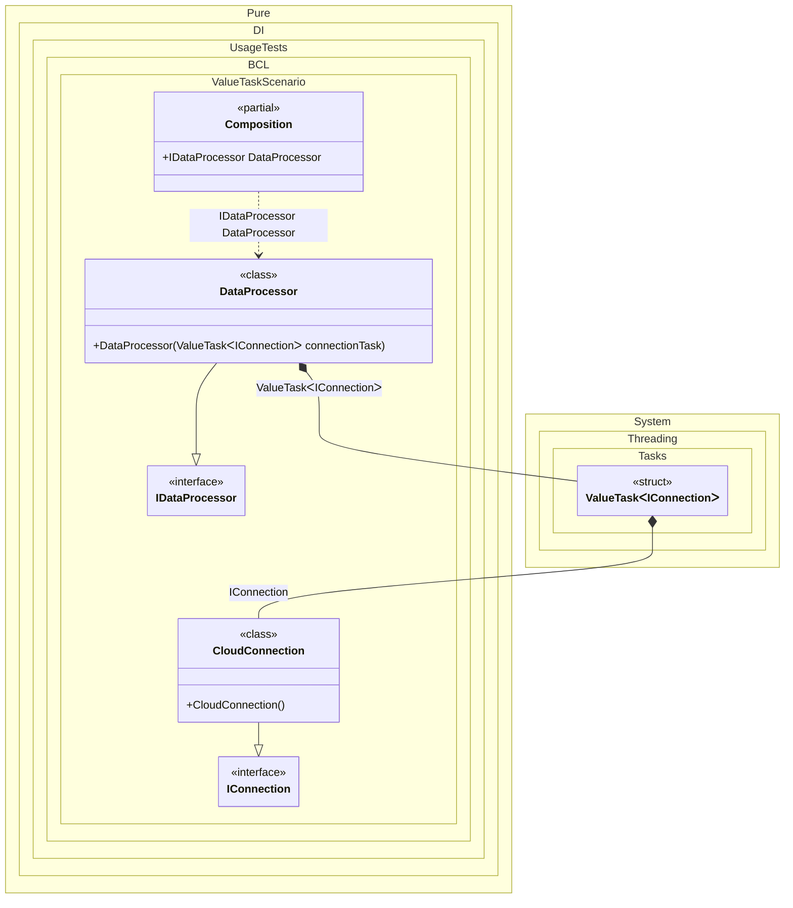

#### ValueTask


```c#
using Pure.DI;

DI.Setup(nameof(Composition))
    .Bind<IConnection>().To<CloudConnection>()
    .Bind<IDataProcessor>().To<DataProcessor>()

    // Composition root
    .Root<IDataProcessor>("DataProcessor");

var composition = new Composition();
var processor = composition.DataProcessor;
await processor.ProcessDataAsync();

interface IConnection
{
    ValueTask<bool> PingAsync();
}

class CloudConnection : IConnection
{
    public ValueTask<bool> PingAsync() => ValueTask.FromResult(true);
}

interface IDataProcessor
{
    ValueTask ProcessDataAsync();
}

class DataProcessor(ValueTask<IConnection> connectionTask) : IDataProcessor
{
    public async ValueTask ProcessDataAsync()
    {
        // The connection is resolved asynchronously, allowing potential
        // non-blocking initialization or resource allocation.
        var connection = await connectionTask;
        await connection.PingAsync();
    }
}
```

<details>
<summary>Running this code sample locally</summary>

- Make sure you have the [.NET SDK 10.0](https://dotnet.microsoft.com/en-us/download/dotnet/10.0) or later is installed
```bash
dotnet --list-sdk
```
- Create a net10.0 (or later) console application
```bash
dotnet new console -n Sample
```
- Add reference to NuGet package
  - [Pure.DI](https://www.nuget.org/packages/Pure.DI)
```bash
dotnet add package Pure.DI
```
- Copy the example code into the _Program.cs_ file

You are ready to run the example 🚀
```bash
dotnet run
```

</details>

The following partial class will be generated:

```c#
partial class Composition
{
  [OrdinalAttribute(256)]
  public Composition()
  {
  }

  internal Composition(Composition parentScope)
  {
  }

  public IDataProcessor DataProcessor
  {
    [MethodImpl(MethodImplOptions.AggressiveInlining)]
    get
    {
      ValueTask<IConnection> transientValueTask1;
      IConnection localValue25 = new CloudConnection();
      // Initializes a new instance of the ValueTask class using the supplied instance
      transientValueTask1 = new ValueTask<IConnection>(localValue25);
      return new DataProcessor(transientValueTask1);
    }
  }
}
```

Class diagram:



