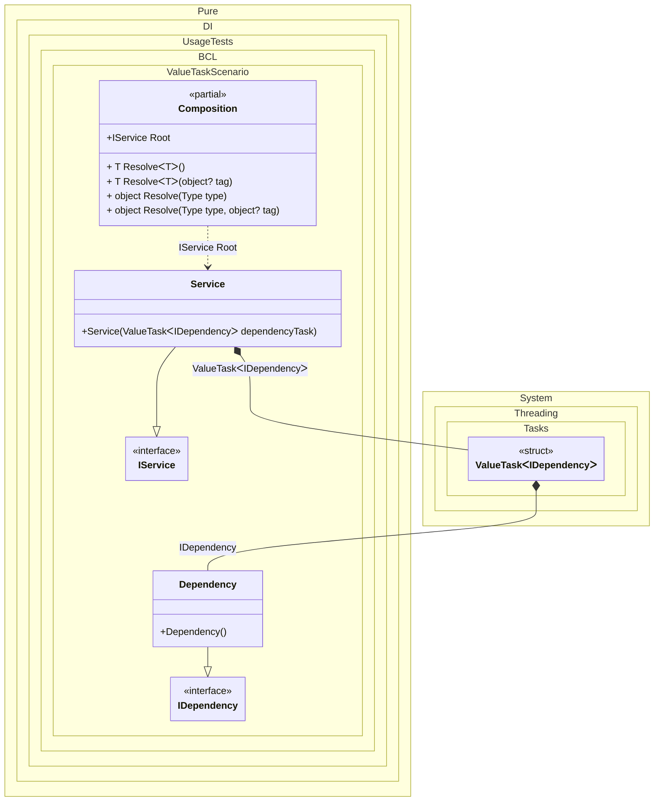

#### ValueTask

[](../tests/Pure.DI.UsageTests/BaseClassLibrary/ValueTaskScenario.cs)


```c#
using Pure.DI;

DI.Setup(nameof(Composition))
    .Bind<IDependency>().To<Dependency>()
    .Bind<IService>().To<Service>()

    // Composition root
    .Root<IService>("Root");

var composition = new Composition();
var service = composition.Root;
await service.RunAsync();

interface IDependency
{
    ValueTask DoSomething();
}

class Dependency : IDependency
{
    public ValueTask DoSomething() => ValueTask.CompletedTask;
}

interface IService
{
    ValueTask RunAsync();
}

class Service(ValueTask<IDependency> dependencyTask) : IService
{
    public async ValueTask RunAsync()
    {
        var dependency = await dependencyTask;
        await dependency.DoSomething();
    }
}
```


Class diagram:



