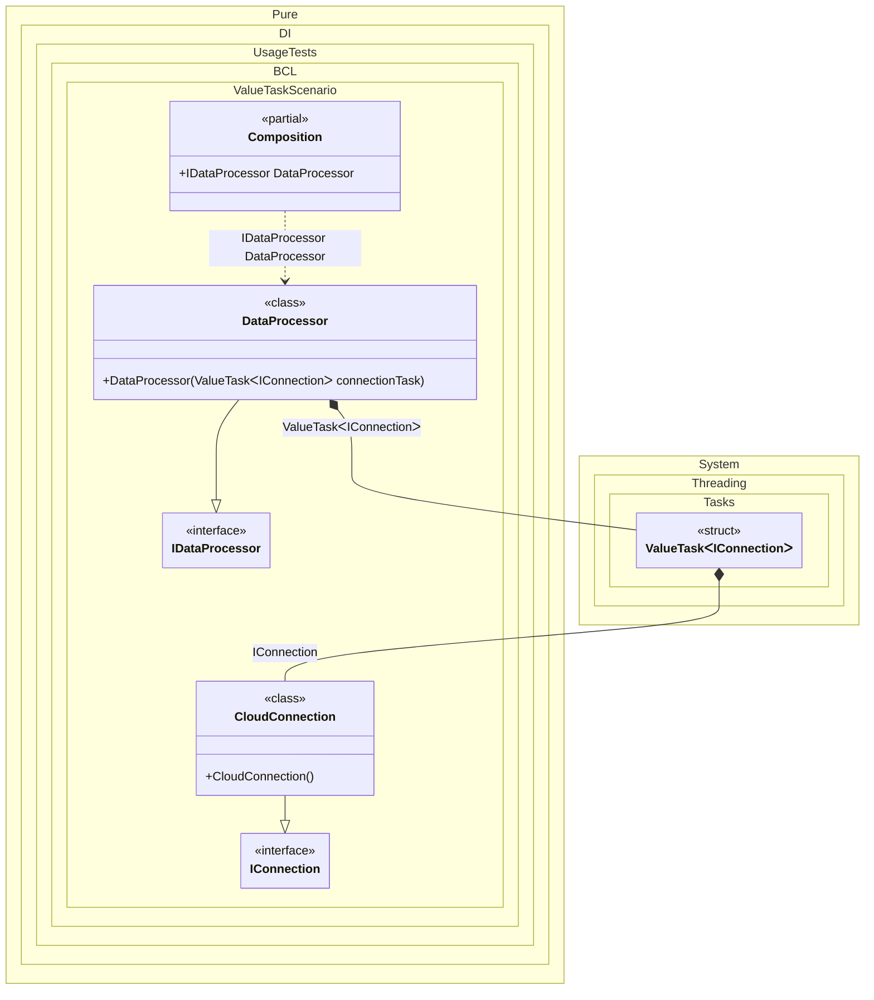

#### ValueTask

Demonstrates `ValueTask<T>` injection, which provides a more efficient alternative to `Task<T>` for scenarios where the result is often already available synchronously.


```c#
using Shouldly;
using Pure.DI;

DI.Setup(nameof(Composition))
    .Bind<IConnection>().To<CloudConnection>()
    .Bind<IDataProcessor>().To<DataProcessor>()

    // Composition root
    .Root<IDataProcessor>("DataProcessor");

var composition = new Composition();
var processor = composition.DataProcessor;
await processor.ProcessDataAsync();

interface IConnection
{
    ValueTask<bool> PingAsync();
}

class CloudConnection : IConnection
{
    public ValueTask<bool> PingAsync() => ValueTask.FromResult(true);
}

interface IDataProcessor
{
    ValueTask ProcessDataAsync();
}

class DataProcessor(ValueTask<IConnection> connectionTask) : IDataProcessor
{
    public async ValueTask ProcessDataAsync()
    {
        // The connection is resolved asynchronously, allowing potential
        // non-blocking initialization or resource allocation.
        var connection = await connectionTask;
        await connection.PingAsync();
    }
}
```

<details>
<summary>Running this code sample locally</summary>

- Make sure you have the [.NET SDK 10.0](https://dotnet.microsoft.com/en-us/download/dotnet/10.0) or later installed
```bash
dotnet --list-sdk
```
- Create a net10.0 (or later) console application
```bash
dotnet new console -n Sample
```
- Add references to the NuGet packages
  - [Pure.DI](https://www.nuget.org/packages/Pure.DI)
  - [Shouldly](https://www.nuget.org/packages/Shouldly)
```bash
dotnet add package Pure.DI
dotnet add package Shouldly
```
- Copy the example code into the _Program.cs_ file

You are ready to run the example 🚀
```bash
dotnet run
```

</details>

>[!NOTE]
>`ValueTask<T>` reduces allocations compared to `Task<T>` when operations complete synchronously, making it ideal for high-performance scenarios.

The following partial class will be generated:

```c#
partial class Composition
{
  public IDataProcessor DataProcessor
  {
    [MethodImpl(MethodImplOptions.AggressiveInlining)]
    get
    {
      ValueTask<IConnection> transientValueTask464;
      IConnection localValue40 = new CloudConnection();
      // Initializes a new instance of the ValueTask class using the supplied instance
      transientValueTask464 = new ValueTask<IConnection>(localValue40);
      return new DataProcessor(transientValueTask464);
    }
  }
}
```

Class diagram:


```mermaid
---
 config:
  maxTextSize: 2147483647
  maxEdges: 2147483647
  class:
   hideEmptyMembersBox: true
---
classDiagram
	CloudConnection --|> IConnection
	DataProcessor --|> IDataProcessor
	Composition ..> DataProcessor : IDataProcessor DataProcessor
	DataProcessor *--  ValueTaskᐸIConnectionᐳ : ValueTaskᐸIConnectionᐳ
	ValueTaskᐸIConnectionᐳ *--  CloudConnection : IConnection
	namespace Pure.DI.UsageTests.BCL.ValueTaskScenario {
		class CloudConnection {
				<<class>>
			+CloudConnection()
		}
		class Composition {
		<<partial>>
		+IDataProcessor DataProcessor
		}
		class DataProcessor {
				<<class>>
			+DataProcessor(ValueTaskᐸIConnectionᐳ connectionTask)
		}
		class IConnection {
			<<interface>>
		}
		class IDataProcessor {
			<<interface>>
		}
	}
	namespace System.Threading.Tasks {
		class ValueTaskᐸIConnectionᐳ {
				<<struct>>
		}
	}
```

