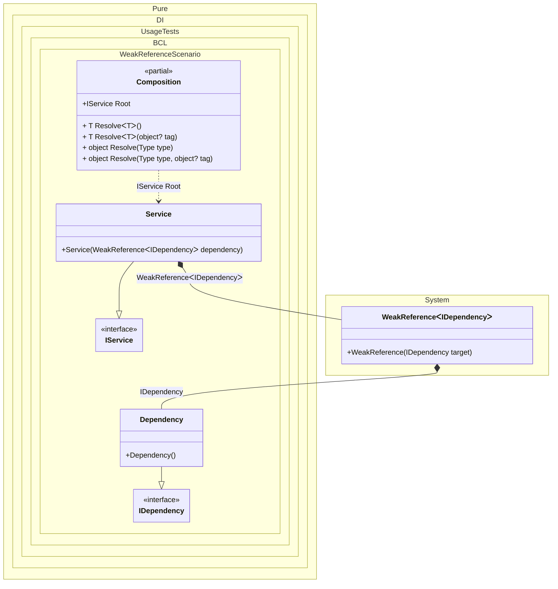

#### Weak Reference

[](../tests/Pure.DI.UsageTests/BaseClassLibrary/WeakReferenceScenario.cs)


```c#
using Pure.DI;

DI.Setup(nameof(Composition))
    .Bind<IDependency>().To<Dependency>()
    .Bind<IService>().To<Service>()

    // Composition root
    .Root<IService>("Root");

var composition = new Composition();
var service = composition.Root;

interface IDependency;

class Dependency : IDependency;

interface IService;

class Service(WeakReference<IDependency> dependency) : IService
{
    public IDependency? Dependency =>
        dependency.TryGetTarget(out var value)
            ? value
            : null;
}
```


Class diagram:



