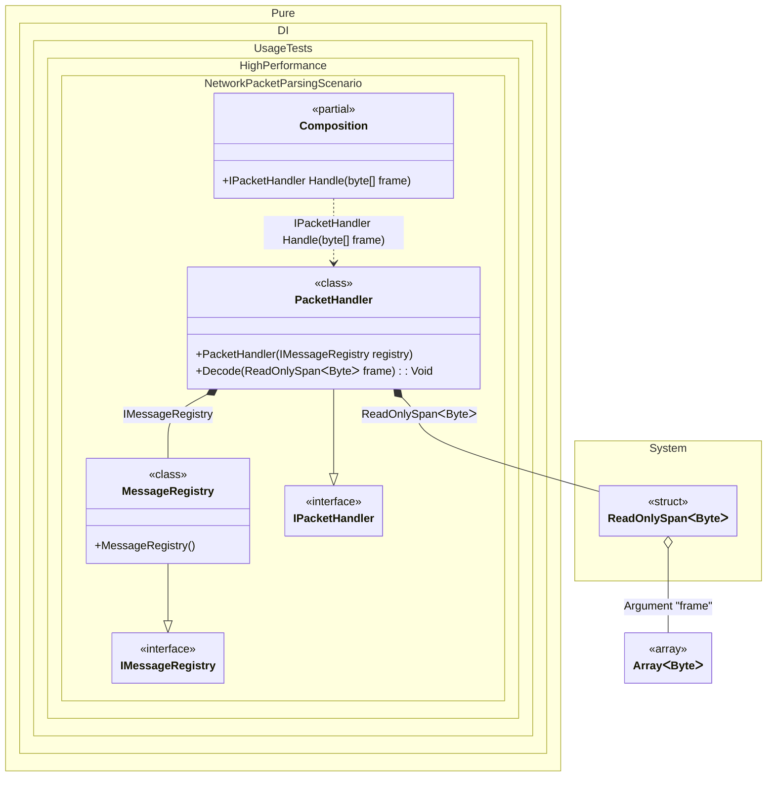

#### Zero-copy network packet parsing

Network servers commonly receive an owned `byte[]` from a socket, pipeline adapter, or message broker and need to inspect it without allocating another buffer. A `byte[]` root argument can satisfy a `ReadOnlySpan<byte>` method-injection target: Pure.DI generates a root method that accepts the caller-owned array and applies the compiler-provided span conversion when invoking the parser.
The packet handler below combines a stable message registry with one frame supplied for the current operation. `Decode(...)` validates the header, reads the message identifier in network byte order, and computes a payload checksum directly over the original array. The stack-only view is consumed immediately; only parsed values are retained by the heap object.


```c#
using Shouldly;
using Pure.DI;
using System;
using System.Buffers.Binary;

DI.Setup(nameof(Composition))
    .Bind<IMessageRegistry>().To<MessageRegistry>()
    .Bind<IPacketHandler>().To<PacketHandler>()
    .RootArg<byte[]>("frame")
    .Root<IPacketHandler>("Handle");

var frame = new byte[]
{
    0x00, 0x2A, // Message id 42, big endian
    0x03,       // Payload length
    0x10, 0x20, 0x30
};

var composition = new Composition();
var packet = composition.Handle(frame);

packet.MessageName.ShouldBe("OrderAccepted");
packet.PayloadLength.ShouldBe(3);
packet.PayloadChecksum.ShouldBe(0x60);

interface IMessageRegistry
{
    string GetName(ushort messageId);
}

sealed class MessageRegistry : IMessageRegistry
{
    public string GetName(ushort messageId) =>
        messageId == 42 ? "OrderAccepted" : "Unknown";
}

interface IPacketHandler
{
    string MessageName { get; }

    int PayloadLength { get; }

    int PayloadChecksum { get; }
}

sealed class PacketHandler(IMessageRegistry registry) : IPacketHandler
{
    public string MessageName { get; private set; } = "";

    public int PayloadLength { get; private set; }

    public int PayloadChecksum { get; private set; }

    [Ordinal(0)]
    public void Decode(ReadOnlySpan<byte> frame)
    {
        if (frame.Length < 3)
        {
            throw new ArgumentException("The packet header is incomplete.", nameof(frame));
        }

        var payloadLength = frame[2];
        if (frame.Length != payloadLength + 3)
        {
            throw new ArgumentException("The packet payload length is invalid.", nameof(frame));
        }

        var messageId = BinaryPrimitives.ReadUInt16BigEndian(frame);
        var checksum = 0;
        foreach (var value in frame[3..])
        {
            checksum += value;
        }

        MessageName = registry.GetName(messageId);
        PayloadLength = payloadLength;
        PayloadChecksum = checksum;
    }
}
```

<details>
<summary>Running this code sample locally</summary>

- Make sure you have the [.NET SDK 10.0](https://dotnet.microsoft.com/en-us/download/dotnet/10.0) or later installed
```bash
dotnet --list-sdk
```
- Create a net10.0 (or later) console application
```bash
dotnet new console -n Sample
```
- Add references to the NuGet packages
  - [Pure.DI](https://www.nuget.org/packages/Pure.DI)
  - [Shouldly](https://www.nuget.org/packages/Shouldly)
```bash
dotnet add package Pure.DI
dotnet add package Shouldly
```
- Copy the example code into the _Program.cs_ file

You are ready to run the example 🚀
```bash
dotnet run
```

</details>

This shape is useful for socket protocols, telemetry ingestion, binary file headers, and queue consumers. The caller keeps ownership of the array and may return it to a pool after the root call completes. Do not store the span or the original pooled array in the handler unless ownership is explicitly transferred; keep parsing synchronous and copy only the fields that must outlive the call.
Unlike regular `Span<T>` collection injection, this path does not build a collection from element bindings. Pure.DI detects an implicit span conversion from an existing root argument and reuses that value. Ordinary small value-type span collections continue to use the generator's `stackalloc` optimization.
The conversion matrix follows the [official C# 14 first-class Span types specification](https://learn.microsoft.com/en-us/dotnet/csharp/language-reference/proposals/csharp-14.0/first-class-span-types).

<details>
<summary>The following partial class will be generated</summary>

```c#
partial class Composition
{
  [MethodImpl(MethodImplOptions.AggressiveInlining)]
  public IPacketHandler Handle(byte[] frame)
  {
    if (frame is null) throw new ArgumentNullException(nameof(frame));
    var transientPacketHandler = new PacketHandler(new MessageRegistry());
    transientPacketHandler.Decode(frame);
    return transientPacketHandler;
  }
}
```

</details>

Class diagram:



See also:

- [Span and ReadOnlySpan](span-and-readonlyspan.md)
- [Root arguments](root-arguments.md)
- [Method injection](method-injection.md)

